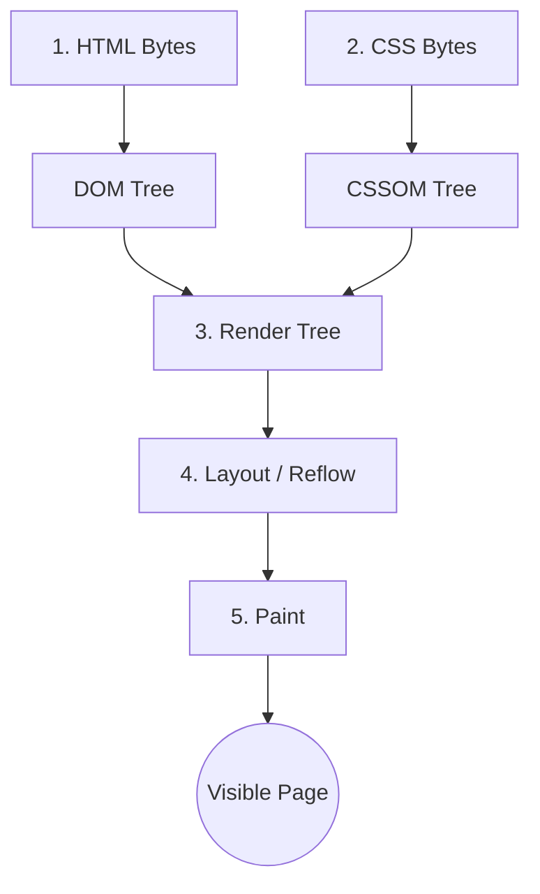

# Critical Rendering Path

> **Level 9 — DOM, Rendering & Accessibility**
> The sequence of steps the web browser engine performs to parse HTML, CSS, and JavaScript files and translate them into visual pixels on the user's screen.

---

## 1. Prerequisites
- [DOM (Document Object Model)](dom.md) — The interactive, in-memory representation.
- [The Tree Structure](tree_structure.md) — The hierarchical parent-child format.

---

## 2. Term Category

**Concept / Architecture (Universal Browser Architecture .)**: Critical Rendering Path is a fundamental concept in this technology stack. **Level 9 — DOM, Rendering & Accessibility**

---

## 3. Explanation

### (1) Design Motivation — "Why did we design this?"
When you open a website, your browser downloads a text file containing HTML code, some CSS files, and some JavaScript. 

How does the browser translate these raw code strings into colorful, clickable, interactive boxes on your screen?

This translation pipeline is called the **Critical Rendering Path (CRP)**. 

Understanding the CRP is crucial for web developers. If a site is slow to load, it is because something is blocking this pipeline. By understanding each step, you can optimize your code so pages load instantly and animations run smoothly at 60 frames per second without stuttering.

---

### (2) The 5 Steps of the Rendering Pipeline

The rendering engine converts code to pixels in five sequential stages:



#### Step 1: Build the DOM Tree
The browser parses the HTML code bytes and converts them into **Element Nodes** and **Text Nodes**, organizing them into the hierarchical parent-child [Tree Structure](../level_09/tree_structure.md).

#### Step 2: Build the CSSOM Tree
The browser reads the CSS styling rules (from `<style>` tags or external `.css` files) and builds a second tree called the **CSS Object Model (CSSOM)**. This tree maps visual styles (fonts, sizes, colors) to classes and tags.

#### Step 3: Combine into the Render Tree
The browser combines the DOM and CSSOM trees into a single **Render Tree**. 
-   **Critical Rule:** The Render Tree only contains elements that are **visible** on the screen.
-   If an element has `display: none;` set in CSS, it is completely ignored by the Render Tree. (However, elements with `visibility: hidden;` *are* included because they still occupy physical layout space).

#### Step 4: Layout (Geometry)
The browser calculates the exact physical footprint of each element:
-   Where does it sit on the screen? (X, Y coordinates).
-   What are its dimensions? (Width, height in pixels).
-   This step is also called **Reflow**.

#### Step 5: Paint (Drawing Pixels)
Finally, the browser fills in the colorful pixels on the screen, drawing background colors, shadows, borders, text letters, and images.

---

### (3) Code Examples

#### Visual Exclusion in the Render Tree
Consider the following HTML/CSS:

```html
<!-- HTML -->
<body>
  <h1>Main Heading</h1>
  <p class="hidden-note">This note is secret.</p>
</body>

<!-- CSS -->
<style>
  .hidden-note {
    display: none;
  }
</style>
```

When building the trees:
1.  **DOM Tree:** Contains both `<h1>` and `<p>`.
2.  **CSSOM Tree:** Contains the style rules for `.hidden-note`.
3.  **Render Tree:** Contains **only** the `<h1>`. The `<p>` is excluded because `display: none` renders it invisible.
4.  **Layout/Paint:** Only draws the `<h1>` pixels.

---

## 4. Common Mistakes & Pitfalls

### Mistake 1: Layout Thrashing (JavaScript performance bug)

**The mistake:** Writing JavaScript code that forces the browser to calculate layout geometry over and over again inside a loop:

```html
<script>
  // BAD: Layout Thrashing!
  for (let i = 0; i < paragraphs.length; i++) {
    // Reading height forces the browser to run the Layout step!
    let width = container.offsetWidth; 
    // Writing new styles forces the browser to discard the Layout!
    paragraphs[i].style.width = width + 'px'; 
  }
</script>
```

**Why it's wrong:** In the loop above, reading `offsetWidth` forces the browser to run Step 4 (Layout) to find the width. Then, changing the style invalidates the layout. On the next loop cycle, the browser has to recalculate Layout all over again. Doing this repeatedly causes the rendering pipeline to jam, leading to massive lag and stuttering (called "jank").

**Fix:** Read all layout measurements first (batch reads), then make all style changes (batch writes) outside the loop.

---


### Mistake 2: Placing Large External Blocking CSS and Synchronous JS Files Above Fold (FCP Delay)

**The mistake:** Loading 10 un-optimized synchronous CSS/JS files in `<head>`.

**Why it's wrong:** Browsers halt DOM tree construction while fetching and parsing synchronous CSS and JS files (Render-Blocking), delaying First Contentful Paint (FCP) and LCP metrics.

*Incorrect:*
```html
<!-- 10 un-deferred external scripts and large CSS files in <head> -->
```

*Fix:*
```html
<!-- Inline critical CSS; defer non-critical JS scripts: -->
<script src="app.js" defer></script>
```

### Mistake 3: Causing Thrashing and Forced Synchronous Layouts via JavaScript DOM Access

**The mistake:** Reading `element.offsetHeight` immediately after setting `element.style.width` inside a loop.

**Why it's wrong:** Reading layout geometry properties immediately after mutating DOM styles forces the browser engine to perform an expensive synchronous layout recalculation in the middle of execution.

*Incorrect:*
```html
for (let i = 0; i < 100; i++) {
  box.style.width = i + 'px';
  console.log(box.offsetHeight); // ❌ Forced synchronous layout thrashing!
}
```

*Fix:*
```html
// Batch DOM reads first, then batch DOM style writes
```

## 5. Practice Exercises

### Exercise 1: Optimizing Critical Path HTML with Inlined CSS and Deferred Scripts

**Scenario:** An author optimizes the Critical Rendering Path by inlining critical above-the-fold CSS and deferring non-critical scripts.

**Requirements:**
1. Inline critical CSS rules in `<style>` in `<head>`.
2. Defer non-critical JavaScript files using `defer`.
3. Preload primary font assets.

> [!check]- Answer
>
> #### Implementation
>
> ```html
> <head>
>   <meta charset="utf-8">
>   <title>Critical Rendering Path Optimization</title>
>
>   <!-- 1. Preload critical web font -->
>   <link rel="preload" href="fonts/inter.woff2" as="font" type="font/woff2" crossorigin="anonymous">
>
>   <!-- 2. Inline critical above-the-fold CSS -->
>   <style>
>     body { margin: 0; font-family: system-ui; }
>     .hero { min-height: 80vh; background: #0f172a; color: white; padding: 2rem; }
>   </style>
>
>   <!-- 3. Defer non-critical scripts -->
>   <script src="js/app.js" defer></script>
> </head>
> ```
>
> #### Technical Explanation
>
> 1. **Critical Rendering Path (CRP)**: The sequence of steps browsers take to parse HTML, construct DOM/CSSOM trees, render layout, and paint pixels to screen.
> 2. **Eliminating Render-Blocking CSS**: Inlining critical CSS eliminates network round-trips for the initial page paint.
> 3. **Non-Blocking Deferred Scripts**: Using `defer` allows HTML DOM parsing to finish without waiting for JavaScript execution.
> 
---

### Exercise 2: Resource Preloading and Early Preconnect to Unblock Assets

**Scenario:** Uses `preconnect` and `preload` resource hints to accelerate network fetching.

**Requirements:**
1. Add `<link rel="preconnect" href="...">`.
2. Add `<link rel="preload" href="..." as="script">`.

> [!check]- Answer
>
> #### Implementation
>
> ```html
> <head>
>   <meta charset="utf-8">
>   <title>Preconnect Demo</title>
>   <link rel="preconnect" href="https://fonts.gstatic.com" crossorigin="anonymous">
>   <link rel="preload" href="images/hero-banner.jpg" as="image">
> </head>
> ```
>
> #### Technical Explanation
>
> 1. **`preconnect` Speedup**: Establishes early DNS, TCP, and TLS connections to external domains before asset discovery.
> 2. **`preload` Prioritization**: Instructs browser to download high-priority hero images before layout calculations finish.
> 3. **Faster First Contentful Paint**: Reduces overall page render latency on mobile networks.
> 
---

### Exercise 3: Reducing HTML DOM Depth to Minimize Render Tree Time

**Scenario:** Simplifies HTML DOM node depth to accelerate style recalculation and layout paint times.

**Requirements:**
1. Refactor over-nested `<div>` trees into flat semantic elements.

> [!check]- Answer
>
> #### Implementation
>
> ```html
> <!-- Optimized Flat DOM Tree Structure -->
> <main class="page-container">
>   <article class="content-card">
>     <h1>Page Title</h1>
>     <p>Direct paragraph content without redundant wrapper divs.</p>
>   </article>
> </main>
> ```
>
> #### Technical Explanation
>
> 1. **DOM Tree Depth Impact**: Excessive DOM node nesting slows down CSSOM matching and layout paint calculations.
> 2. **Memory Footprint**: Flatter HTML trees use less memory in V8 and browser layout engines.
> 3. **Smooth 60fps Rendering**: Improves scrolling animation performance.
## 6. Related Terms
- [DOM (Document Object Model)](dom.md) — The foundational node representation.
- [The Tree Structure](tree_structure.md) — The parent-child layout hierarchy.
- [Render-Blocking Resources](render_blocking.md) — Files that pause this pipeline.

---

## 7. Key Takeaways
- The Critical Rendering Path is the process browsers use to compile HTML, CSS, and JS into pixels.
- The DOM (content) and CSSOM (styles) trees are built in parallel.
- The Render Tree combines them, omitting elements styled with `display: none`.
- Layout calculates geometry (size and position); Paint draws the actual colored pixels.
- Avoid writing code that forces repeated Layout loops (Layout Thrashing) to prevent animations from lagging.
