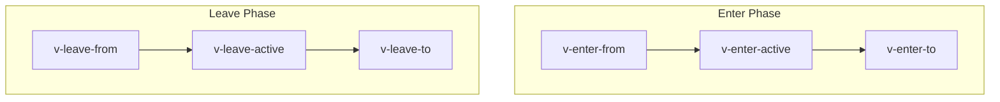

# Transitions & Animations

> **Level 10 — Ecosystem & Tooling**
> Built-in Vue components (`<Transition>` and `<TransitionGroup>`) that automatically coordinate CSS transition/animation classes or JavaScript hooks on elements when they enter or leave the DOM.

---

## 1. Prerequisites
- [Components](../level_04/components.md) — Base template layouts.
- [`v-if` / `v-show`](../level_03/v_if_show.md) — Conditional rendering triggers.
- [Dynamic Components](../level_04/dynamic_components.md) — Dynamic swapping layouts.

---

## 2. Term Category
- **Component Pattern**

---

## 3. Environment Context
- **Client-Side (Browser)**

---

## 4. Explanation

### (1) Design Motivation — "Why did we design this?"
In web design, sudden changes feel unpolished. If a modal pop-up snaps into existence instantly, it is jarring. If a list item vanishes without trace, it is easy to miss.

However, adding transitions manually using raw CSS and JavaScript is tedious. You have to manually append classes, wait for animation timers, and physically remove DOM nodes only *after* their fade-out finishes.

Vue designed **`<Transition>`** and **`<TransitionGroup>`** to automate this. Instead of manually coordinating timers, you wrap the target elements in Vue's helper components. Vue monitors their mount states and hooks into the browser's render loop, applying specific class suffixes exactly when the element enters, remains, or leaves the view.

### (2) How it works under the hood

#### `<Transition>` (Single Element)
`<Transition>` manages a single element or a set of mutually exclusive elements (using `v-if` / `v-else`). As the element changes state:
1. **Enter (Mount/Show):** Vue applies classes to control the start, animation duration, and end of the transition.
2. **Leave (Unmount/Hide):** Vue applies classes to control the exit animation, and physically deletes the element from the DOM only *after* the exit transition completes.

By default, classes use a `v-` prefix. If you name your transition (e.g. `<Transition name="fade">`), the prefix changes to `fade-`.



#### `<TransitionGroup>` (Lists)
Used when animating items rendered via `v-for`. Unlike `<Transition>`:
- It renders an actual wrapper tag in the DOM (defaults to `<span>`, customizable via the `tag` prop).
- It requires every child item to have a unique, stable `:key`.
- It supports the **`-move`** class, which Vue applies to elements that are changing positions (e.g., when a list is sorted), utilizing the FLIP animation technique under the hood to ensure smooth movement.

### (3) Code Examples

#### Short Snippet
A simple fade toggle:
```vue
<script setup>
import { ref } from 'vue'
const show = ref(true)
</script>

<template>
  <button @click="show = !show">Toggle</button>
  
  <Transition name="fade">
    <div v-if="show" class="box">Hello Vue</div>
  </Transition>
</template>

<style>
/* CSS class definitions matched to the transition name */
.fade-enter-active, .fade-leave-active {
  transition: opacity 0.5s ease;
}
.fade-enter-from, .fade-leave-to {
  opacity: 0;
}
</style>
```

#### Fuller Example
An animated todo list using `<TransitionGroup>` to animate additions, deletions, and moves.

```vue
<!-- App.vue -->
<script setup>
import { ref } from 'vue'

const items = ref([
  { id: 1, text: 'Buy groceries' },
  { id: 2, text: 'Clean room' }
])
let nextId = 3

function addItem() {
  items.value.push({ id: nextId++, text: `Task ${nextId}` })
}
function remove(id) {
  items.value = items.value.filter(item => item.id !== id)
}
</script>

<template>
  <div>
    <button @click="addItem">Add Task</button>
    
    <!-- TransitionGroup rendering a <ul> tag -->
    <TransitionGroup name="list" tag="ul" class="todo-list">
      <li v-for="item in items" :key="item.id">
        {{ item.text }}
        <button @click="remove(item.id)">Delete</button>
      </li>
    </TransitionGroup>
  </div>
</template>

<style>
/* Transitions for adding/deleting */
.list-enter-active, .list-leave-active {
  transition: all 0.5s ease;
}
.list-enter-from, .list-leave-to {
  opacity: 0;
  transform: translateX(30px);
}

/* 
  .list-move applies transition classes when elements shift positions.
  We make sure leaving elements are positioned absolutely so moving 
  elements animate smoothly!
*/
.list-move {
  transition: transform 0.5s ease;
}
.list-leave-active {
  position: absolute;
}
</style>
```

---

## 5. Common Mistakes & Pitfalls

### Mistake 1: Elements overlapping during transition switches

**The mistake:** Transitioning between two elements using `v-if`/`v-else` and seeing them stack vertically or jump during the transition.

**Why it's wrong:** By default, Vue initiates the entrance transition of the incoming element and the exit transition of the outgoing element **at the exact same time**. For a brief moment, both elements are in the DOM, disrupting the layout flow.

*Incorrect:*
```vue
<!-- Elements will overlap during animation -->
<Transition name="fade">
  <button v-if="isEditing" key="save">Save</button>
  <button v-else key="edit">Edit</button>
</Transition>
```

*Fix:* Add the `mode` attribute to control the sequence.
```vue
<!-- Wait for the old button to disappear completely before mounting the new one -->
<Transition name="fade" mode="out-in">
  <button v-if="isEditing" key="save">Save</button>
  <button v-else key="edit">Edit</button>
</Transition>
```

**Golden Rule:** When animating transitions between mutually exclusive elements, always use `mode="out-in"` to prevent layout overlapping.

---

### Mistake 2: Applying `<Transition>` to Multi-Root Component Elements Without a Single Root Node

**The mistake:** Wrapping a multi-root element component inside `<Transition>`.

**Why it's wrong:** `<Transition>` works by applying CSS transition classes to a single target DOM root node. Multi-root elements trigger a runtime warning and fail to animate.

*Incorrect:*
```vue
<Transition>
  <!-- 2 root elements inside Transition -->
  <h1>Title</h1>
  <p>Text</p> <!-- ❌ Warning: Transition expects a single root node! -->
</Transition>
```

*Fix:*
```vue
<Transition>
  <div>
    <h1>Title</h1>
    <p>Text</p> <!-- Wrapped in single root container -->
  </div>
</Transition>
```

---

### Mistake 3: Confusing `<Transition>` (Single Element) with `<TransitionGroup>` (Lists)

**The mistake:** Wrapping a `v-for` list of items in `<Transition>` instead of `<TransitionGroup>`.

**Why it's wrong:** `<Transition>` animates ONLY single elements or toggled `v-if/v-else` targets. Animating `v-for` element arrays requires `<TransitionGroup tag="ul">`.

*Incorrect:*
```vue
<Transition>
  <li v-for="item in list" :key="item.id">{{ item.name }}</li> <!-- ❌ Fails on lists! -->
</Transition>
```

*Fix:*
```vue
<TransitionGroup tag="ul">
  <li v-for="item in list" :key="item.id">{{ item.name }}</li>
</TransitionGroup>
```


---

## 6. Practice Exercises

### Exercise 1: Build a Slide Transition

**Problem:** You are building a notification toast. Create the CSS definitions for a slide-fade transition named `slide`. The banner should slide in from the right (`transform: translateX(100px)`) and fade in.

```vue
<template>
  <Transition name="slide">
    <div v-if="active" class="toast">Saved Successfully!</div>
  </Transition>
</template>

<style>
/* Complete the CSS transitions below */
</style>
```

**Expected output:**
```css
.slide-enter-active, .slide-leave-active {
  transition: all 0.3s ease-out;
}
.slide-enter-from, .slide-leave-to {
  transform: translateX(100px);
  opacity: 0;
}
```

> [!check]- Answer
> - Match the class names: `.slide-enter-active`, `.slide-leave-active`, `.slide-enter-from`, and `.slide-leave-to`.
> - Use standard CSS properties: `transition`, `transform`, and `opacity`.

---

### Exercise 2: Vue Transition CSS Classes Matrix

**Problem:** List the 6 auto-generated CSS classes provided by `<Transition name="fade">` during enter and leave phases.

**Expected output:**
```text
Enter: fade-enter-from, fade-enter-active, fade-enter-to
Leave: fade-leave-from, fade-leave-active, fade-leave-to
```

> [!check]- Answer
> - Enter phase: `fade-enter-from`, `fade-enter-active`, `fade-enter-to`
> - Leave phase: `fade-leave-from`, `fade-leave-active`, `fade-leave-to`
> 
> ```css
> .fade-enter-active, .fade-leave-active {
>   transition: opacity 0.5s ease;
> }
> .fade-enter-from, .fade-leave-to {
>   opacity: 0;
> }
> ```

---

### Exercise 3: Transition mode Prop

**Problem:** Which `mode` prop setting on `<Transition>` waits for the leaving element to finish animating out before entering the new element (`mode="out-in"`)?

**Expected output:**
```text
mode="out-in"
```

> [!check]- Answer
> - `mode="out-in"` -> Outgoing element animates out first, then incoming element enters.
> 
> ```html
> <Transition name="fade" mode="out-in">
>   <component :is="activeTab" />
> </Transition>
> ```


---

## 7. Related Terms
- [Dynamic Components](../level_04/dynamic_components.md) — Swapping active nodes.
- [`v-if` / `v-show`](../level_03/v_if_show.md) — The visibility attributes that trigger transitions.
- [Components](../level_04/components.md) — Custom templates.

---

## 8. Key Takeaways
- **`<Transition>`** is a built-in wrapper component that adds entry/exit CSS classes to a single target element.
- Custom animation class names are defined via the `name` prop (e.g. `<Transition name="slide">`).
- Entry stages are tracked via `-enter-from`, `-enter-active`, and `-enter-to` classes.
- Use **`mode="out-in"`** when transitioning between multiple nodes to prevent them from rendering simultaneously.
- **`<TransitionGroup>`** manages list rendering animations (`v-for`) and supports the `-move` class for sorting reorders.
