# Missing Terms & Knowledge Gaps — Next.js Knowledge Base (`09-nextjs`)

> **Purpose**: This document identifies terms that are **referenced but never defined** within the `09-nextjs` knowledge base, plus **foundational concepts assumed but never explained** that block a junior developer from comprehensively understanding the 53 existing terms. This file is structured for **AI ingestion** — every missing term includes its canonical ID, which existing terms depend on it, and how it relates to other missing terms.

---

## How to Read This Document

- **`[REFERENCED]`** — The term is explicitly linked (via markdown hyperlink) from an existing term document as a prerequisite, but the link target does not exist within the `09-nextjs` knowledge base.
- **`[ASSUMED]`** — The term is used conceptually in explanations, code samples, or pitfalls across multiple existing term documents without being defined or linked. A junior developer encountering this concept has no entry point to understand it.
- **`[IMPLICIT]`** — The term is a foundational web/JS/React concept that the knowledge base silently depends on. Without it, the causal chain from one existing term to the next breaks.

---

## Section 1: Missing External Prerequisites (Referenced but Undefined)

These terms are **explicitly linked as prerequisites** in `## 1. Prerequisites` sections of existing term documents. The links point to other knowledge bases (`01-html`, `03-javascript`, `04-apis`, `05-nodejs`, `06-react`) that may or may not have the corresponding files. Regardless, within the Next.js KB alone, a reader has **no way to resolve these dependencies**.

### 1.1 React Ecosystem (`06-react`)

| # | Missing Term | Tag | Referenced By (Existing Terms) | Why It Blocks Learning |
|---|---|---|---|---|
| M01 | **React Components** [DONE] | `[REFERENCED]` | Term #2 (RSC), Term #11 (`<Link>`) | RSC is the #1 concept in the KB. Without understanding what a standard React component is, the reader cannot grasp what "server-only component" means. |
| M02 | **React Hooks / Rules of Hooks** [DONE] | `[REFERENCED]` | Term #3 (Client Components) | The `"use client"` directive exists specifically to enable hooks. Without knowing what `useState`/`useEffect` are, the reader cannot understand *why* client components are needed. |
| M03 | **React `useEffect`** [DONE] | `[REFERENCED]` | Term #8 (`template.tsx`) | Templates are defined by their ability to re-trigger `useEffect` on navigation. Without knowing `useEffect`, the template vs layout distinction is meaningless. |
| M04 | **React Suspense** [DONE] | `[REFERENCED]` | Term #9 (`loading.tsx`), Term #25 (Streaming) | `loading.tsx` and Streaming are both described as "Suspense under the hood." Without understanding Suspense boundaries and Promise catching, the reader cannot understand how streaming works. |
| M05 | **React Error Boundaries** [DONE] | `[REFERENCED]` | Term #10 (`error.tsx`) | `error.tsx` is described as a wrapper around React Error Boundaries. Without knowing class-based `componentDidCatch`, the reader cannot understand why `error.tsx` must be `"use client"`. |
| M06 | **React Children Prop** [DONE] | `[REFERENCED]` | Term #7 (`layout.tsx`) | Layouts are defined by their `children` prop. Without understanding the composition pattern, the reader cannot understand nested layouts. |
| M07 | **Client-Side Rendering (CSR) / SPA** [DONE] | `[REFERENCED]` | Term #38 (Dynamic Rendering / SSR L8) | SSR is constantly compared against CSR. Without defining CSR, the "why" of SSR collapses. |

### 1.2 JavaScript Core (`03-javascript`)

| # | Missing Term | Tag | Referenced By (Existing Terms) | Why It Blocks Learning |
|---|---|---|---|---|
| M08 | **JavaScript Fetch API** [DONE] | `[REFERENCED]` | Term #21 (Server-side Fetch), Term #32 (`NextRequest`/`NextResponse`) | The extended `fetch` in Next.js is described as a patch on top of the native Web `fetch()`. Without knowing the standard `fetch()` signature (`Request`, `Response`, `Headers`), the reader cannot understand what Next.js is extending. |
| M09 | **JavaScript Rest Parameters (`...`)** [DONE] | `[REFERENCED]` | Term #14 (Catch-all Segments) | The `[...slug]` folder naming convention is described as inspired by JS rest parameters. Without this, the syntax looks arbitrary. |

### 1.3 Node.js (`05-nodejs`)

| # | Missing Term | Tag | Referenced By (Existing Terms) | Why It Blocks Learning |
|---|---|---|---|---|
| M10 | **Node.js Runtime** [DONE] | `[REFERENCED]` | Term #1 (Next.js Overview), Term #47 (Edge Runtime) | The entire KB assumes the reader knows Node.js is a server-side JS runtime. Without this, "server" vs "client" is meaningless. |
| M11 | **V8 Engine** [DONE] | `[REFERENCED]` | Term #47 (Edge Runtime) | Edge Runtime is described as "V8 stripped of Node.js APIs." Without knowing what V8 is, this definition is opaque. |
| M12 | **Node.js Environment Variables** [DONE] | `[REFERENCED]` | Term #48 (Environment Variables) | Next.js env vars extend the standard Node.js `process.env` pattern. |
| M13 | **Node.js `path` Module** [DONE] | `[REFERENCED]` | Term #17 (Intercepting Routes) | The `(..)` convention in intercepting routes is compared to relative file paths. |

### 1.4 HTML (`01-html`)

| # | Missing Term | Tag | Referenced By (Existing Terms) | Why It Blocks Learning |
|---|---|---|---|---|
| M14 | **HTML `<head>` Element** [DONE] | `[REFERENCED]` | Term #44 (Metadata API) | The Metadata API generates `<title>`, `<meta>`, and Open Graph tags inside `<head>`. Without knowing what `<head>` is, SEO optimization is abstract. |
| M15 | **HTML `` Element** [DONE] | `[REFERENCED]` | Term #41 (`<Image>` Component) | The `<Image>` component is described as a replacement for ``. Without knowing native image loading behavior (no lazy loading, no size optimization), the motivation is lost. |
| M16 | **HTML `<script>` Element** [DONE] | `[REFERENCED]` | Term #43 (`<Script>` Component) | Same pattern — Next.js `<Script>` replaces native `<script>` with load strategies. |
| M17 | **HTML Forms (`<form>`)** [DONE] | `[REFERENCED]` | Term #27 (Form Actions) | Form Actions build on the native `<form action="">` pattern. Without knowing standard form submission behavior, the reader cannot appreciate what Next.js automates. |

### 1.5 APIs (`04-apis`)

| # | Missing Term | Tag | Referenced By (Existing Terms) | Why It Blocks Learning |
|---|---|---|---|---|
| M18 | **HTTP Methods (GET, POST, PUT, DELETE)** [DONE] | `[REFERENCED]` | Term #31 (Route Handlers) | Route handlers export functions named after HTTP methods (`GET`, `POST`). Without knowing what HTTP methods are, the reader cannot understand API design. |

---

## Section 2: Missing Assumed Concepts (Used but Never Defined)

These terms appear **repeatedly in explanations, code samples, and pitfalls** across multiple existing term documents but are never formally defined, linked, or given a dedicated document. A junior developer will encounter these words frequently and have no anchor point.

### 2.1 Core Web / Browser Concepts

| # | Missing Term | Tag | Used In (Existing Terms) | Relationship to Existing Terms |
|---|---|-| M19 | **Hydration** [DONE] | `[ASSUMED]` | Term #5 (SSR), Term #3 (Client Components), Term #1 (Next.js Overview) | Hydration is mentioned **9 times** across the KB. It is described in Term #5 but never gets its own entry. It is the critical bridge between SSR (server HTML) and Client Components (interactive browser). Without it, the reader cannot understand: why `"use client"` components also run on the server (pre-render), why hydration mismatches occur, or how the server HTML becomes interactive. **Depends on**: M01 (React Components), M07 (CSR). **Depended on by**: Term #3, Term #5, Term #10 (`error.tsx`). |
| M20 | **Client-Side Rendering (CSR)** [DONE] | `[ASSUMED]` | Term #1 (Next.js Overview), Term #5 (SSR), Term #21 (Server-side Fetch), Term #24 (Client Fetching) | CSR is the "before" in every "before vs after" explanation. Next.js solves CSR's SEO and performance problems. Without defining CSR (empty `<div id="root">`, full JS download, then render), the reader has no frame of reference for *why* SSR/SSG/RSC exist. **Overlaps with**: M07. |
| M21 | **SEO (Search Engine Optimization)** [DONE] | `[ASSUMED]` | Term #1, Term #5, Term #24, Term #44, Term #45 | SEO is the #1 motivation cited for SSR and the Metadata API. The KB assumes the reader knows what "search engine bots" do, why empty HTML is bad for indexing, and what Open Graph tags are for. Without this, the motivation for SSR, SSG, and the entire Level 9 (Optimizations) is unclear. |
| M22 | **CDN (Content Delivery Network)** [DONE] | `[ASSUMED]` | Term #37 (SSG), Term #39 (PPR), Term #53 (Vercel Deployment) | CDNs are mentioned **8 times** as the destination for static HTML. The KB assumes the reader knows what a CDN is, why geographic proximity matters, and why serving static files from a CDN is faster than running Node.js. **Depended on by**: SSG, PPR, Vercel. |
| M23 | **Serverless Functions / AWS Lambda** [DONE] | `[ASSUMED]` | Term #53 (Vercel Deployment) | Vercel's architecture is described as splitting the app into CDN + Serverless Functions + Edge Functions. Without knowing what serverless means (ephemeral, stateless, cold starts, timeouts), the reader cannot understand Vercel's deployment model or its pitfalls (file system loss, timeout errors). **Related to**: M10 (Node.js), M22 (CDN). |
| M24 | **Web Core Vitals (FCP, LCP, CLS, TTFB)** [DONE] | `[ASSUMED]` | Term #41 (`<Image>`), Term #39 (PPR), Term #43 (`<Script>`) | The `<Image>`, `<Script>`, and PPR terms reference performance metrics like "First Contentful Paint" without defining them. Without Core Vitals context, the reader cannot understand *why* lazy loading images or deferring scripts matters. |
 
### 2.2 Next.js-Specific Undocumented Concepts
 
| # | Missing Term | Tag | Used In (Existing Terms) | Relationship to Existing Terms |
|---|---|---|---|---|
| M25 | **`next.config.mjs` / `next.config.js`** [DONE] | `[ASSUMED]` | Term #41 (`<Image>` — `remotePatterns`), Term #51 (SWC — `compiler`), Term #52 (Standalone — `output`), Term #39 (PPR — `experimental.ppr`) | This is the central configuration file for Next.js. It is referenced in **4+ term documents** for critical settings (`output: 'standalone'`, `remotePatterns`, `compiler.removeConsole`, `experimental.ppr`). No dedicated term explains what this file is, where it lives, or its structure. **Depended on by**: Term #41, #51, #52, #39. |41, #51, #52, #39. |
| M26 | **React Server Component Payload (RSC Payload)** [DONE] | `[ASSUMED]` | Term #39 (The Four Caches — Layer 3, Layer 4), Term #39 (PPR) | The Four Caches doc references "React Server Component Payload" multiple times as the binary format cached by the Full Route Cache and Router Cache. Without defining what an RSC Payload is (a compact binary representation of the rendered component tree, not HTML), the caching layers are confusing. **Depends on**: Term #2 (RSC). **Depended on by**: Term #39 (Four Caches), Term #40 (PPR). |
| M27 | **`generateStaticParams`** [DONE] | `[ASSUMED]` | Term #37 (SSG) — explained inline but not a standalone term | This function is explained within the SSG document but is a critical, standalone API. It replaces `getStaticPaths` from the Pages Router and is essential for understanding how dynamic routes get pre-built. **Depends on**: Term #13 (Dynamic Routes), Term #37 (SSG). |
| M28 | **File-System Routing** [DONE] | `[ASSUMED]` | Term #4 (App Router), Term #6 (`page.tsx`), Term #7 (`layout.tsx`) | The concept "folders define routes, files define UI" is the architectural foundation of the App Router. It is described in passing but never formalized. Without it, the entire Level 2–4 routing structure feels arbitrary. |
| M29 | **Network Boundary / Serialization Boundary** [DONE] | `[ASSUMED]` | Term #3 (Client Components), Term #26 (Server Actions) | The `"use client"` doc introduces "Network Boundary" as a critical concept (it determines what gets bundled), but it is never given its own definition. Understanding this boundary is essential for: (a) knowing which imports cascade into the client bundle, (b) understanding why Server Components can't be imported into Client Components, (c) understanding how props must be serializable. **Depends on**: Term #2 (RSC), Term #3 (Client Components). |
| M30 | **Turbopack** [DONE] | `[IMPLICIT]` | Term #51 (SWC) | SWC handles compilation, but Turbopack (the Next.js 15 dev bundler, successor to Webpack) is never mentioned. A junior developer running `next dev --turbopack` will encounter it. **Related to**: M25 (`next.config.mjs`), Term #51 (SWC). |

### 2.3 Validation & Security Patterns

| # | Missing Term | Tag | Used In (Existing Terms) | Relationship to Existing Terms |
|---|---|---|---|---|
| M31 | **Zod (Schema Validation)** [DONE] | `[ASSUMED]` | Term #26 (Server Actions), Term #28 (`useFormState`) | Zod is mentioned **5 times** across Server Actions and `useFormState` as the recommended way to validate form data. The KB tells the reader to "validate input data using Zod" but never explains what Zod is, how schemas work, or how to integrate it with Server Actions. **Depends on**: Term #26 (Server Actions), Term #28 (`useFormState`). |
| M32 | **Authentication / Session Management** [DONE] | `[ASSUMED]` | Term #26 (Server Actions — "authenticate the user"), Term #46 (Middleware — cookie checking), Term #49 (Draft Mode — secret tokens) | Authentication is referenced in **3+ terms** as something you "must always do" but is never defined. Cookies, sessions, JWT tokens, and `cookies()` from `next/headers` are used in code samples without explaining the auth flow. **Depends on**: Term #46 (Middleware), Term #31 (Route Handlers). |

### 2.4 Data & Backend Concepts

| # | Missing Term | Tag | Used In (Existing Terms) | Relationship to Existing Terms |
|---|---|---|---|---|
| M33 | **ORM (Object-Relational Mapping) / Prisma** [DONE] | `[ASSUMED]` | Term #2 (RSC — `db.user.findUnique`), Term #26 (Server Actions — `db.post.delete`), Term #37 (SSG — `db.post.findMany`), Term #47 (Edge Runtime — "Prisma cannot run on Edge") | Almost every Server Component code example uses `db.someModel.findUnique()` syntax (Prisma-style). The KB assumes the reader knows what an ORM is and how Prisma works. Without this, all data fetching examples look like magic. **Related to**: M10 (Node.js). |
| M34 | **`cookies()` and `headers()` from `next/headers`** [DONE] | `[ASSUMED]` | Term #5 (SSR), Term #38 (Dynamic Rendering), Term #39 (PPR), Term #46 (Middleware), Term #49 (Draft Mode) | These two functions are the **primary triggers** that force a page from Static to Dynamic rendering. They are used in code samples across 5+ terms but never get their own dedicated document explaining their API, their import path (`next/headers`), or their caching implications. **Depended on by**: Term #5 (SSR), Term #38, Term #39 (PPR), Term #49. |
| M35 | **`React.cache()` Function** [DONE] | `[ASSUMED]` | Term #45 (`generateMetadata` — "you may need to wrap the database call in React's `cache()` function") | React's `cache()` is mentioned as the solution for request deduplication when not using `fetch()` (e.g., when using Prisma). Without explaining what `cache()` is, the reader cannot deduplicate ORM queries. **Depends on**: M33 (ORM/Prisma), Term #21 (Server-side Fetch). |

---

## Section 3: Structural & Format Gaps

These are not "missing terms" but **structural inconsistencies** in the knowledge base that will confuse an AI system trying to parse the documents uniformly.

| # | Issue | Affected Terms | Impact |
|---|---|---|---|
| S01 | **Inconsistent Document Format** — Terms #49 (Draft Mode), #50 (i18n), #51 (SWC) use a non-standard format (`## 3. Core Definition`, `## 4. Key Characteristics`, `## 5. Typical Usage`) instead of the mandated 8-section format (`## 3. Environment Context`, `## 4. Explanation` with 3 sub-headings, `## 5. Common Mistakes`, `## 6. Practice Exercises`, `## 8. Key Takeaways`). | Terms #49, #50, #51 | An AI parsing all terms uniformly will fail to extract structured fields (Environment Context, Practice Exercises, Key Takeaways) from these 3 documents. |
| S02 | **Missing Practice Exercises** — Terms #49 (Draft Mode), #50 (i18n), #51 (SWC) lack `## 6. Practice Exercises` sections entirely. | Terms #49, #50, #51 | These terms cannot be used for active recall or quiz generation. |
| S03 | **Missing Key Takeaways** — Terms #49 (Draft Mode), #50 (i18n), #51 (SWC) lack `## 8. Key Takeaways` sections. | Terms #49, #50, #51 | An AI summarizer relying on Key Takeaways will produce incomplete summaries for Level 10. |
| S04 | **Term #45 listed as `generateMetadata` but the roadmap calls it "Open Graph & Twitter Cards"** — The roadmap (Term #45) says "Open Graph & Twitter Cards" but the actual file `generate_metadata.md` covers `generateMetadata`. Open Graph is only a sub-topic inside it. There is no standalone Open Graph term. | Term #45 / Roadmap mismatch | A reader following the roadmap expects a dedicated Open Graph document and won't find one. |
| S05 | **Circular prerequisite** — Term #22 (Data Caching) lists Term #39 (The Four Caches) as a prerequisite, and Term #39 lists Term #22 as a prerequisite. | Terms #22, #39 | Creates a dependency loop that prevents linear learning. |

---

## Section 4: Dependency Chain Analysis (For AI Graph Construction)

This section maps how the missing terms form **dependency chains** that block comprehension of existing terms. Read as: `A → B` means "understanding A is required to understand B."

### Chain 1: The Rendering Pipeline
```
M01 (React Components) 
  → Term #2 (RSC) 
    → M19 (Hydration) 
      → Term #5 (SSR) 
        → Term #37 (SSG) 
          → Term #38 (ISR) 
            → Term #39 (PPR)
              → M24 (Web Core Vitals)
```
**Gap**: M01 and M19 are missing at the start and middle of the chain. Without them, the entire rendering strategy progression (SSR → SSG → ISR → PPR) has no foundation.

### Chain 2: The Data Flow Pipeline
```
M08 (JS Fetch API) 
  → Term #21 (Extended Fetch) 
    → Term #22 (Data Caching) 
      → Term #23 (Time-based Revalidation)
        → Term #30 (On-Demand Revalidation) 
          → Term #39 (The Four Caches)
            → M26 (RSC Payload)
```
**Gap**: M08 is the entry point. M26 is needed to understand what Layer 3 and 4 of the cache actually store.

### Chain 3: The Mutation Pipeline
```
M17 (HTML Forms) 
  → Term #27 (Form Actions) 
    → Term #26 (Server Actions) 
      → M31 (Zod Validation) 
        → Term #28 (useFormState) 
          → Term #29 (useFormStatus)
```
**Gap**: M17 (HTML Forms) is the prerequisite. M31 (Zod) is needed to understand validation patterns referenced in Terms #26 and #28.

### Chain 4: The Infrastructure Pipeline
```
M10 (Node.js) 
  → M11 (V8 Engine) 
    → Term #47 (Edge Runtime) 
      → Term #46 (Middleware) 
        → M32 (Authentication) 
          → Term #49 (Draft Mode)

M10 (Node.js) 
  → M23 (Serverless) 
    → Term #53 (Vercel Deployment) 
      → Term #52 (Standalone/Docker)
```
**Gap**: M10, M11, M23, and M32 form a chain of infrastructure assumptions. Without them, the entire Level 10 (Advanced Architecture) is inaccessible.

### Chain 5: The Configuration Pipeline
```
M25 (next.config.mjs) 
  → Term #41 (<Image> remotePatterns) 
  → Term #51 (SWC compiler options) 
  → Term #52 (output: 'standalone') 
  → Term #39 (experimental.ppr)
```
**Gap**: M25 is a single missing term that blocks understanding of **4 separate existing terms**.

---

## Section 5: Priority Matrix (For AI-Guided Content Generation)

Terms are ranked by **how many existing terms they unblock** and **how early in the learning path they appear**.

### 🔴 Critical Priority (Blocks 5+ existing terms)

| Missing Term | Blocks These Existing Terms | Suggested Level |
|---|---|---|
| M01 React Components | #2, #3, #6, #7, #8, #9, #10, #11 (all component-based terms) | Pre-Level 1 |
| M08 JS Fetch API | #21, #22, #23, #24, #25, #32 | Pre-Level 5 |
| M19 Hydration | #3, #5, #10, #37, #38 | Level 1 |
| M25 `next.config.mjs` | #39, #41, #51, #52 | Level 2 |
| M34 `cookies()`/`headers()` | #5, #38, #39, #46, #49 | Level 5 |

### 🟡 High Priority (Blocks 3–4 existing terms)

| Missing Term | Blocks These Existing Terms | Suggested Level |
|---|---|---|
| M02 React Hooks | #3, #8, #28, #29 | Pre-Level 1 |
| M04 React Suspense | #9, #25, #39 | Pre-Level 2 |
| M10 Node.js | #1, #47, #52, #53 | Pre-Level 1 |
| M22 CDN | #37, #39, #53 | Level 8 |
| M31 Zod | #26, #28, #29 | Level 6 |
| M33 ORM/Prisma | #2, #26, #37 | Level 5 |

### 🟢 Medium Priority (Blocks 1–2 existing terms)

| Missing Term | Blocks These Existing Terms | Suggested Level |
|---|---|---|
| M03 `useEffect` | #8 | Pre-Level 2 |
| M05 Error Boundaries | #10 | Pre-Level 2 |
| M06 Children Prop | #7 | Pre-Level 2 |
| M07 CSR/SPA | #38 | Pre-Level 1 |
| M09 Rest Parameters | #14 | Pre-Level 3 |
| M11 V8 Engine | #47 | Pre-Level 10 |
| M12 Node.js env vars | #48 | Pre-Level 10 |
| M13 `path` module | #17 | Pre-Level 4 |
| M14 HTML `<head>` | #44 | Pre-Level 9 |
| M15 HTML `` | #41 | Pre-Level 9 |
| M16 HTML `<script>` | #43 | Pre-Level 9 |
| M17 HTML Forms | #27 | Pre-Level 6 |
| M18 HTTP Methods | #31 | Pre-Level 7 |
| M20 CSR (detailed) | #1, #5 | Level 1 |
| M21 SEO | #1, #24, #44, #45 | Level 1 |
| M23 Serverless | #53 | Level 10 |
| M24 Core Vitals | #41, #43 | Level 9 |
| M26 RSC Payload | #39 | Level 8 |
| M27 `generateStaticParams` | #37 | Level 8 |
| M28 File-System Routing | #4, #6 | Level 1 |
| M29 Network Boundary | #3, #26 | Level 1 |
| M30 Turbopack | #51 | Level 10 |
| M32 Authentication | #26, #46, #49 | Level 7 |
| M35 `React.cache()` | #45 | Level 5 |

---

## Section 6: Relationship Graph (Mermaid — For AI Visualization)

```mermaid
graph TD
    subgraph "Missing External Prerequisites"
        M01["M01: React Components"]
        M02["M02: React Hooks"]
        M03["M03: useEffect"]
        M04["M04: React Suspense"]
        M05["M05: Error Boundaries"]
        M06["M06: Children Prop"]
        M07["M07: CSR/SPA"]
        M08["M08: JS Fetch API"]
        M09["M09: Rest Parameters"]
        M10["M10: Node.js"]
        M11["M11: V8 Engine"]
        M14["M14: HTML head"]
        M15["M15: HTML img"]
        M17["M17: HTML Forms"]
        M18["M18: HTTP Methods"]
    end

    subgraph "Missing Assumed Concepts"
        M19["M19: Hydration"]
        M20["M20: CSR (detailed)"]
        M21["M21: SEO"]
        M22["M22: CDN"]
        M23["M23: Serverless"]
        M24["M24: Core Vitals"]
        M25["M25: next.config.mjs"]
        M26["M26: RSC Payload"]
        M29["M29: Network Boundary"]
        M31["M31: Zod"]
        M33["M33: ORM/Prisma"]
        M34["M34: cookies/headers"]
    end

    subgraph "Existing Terms (Selected)"
        T01["#1: Next.js Overview"]
        T02["#2: RSC"]
        T03["#3: Client Components"]
        T05["#5: SSR"]
        T09["#9: loading.tsx"]
        T10["#10: error.tsx"]
        T21["#21: Extended Fetch"]
        T25["#25: Streaming"]
        T26["#26: Server Actions"]
        T37["#37: SSG"]
        T39["#39: Four Caches"]
        T41["#41: Image Component"]
        T46["#46: Middleware"]
        T47["#47: Edge Runtime"]
        T53["#53: Vercel Deployment"]
    end

    M01 --> T02
    M01 --> T03
    M02 --> T03
    M03 --> T03
    M04 --> T09
    M04 --> T25
    M05 --> T10
    M06 --> T09
    M07 --> T05
    M08 --> T21
    M10 --> T01
    M10 --> T47
    M11 --> T47
    M14 --> T41
    M17 --> T26
    M18 --> T26

    M19 --> T05
    M19 --> T03
    M20 --> T01
    M21 --> T05
    M21 --> T37
    M22 --> T37
    M22 --> T53
    M23 --> T53
    M25 --> T41
    M25 --> T37
    M26 --> T39
    M29 --> T03
    M29 --> T26
    M31 --> T26
    M33 --> T02
    M33 --> T26
    M34 --> T05
    M34 --> T46

    M01 --> M19
    M07 --> M19
    M10 --> M11
    M10 --> M23
    M22 --> M23
    M19 --> M20
```



---

## Section 7: Summary Statistics

| Metric | Count |
|---|---|
| Total Existing Terms | 53 |
| Total Missing Referenced Prerequisites | 18 (M01–M18) |
| Total Missing Assumed Concepts | 17 (M19–M35) |
| Total Missing Terms | **35** |
| Structural Format Issues | 5 (S01–S05) |
| Existing Terms with No Missing Dependencies | ~15 (mostly Level 3–4 routing terms) |
| Existing Terms Blocked by 3+ Missing Terms | ~20 |
| Most-Blocking Missing Term | M01 (React Components) — blocks 8+ terms |
| Most-Referenced Missing Concept | M19 (Hydration) — mentioned 9 times, never defined |

---

> **AI Ingestion Note**: To resolve these gaps, generate term documents for M19 (Hydration), M25 (`next.config.mjs`), M26 (RSC Payload), M28 (File-System Routing), M29 (Network Boundary), M34 (`cookies()`/`headers()`), and M27 (`generateStaticParams`) as **new terms within the `09-nextjs` knowledge base** since they are Next.js-specific. For M01–M18 (external prerequisites from React, JavaScript, HTML, Node.js), either create bridge summaries within `09-nextjs` or ensure the corresponding knowledge bases (`01-html`, `03-javascript`, `05-nodejs`, `06-react`) contain these definitions.
