# Missing Terms & Knowledge Gaps — Nuxt.js Knowledge Base (`10-nuxtjs`)

> **Purpose**: This document identifies terms that are **referenced but never defined** within the `10-nuxtjs` knowledge base, plus **foundational concepts assumed but never explained** that block a junior developer from comprehensively understanding the 50 existing terms. This file is structured for **AI ingestion** — every missing term includes its canonical ID, which existing terms depend on it, and how it relates to other missing terms.

---

## How to Read This Document

- **`[REFERENCED]`** — The term is explicitly linked (via markdown hyperlink) from an existing term document as a prerequisite, but the link target does not exist within this knowledge base.
- **`[ASSUMED]`** — The term is used conceptually in explanations, code samples, or pitfalls across multiple existing term documents without being defined or linked. A junior developer encountering this concept has no anchor point.
- **`[IMPLICIT]`** — The term is a foundational web/JS/Vue concept that the knowledge base silently depends on. Without it, the causal chain from one existing term to the next breaks.
- **`[ROADMAP_MISSING]`** — The term is listed in the official roadmap (`nuxtjs_terms_zero_to_hero.md`) but has **no corresponding file** in the `terms/` directory.
- **`[ROADMAP_MISMATCH]`** — The term file exists but covers a **different topic** than the roadmap entry it was supposed to implement.

---

## Section 1: Roadmap-to-File Alignment Issues

The roadmap (`_meta/nuxtjs_terms_zero_to_hero.md`) defines 50 terms, but the actual files in `terms/` do not match the roadmap for 10 entries. This is the highest-priority structural issue.

### 1.1 Terms Listed in Roadmap But Missing From Filesystem

| # | Roadmap Term | Expected File | Tag | Impact |
|---|---|---|---|---|
| R01 | **Edge Side Rendering (ESR)** [DONE] | `level_09/esr.md` | `[ROADMAP_MISSING]` | ESR is Level 9 Term #43 in the roadmap. No file exists. The concept of rendering at Edge CDN nodes is mentioned in Nitro Engine (#5) but never gets a standalone explanation. |
| R02 | **Nuxt Server Components (Islands)** [DONE] | `level_09/nuxt_server_components.md` | `[ROADMAP_MISSING]` | Level 9 Term #44 in the roadmap. Nuxt Islands Architecture (zero-JS server-rendered components embedded in client pages) is a major Nuxt 3 feature with no documentation. |
| R03 | **Nuxt DevTools** [DONE] | `level_10/nuxt_devtools.md` | `[ROADMAP_MISSING]` | Level 10 Term #48 in the roadmap. The debugging interface for inspecting routes, composables, state, and Nitro server routes is undocumented. |
| R04 | **Standalone Build (Node server)** [DONE] | `level_10/standalone_build.md` | `[ROADMAP_MISSING]` | Level 10 Term #49 in the roadmap. The `node .output/server/index.mjs` deployment pattern is partially covered in `.output/` Directory (#50) but lacks its own document explaining Docker, PM2, and production process management. |
| R05 | **Edge Deployment** [DONE] | `level_10/edge_deployment.md` | `[ROADMAP_MISSING]` | Level 10 Term #50 in the roadmap. Referenced as a Related Term in Nitro Engine (#5), but the target file does not exist. Cloudflare Workers, Vercel Edge, Deno Deploy, and Netlify Edge are never covered. |

### 1.2 Files That Exist But Replace Roadmap Entries

These files exist in the `terms/` directory but **do not correspond to any roadmap entry**. They appear to have been substituted for the missing roadmap terms above.

| # | Actual File | Actual Topic | Likely Replaced Roadmap Entry | Tag |
|---|---|---|---|---|
| R06 | `level_09/spa.md` | Single Page Application (SPA) Mode | Replaces **ESR** (R01) | `[ROADMAP_MISMATCH]` |
| R07 | `level_09/vue_suspense.md` | Vue Suspense | Replaces **Nuxt Server Components** (R02) | `[ROADMAP_MISMATCH]` |
| R08 | `level_10/nuxt_error_boundary.md` | `<NuxtErrorBoundary>` | Replaces **Nuxt DevTools** (R03) | `[ROADMAP_MISMATCH]` |
| R09 | `level_10/env_variables.md` | Environment Variables (`.env`) | Replaces **Standalone Build** (R04) | `[ROADMAP_MISMATCH]` |
| R10 | `level_10/output_directory.md` | `.output/` Directory | Replaces **Edge Deployment** (R05) | `[ROADMAP_MISMATCH]` |

> **AI Note**: The replacement files (R06–R10) are high-quality and follow the 8-section format. However, they create a gap where the roadmap promises ESR, Islands, DevTools, Standalone Build, and Edge Deployment but the reader finds SPA, Vue Suspense, NuxtErrorBoundary, env vars, and .output instead. An AI following the roadmap index will fail to locate 5 topics.

---

## Section 2: Missing Assumed Concepts (Used but Never Defined)

These terms appear **repeatedly in explanations, code samples, and pitfalls** across multiple existing term documents but are never formally defined, linked, or given a dedicated document. A junior developer will encounter these words frequently and have no anchor point.

### 2.1 Vue.js Foundation Concepts

| # | Missing Term | Tag | Used In (Existing Terms) | Why It Blocks Learning |
|---|---|---|---|---|
| M01 | **Vue Reactivity System (`ref`, `reactive`, `computed`, `watch`)** | `[ASSUMED]` | #2 (Composition API), #3 (Auto-imports), #17 (`useState`), #19 (Pinia), #22 (`useFetch`) | `ref()` and `reactive()` appear in **every single code sample** across the KB. The KB tells you to "use `ref()`" but never explains what reactivity IS — why `.value` is needed, how Vue's proxy-based tracking works, or when to use `ref` vs `reactive`. Without this, every code sample is cargo-culting. **Depended on by**: virtually all 50 terms. |
| M02 | **Vue Lifecycle Hooks (`onMounted`, `onUnmounted`, etc.)** | `[ASSUMED]` | #1 (Nuxt 3 Overview — "wrap browser code in `onMounted`"), #4 (Universal Rendering), #14 (ClientOnly), #17 (`useState`) | `onMounted` is the #1 recommended solution for browser-only code. It appears in **4+ documents**. Without knowing that `onMounted` runs after the component is inserted into the DOM (client-only), the reader can't understand *why* it's safe for `window` access. |
| M03 | **Vue Template Syntax (`v-if`, `v-for`, `v-else`, `@click`, `:bind`)** | `[ASSUMED]` | #7 (`app.vue`), #9 (Dynamic Routes), #22 (`useFetch`), #25 (Fetching Errors), #46 (`error.vue`) | Every `<template>` block in the KB uses Vue directives (`v-if="pending"`, `v-for="item in items"`, `@click="handler"`). Without knowing Vue template syntax, the reader cannot parse any code example. |
| M04 | **Vue Slots (`<slot />`, `#fallback`, `#error`)** | `[ASSUMED]` | #10 (`layouts/` — `<slot />`), #14 (ClientOnly — `#fallback`), #48 (`<NuxtErrorBoundary>` — `#error`) | Slots are the mechanism for component composition. Layouts use `<slot />` to inject page content. ClientOnly uses named slots (`#fallback`). NuxtErrorBoundary uses scoped slots (`#error="{ error }"`). Without understanding slots, layouts and error boundaries are opaque. |
| M05 | **Vue `<Transition>` / `<TransitionGroup>`** | `[IMPLICIT]` | #10 (`layouts/` — "visual tearing during route changes"), #15 (`<NuxtLink>` — prefetching and page transitions) | Page transitions during Nuxt navigation are powered by Vue's `<Transition>` component. The layouts doc warns about "visual tearing" during transitions but never explains the underlying Vue feature. |
| M06 | **Vue `provide` / `inject`** | `[IMPLICIT]` | #38 (`plugins/` — `provide` key), #20 (`useNuxtApp`) | The `plugins/` directory doc explains the `provide` return key. Without knowing Vue's dependency injection system (`provide`/`inject`), the reader can't understand how `$helpers` propagate to components. |
| M07 | **Vuex (Legacy State Management)** | `[IMPLICIT]` | #17 (`useState` — "lightweight global state manager like a mini-Vuex"), #19 (Pinia — "replacing Vuex") | Both `useState` and Pinia are explicitly compared to Vuex. Without knowing what Vuex is, the "replacing Vuex" motivation falls flat. |

### 2.2 Core Web / JavaScript Concepts

| # | Missing Term | Tag | Used In (Existing Terms) | Why It Blocks Learning |
|---|---|---|---|---|
| M08 | **Hydration** [DONE] | `[ASSUMED]` | #1, #4, #10, #14, #17, #18, #19, #21, #22 | Hydration is mentioned **23 times** across the KB. It is the single most referenced concept. Term #4 (Universal Rendering) describes it inline as "attaching event listeners to static HTML", but it is never formalized. Without a dedicated definition, the reader cannot understand: why `useFetch` prevents "double-fetching", why `useState` prevents "Hydration Mismatches", or why `<ClientOnly>` exists. **Depends on**: M01 (Vue Reactivity), M12 (Node.js). **Depended on by**: #4, #14, #17, #21, #22. |
| M09 | **SEO (Search Engine Optimization)** [DONE] | `[ASSUMED]` | #1, #4, #8, #22, #26, #27, #41, #42, #43, #45 | SEO is mentioned **40+ times** across the KB. It is the #1 motivation cited for SSR, SSG, `useHead`, `useSeoMeta`, and `await useFetch`. The KB assumes the reader knows what search engine crawlers are, why empty HTML is bad for indexing, and what Open Graph tags do. Without this, the motivation for SSR and the entire Level 6 (SEO & Configuration) is unclear. |
| M10 | **HTTP Methods & Status Codes** | `[ASSUMED]` | #31 (`server/api/` — `users.post.ts`), #34 (H3 Handlers — `readBody`, `getQuery`), #47 (`createError` — `statusCode: 404`) | The server API docs assume the reader knows GET, POST, PUT, DELETE semantics. `createError` uses HTTP status codes (400, 401, 403, 404, 500) without defining what they mean. Without this, the entire Level 7 (Server Engine) is inaccessible. |
| M11 | **JavaScript Promises & `async`/`await`** | `[ASSUMED]` | #22 (`useFetch` — `await`), #23 (`useAsyncData` — `Promise.all`), #45 (Vue Suspense — "top-level `await`") | The KB tells readers to `await useFetch()` vs. not awaiting it (for lazy fetching). Without understanding what a Promise is, what `await` does, or why `Promise.all` runs concurrently, the entire data fetching layer (Level 5) and Suspense (Level 9) are meaningless. |
| M12 | **Node.js Runtime** | `[ASSUMED]` | #1 (Nuxt Overview — "boots up a Node.js server"), #4 (Universal Rendering — "Node server"), #5 (Nitro — "independent of Node.js"), #50 (`.output/` — "`node .output/server/index.mjs`") | The KB constantly says "runs on the Node server" vs. "runs in the browser." Without knowing that Node.js is a server-side JavaScript runtime that does NOT have `window`, `document`, or `localStorage`, the server/client split is incomprehensible. |
| M13 | **CDN (Content Delivery Network)** | `[ASSUMED]` | #42 (SSG — "deploy to a CDN"), #43 (Hybrid Rendering — "offload static pages to the CDN"), #28 (`app.config.ts` — "CDN URL") | CDNs are the deployment target for SSG. The KB assumes the reader knows what a CDN is and why geographic proximity matters for latency. |
| M14 | **Serverless Functions / Edge Runtimes** | `[ASSUMED]` | #5 (Nitro — "Serverless, Edge, Cloudflare"), #31 (`server/api/` — "serverless function"), #34 (H3 — "Edge environments"), #35 (Storage — "deployed as a serverless function") | Nitro's selling point is running on Serverless/Edge, but these deployment models are never defined. A junior developer doesn't know what "serverless" means (ephemeral, stateless, cold starts) or how Edge runtimes differ from Node.js. |
| M15 | **CORS (Cross-Origin Resource Sharing)** | `[ASSUMED]` | #31 (`server/api/` — "configure CORS"), #40 (Route Rules — `cors: true`) | Route Rules show `{ cors: true }` as a configuration option. Without knowing what CORS is (browser same-origin policy, preflight requests), this flag is meaningless. |
| M16 | **JavaScript `import` / ES Modules** | `[IMPLICIT]` | #3 (Auto-imports — "eliminating manual imports"), #19 (Pinia — `import { defineStore }`), #39 (Vue vs Nuxt Plugins — `import Toast`) | The Auto-imports doc tells you to "delete your manual imports." But to understand what you're deleting (and when manual imports are still needed, e.g., third-party libraries), you need to understand ES Module syntax. |

### 2.3 Nuxt-Specific Undocumented Concepts

| # | Missing Term | Tag | Used In (Existing Terms) | Why It Blocks Learning |
|---|---|---|---|---|
| M17 | **`definePageMeta` Compiler Macro** [DONE] | `[ASSUMED]` | #8 (`pages/` — defines layout and middleware), #9 (Dynamic Routes — `validate`), #36 (Route Middleware — `middleware: 'auth'`), #37 (Global Middleware) | `definePageMeta` is used in **4+ term documents** to set layouts, middleware, and validation. It is called a "compiler macro" but is never given its own dedicated document. Without it, the reader doesn't understand: (a) that it's extracted at build time, (b) that it cannot access runtime variables like `ref()`, (c) why it differs from `<script setup>` logic. **Depended on by**: #8, #9, #36, #37. |
| M18 | **`navigateTo` Utility** | `[ASSUMED]` | #36 (Route Middleware — `return navigateTo('/login')`), #47 (`createError` — auth guard redirects) | `navigateTo` is the recommended way to redirect users in middleware (not `useRouter().push()`). It is used in code samples but never defined. Without it, readers will use `useRouter().push()` and break SSR. |
| M19 | **`abortNavigation` Utility** [DONE] | `[ASSUMED]` | #36 (Route Middleware — exercise), #47 (`createError` — middleware auth guard) | `abortNavigation` paired with `createError` is the pattern for blocking unauthorized access. It is used in exercises but never defined. |
| M20 | **`useRoute` / `useRouter` Composables** [DONE] | `[ASSUMED]` | #9 (Dynamic Routes — `useRoute().params.id`), #15 (`<NuxtLink>`), #36 (Route Middleware — "don't use `useRouter().push()`") | `useRoute()` is used in Term #9 to access route params. `useRouter()` is referenced as a pitfall in Term #36. Neither is documented. Without them, the reader cannot programmatically navigate or access URL parameters. |
| M21 | **`<NuxtPage>` / `<NuxtLayout>` Built-in Components** [DONE] | `[ASSUMED]` | #7 (`app.vue` — `<NuxtPage />`), #10 (`layouts/` — `<NuxtLayout>`), #45 (Vue Suspense — "Nuxt wraps `<NuxtPage>` in Suspense") | `<NuxtPage>` and `<NuxtLayout>` are critical built-in components used in `app.vue` and layouts. They are used everywhere but never get standalone documentation explaining their props, transition support, or keep-alive behavior. |
| M22 | **`useLazyFetch` / `useLazyAsyncData`** [DONE] | `[ASSUMED]` | #45 (Vue Suspense — `useLazyFetch('/api/slow-data')`), #22 (`useFetch` — implied) | `useLazyFetch` is the recommended solution for non-blocking data fetching. It appears in the Vue Suspense document as the counterpart to `await useFetch`. Without defining it, the reader has no reference for "lazy" vs "blocking" fetching. |
| M23 | **`clearError` Utility** [DONE] | `[ASSUMED]` | #46 (`error.vue` — `clearError({ redirect: '/' })`), #48 (`<NuxtErrorBoundary>` — `clearError`) | `clearError` is the ONLY way to escape the `error.vue` page. Without understanding this function, the user is stuck on the error page. |
| M24 | **Nuxt Payload (SSR State Transfer)** [DONE] | `[ASSUMED]` | #17 (`useState` — "serializes data, embeds it in the HTML payload"), #22 (`useFetch` — "saves into Nuxt's internal state payload"), #24 (Caching — "payload cache") | The "payload" is Nuxt's mechanism for transferring server-side state to the client. It is mentioned in 3+ terms but never explained. Without it, `useState` and `useFetch` data transfer feels like magic. **Depends on**: M08 (Hydration). |
| M25 | **`useError` Composable** [DONE] | `[ASSUMED]` | #46 (`error.vue` — `const error = useError()`) | Used in `error.vue` to access the error object, but never formally defined. |
| M26 | **Express.js** [DONE] | `[ASSUMED]` | #5 (Nitro — "frameworks like Express"), #31 (`server/api/` — "separate Node.js project like Express"), #34 (H3 — "standard Express.js apps use `req, res`") | Express is referenced **3 times** as the thing Nitro/H3 replaces. Without knowing what Express is (`req`, `res`, middleware chains, `body-parser`), the reader can't appreciate why H3 is better. |

### 2.4 Authentication & Security Patterns

| # | Missing Term | Tag | Used In (Existing Terms) | Why It Blocks Learning |
|---|---|---|---|---|
| M27 | **Authentication / Session Management** | `[ASSUMED]` | #36 (Route Middleware — `useCookie('auth_token')`), #47 (`createError` — 401 Unauthorized), #37 (Global Middleware), #8 (`definePageMeta({ middleware: 'auth' })`) | Authentication is the #1 use case for Route Middleware. The KB tells you to "check if the user is logged in" but never explains cookies, JWT tokens, session management, or OAuth. **Depends on**: #18 (`useCookie`), #36 (Route Middleware). |
| M28 | **Input Validation / Zod** | `[IMPLICIT]` | #9 (Dynamic Routes — `validate` in `definePageMeta`), #34 (H3 — `if (!body.name)`) | The KB shows manual `if` checks for validation but never mentions schema validation libraries (Zod, Yup) that are standard in production Nuxt apps. Server API routes have no formal validation pattern documented. |

### 2.5 Data & Backend Concepts

| # | Missing Term | Tag | Used In (Existing Terms) | Why It Blocks Learning |
|---|---|---|---|---|
| M29 | **Database / ORM Integration** | `[IMPLICIT]` | #31 (`server/api/` — `database.find(id)`), #35 (Storage Layer — "heavy database query"), #47 (`createError` — "database find") | Multiple server route examples use `database.find(id)` syntax without explaining how to connect a database to Nuxt/Nitro. Without this, all backend code examples look like pseudocode. |
| M30 | **Redis** | `[ASSUMED]` | #35 (Storage Layer — `driver: 'redis'`), #49 (Env Variables — `NUXT_REDIS_PASSWORD`) | Redis is the primary example for persistent storage configuration. It's used in code examples and exercises but never defined. |

---

## Section 3: Structural & Format Gaps

These are not "missing terms" but **structural inconsistencies** in the knowledge base that will confuse an AI system trying to parse the documents uniformly.

| # | Issue | Affected Terms | Impact |
|---|---|---|---|
| S01 | **5 Roadmap entries have no corresponding file** (R01–R05). The roadmap is the canonical learning index, so an AI following it will hit 5 dead ends. | ESR, Islands, DevTools, Standalone Build, Edge Deployment | A student or AI following the roadmap in sequence cannot find Terms #43, #44, #48, #49, #50 as specified. |
| S02 | **5 Files exist that are not in the roadmap** (R06–R10). These cover important topics (SPA, Vue Suspense, NuxtErrorBoundary, env vars, .output) but have no roadmap entry, so they are orphaned from the learning path. | SPA, Vue Suspense, NuxtErrorBoundary, env vars, .output | An AI indexing by the roadmap will never discover these 5 documents. |
| S03 | **Term Numbering Mismatch** — The roadmap numbers terms 1–50 sequentially. The actual files use varying Term numbers (e.g., `error.vue` is Term #46, `<NuxtErrorBoundary>` is Term #48) which don't map to their position in the roadmap. Some files use numbers that conflict with roadmap entries (e.g., Term #41 is SSG in the files, but "Static Site Generation" is Term #42 in the roadmap). | All Level 9–10 terms | An AI trying to cross-reference "Term #43" between the roadmap and the files will get different topics. |
| S04 | **Inconsistent Exercise Quality** — Most Level 1–5 terms have excellent Practice Exercises with code solutions. Level 9–10 terms have simpler text-based exercises. Term #2 (Composition API) lacks a `<details>` hint block. | Terms #2, #41–#50 | AI quiz generation will produce uneven difficulty across levels. |
| S05 | **Missing Related Terms Cross-Links** — Many terms only link to 1 related term. For example, Term #14 (ClientOnly) only links to Term #4 (Universal Rendering), but should also link to Term #12 (Lazy Components) and the missing `.client.vue` suffix pattern. | Terms #14, #17, #24, #42, #46 | An AI building a knowledge graph will have sparse edges between nodes, reducing concept clustering. |

---

## Section 4: Dependency Chain Analysis (For AI Graph Construction)

This section maps how the missing terms form **dependency chains** that block comprehension of existing terms. Read as: `A → B` means "understanding A is required to understand B."

### Chain 1: The Rendering Pipeline
```
M12 (Node.js)
  → M01 (Vue Reactivity — ref, reactive)
    → #2 (Composition API)
      → #4 (Universal Rendering / SSR)
        → M08 (Hydration)
          → M24 (Nuxt Payload)
            → #17 (useState)
            → #22 (useFetch)
              → #23 (useAsyncData)
                → #24 (Caching Data)
                  → #25 (clearNuxtData)
```
**Gap**: M12, M01, M08, and M24 form a 4-link chain of missing terms at the start. Without them, the entire rendering and data-fetching pipeline has no foundation.

### Chain 2: The Server Pipeline
```
M12 (Node.js)
  → #5 (Nitro Engine)
    → M10 (HTTP Methods & Status Codes)
      → #31 (server/api/ Routes)
        → #34 (H3 Handlers)
          → #33 (server/middleware/)
            → M15 (CORS)
              → #40 (Route Rules)
```
**Gap**: M12 and M10 block entry into the server layer. M15 blocks understanding of the `cors: true` route rule.

### Chain 3: The Navigation & Auth Pipeline
```
M03 (Vue Template Syntax)
  → #15 (NuxtLink)
    → M20 (useRoute / useRouter)
      → #9 (Dynamic Routes)
        → M17 (definePageMeta)
          → #36 (Route Middleware)
            → M18 (navigateTo)
            → M19 (abortNavigation)
              → M27 (Authentication)
```
**Gap**: M03, M20, M17, M18, M19, M27 form a 6-link chain of missing terms. Without them, the routing and middleware system is inaccessible.

### Chain 4: The Error Handling Pipeline
```
M10 (HTTP Status Codes)
  → #47 (createError & showError)
    → #46 (error.vue)
      → M25 (useError)
      → M23 (clearError)
    → #48 (NuxtErrorBoundary)
      → M04 (Vue Slots)
```
**Gap**: M10, M25, M23, and M04 block the error handling system.

### Chain 5: The Deployment Pipeline (CRITICALLY INCOMPLETE)
```
R01 (Edge Side Rendering — MISSING FILE)
  → R02 (Nuxt Server Components — MISSING FILE)
    → R05 (Edge Deployment — MISSING FILE)
      → R04 (Standalone Build — MISSING FILE)
        → R03 (Nuxt DevTools — MISSING FILE)
```
**Gap**: The ENTIRE deployment and advanced rendering pipeline has zero documentation. 5 roadmap entries have no files.

---

## Section 5: Priority Matrix (For AI-Guided Content Generation)

Terms are ranked by **how many existing terms they unblock** and **how early in the learning path they appear**.

### 🔴 Critical Priority (Blocks 5+ existing terms or is a missing roadmap entry)

| Missing Term | Blocks These Existing Terms | Suggested Level |
|---|---|---|
| R01 Edge Side Rendering (ESR) | Roadmap Term #43 | Level 9 |
| R02 Nuxt Server Components (Islands) | Roadmap Term #44 | Level 9 |
| R03 Nuxt DevTools | Roadmap Term #48 | Level 10 |
| R04 Standalone Build (Node server) | Roadmap Term #49 | Level 10 |
| R05 Edge Deployment | Roadmap Term #50, Nitro (#5) Related Term link | Level 10 |
| M01 Vue Reactivity (`ref`/`reactive`) | #2, #3, #17, #19, #22, #23, #24 — virtually all terms | Pre-Level 1 |
| M08 Hydration | #1, #4, #10, #14, #17, #18, #19, #21, #22 | Level 1 |
| M17 `definePageMeta` | #8, #9, #36, #37 | Level 2 |
| M24 Nuxt Payload | #17, #22, #24, #45 | Level 4 |

### 🟡 High Priority (Blocks 3–4 existing terms)

| Missing Term | Blocks These Existing Terms | Suggested Level |
|---|---|---|
| M02 Vue Lifecycle Hooks | #1, #4, #14, #17 | Pre-Level 1 |
| M03 Vue Template Syntax | #7, #9, #22, #25, #46 | Pre-Level 1 |
| M04 Vue Slots | #10, #14, #48 | Pre-Level 2 |
| M09 SEO | #1, #4, #22, #26, #27, #41, #42, #45 | Level 1 |
| M10 HTTP Methods & Status Codes | #31, #34, #47 | Pre-Level 7 |
| M12 Node.js Runtime | #1, #4, #5, #50 | Pre-Level 1 |
| M14 Serverless / Edge | #5, #31, #34, #35 | Level 5 |
| M20 `useRoute`/`useRouter` | #9, #15, #36 | Level 2 |
| M27 Authentication | #36, #37, #47 | Level 8 |

### 🟢 Medium Priority (Blocks 1–2 existing terms)

| Missing Term | Blocks These Existing Terms | Suggested Level |
|---|---|---|
| M05 Vue `<Transition>` | #10, #15 | Pre-Level 2 |
| M06 Vue `provide`/`inject` | #38, #20 | Pre-Level 4 |
| M07 Vuex (Legacy) | #17, #19 | Pre-Level 4 |
| M11 Promises / `async`/`await` | #22, #23, #45 | Pre-Level 5 |
| M13 CDN | #42, #43 | Level 9 |
| M15 CORS | #31, #40 | Level 7 |
| M16 ES Module `import` | #3, #19, #39 | Pre-Level 1 |
| M18 `navigateTo` | #36, #47 | Level 8 |
| M19 `abortNavigation` | #36, #47 | Level 8 |
| M21 `<NuxtPage>`/`<NuxtLayout>` | #7, #10, #45 | Level 2 |
| M22 `useLazyFetch` | #22, #45 | Level 5 |
| M23 `clearError` | #46, #48 | Level 10 |
| M25 `useError` | #46 | Level 10 |
| M26 Express.js | #5, #31, #34 | Pre-Level 7 |
| M28 Input Validation / Zod | #9, #34 | Level 7 |
| M29 Database / ORM | #31, #35, #47 | Level 7 |
| M30 Redis | #35, #49 | Level 7 |

---

## Section 6: Relationship Graph (Mermaid — For AI Visualization)

```mermaid
graph TD
    subgraph "Roadmap Missing Files"
        R01["R01: ESR"]
        R02["R02: Islands Architecture"]
        R03["R03: Nuxt DevTools"]
        R04["R04: Standalone Build"]
        R05["R05: Edge Deployment"]
    end

    subgraph "Missing Vue Foundations"
        M01["M01: Vue Reactivity"]
        M02["M02: Lifecycle Hooks"]
        M03["M03: Template Syntax"]
        M04["M04: Vue Slots"]
        M05["M05: Transitions"]
        M06["M06: provide/inject"]
    end

    subgraph "Missing Web/JS Concepts"
        M08["M08: Hydration"]
        M09["M09: SEO"]
        M10["M10: HTTP Methods"]
        M11["M11: Promises/async"]
        M12["M12: Node.js"]
        M14["M14: Serverless/Edge"]
        M15["M15: CORS"]
    end

    subgraph "Missing Nuxt-Specific"
        M17["M17: definePageMeta"]
        M18["M18: navigateTo"]
        M20["M20: useRoute/useRouter"]
        M21["M21: NuxtPage/NuxtLayout"]
        M22["M22: useLazyFetch"]
        M24["M24: Nuxt Payload"]
        M27["M27: Authentication"]
    end

    subgraph "Existing Terms (Selected)"
        T01["#1: Nuxt 3 Overview"]
        T02["#2: Composition API"]
        T04["#4: Universal Rendering"]
        T05["#5: Nitro Engine"]
        T09["#9: Dynamic Routes"]
        T10["#10: Layouts"]
        T17["#17: useState"]
        T22["#22: useFetch"]
        T31["#31: server/api"]
        T36["#36: Route Middleware"]
        T40["#40: Route Rules"]
        T42["#42: SSG"]
        T46["#46: error.vue"]
    end

    M01 --> T02
    M01 --> T17
    M01 --> T22
    M02 --> T01
    M02 --> T04
    M03 --> T09
    M03 --> T22
    M04 --> T10
    M04 --> T46

    M08 --> T04
    M08 --> T17
    M08 --> T22
    M09 --> T04
    M09 --> T42
    M10 --> T31
    M10 --> T46
    M11 --> T22
    M12 --> T01
    M12 --> T05
    M14 --> T05
    M14 --> T31
    M15 --> T40

    M17 --> T09
    M17 --> T36
    M18 --> T36
    M20 --> T09
    M21 --> T10
    M22 --> T22
    M24 --> T17
    M24 --> T22
    M27 --> T36

    R05 --> T05
    R01 --> T04
    R02 --> T05

    M01 --> M08
    M12 --> M08
    M12 --> M14
    M08 --> M24
    M10 --> M15
```



---

## Section 7: Summary Statistics

| Metric | Count |
|---|---|
| Total Existing Term Files | 50 |
| Roadmap Entries with No File | **5** (R01–R05) |
| Files Not in Roadmap | **5** (R06–R10) |
| Missing Vue Foundation Concepts | 7 (M01–M07) |
| Missing Web/JS Concepts | 7 (M08–M16, excl. M13) |
| Missing Nuxt-Specific Undocumented Concepts | 11 (M17–M30, excl. some) |
| Total Missing Conceptual Terms | **30** |
| Structural Format Issues | 5 (S01–S05) |
| Most-Blocking Missing Term | M01 (Vue Reactivity) — blocks virtually all 50 terms |
| Most-Referenced Missing Concept | M08 (Hydration) — mentioned 23 times, never formalized |
| Most Critical Structural Issue | R01–R05 — 5 roadmap entries with zero files |

---

> **AI Ingestion Note**: The highest-priority action items are:
> 1. **Create 5 missing roadmap files** (R01–R05): `esr.md`, `nuxt_server_components.md`, `nuxt_devtools.md`, `standalone_build.md`, `edge_deployment.md`. These are promised by the roadmap index and will cause AI/student navigation failures.
> 2. **Update the roadmap** to include the 5 orphaned files (R06–R10): `spa.md`, `vue_suspense.md`, `nuxt_error_boundary.md`, `env_variables.md`, `output_directory.md`.
> 3. **Create Nuxt-specific bridge terms** for M08 (Hydration), M17 (`definePageMeta`), M24 (Nuxt Payload), M20 (`useRoute`/`useRouter`), M21 (`<NuxtPage>`/`<NuxtLayout>`), and M22 (`useLazyFetch`) as new terms within `10-nuxtjs`.
> 4. For M01–M07 (Vue foundations), either create bridge summaries within `10-nuxtjs` or ensure the Vue 3 knowledge base contains these definitions.
