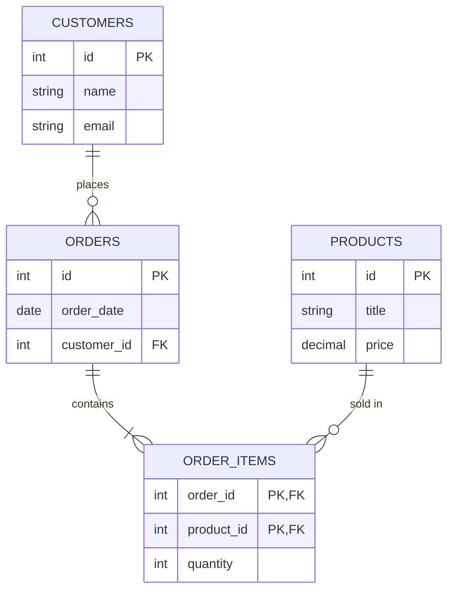

# Entity-Relationship Diagram (ERD)

> **Level 6 — Schema Design & Normalization**
> The visual database modeling blueprint used to represent tables (entities), columns (attributes), and table links (relationships) before writing SQL queries.

---

## 1. Prerequisites
- [Relational Database](../level_01/relational_database.md) — The relational structural philosophy.
- [Table (Relation)](../level_01/table.md) — The physical data containers.

---

## 2. Term Category

**Schema Design** (Entity-Relationship Diagraming): An Entity-Relationship Diagram (ERD) visually models entities, attributes, primary keys, and foreign key relationship cardinalities.


---

## 3. Explanation

### Environment Context
- **Visual / Architecture** (Executed during the design phase of database engineering. Saved as diagram assets or mapped using modeling tools like pgAdmin, dbdiagram.io, or draw.io).

### (1) Design Motivation — "Why did we design this?"
Before building a house, an architect drafts blueprints. They map out structural columns, walls, and plumbing lines. If they skip the blueprints and start building immediately, the house is highly likely to collapse.

Similarly, in database engineering, jumping straight into writing `CREATE TABLE` scripts is a major mistake. It leads to:
-   Circular references (Table A points to B, which points to A).
-   Duplicate columns across different tables.
-   Missing constraints, leading to data corruption.

We designed the **Entity-Relationship Diagram (ERD)** to serve as the structural blueprint for database schemas. 

It is a visual diagram that maps out:
-   **Entities:** The things you want to store data about (maps to **Tables**).
-   **Attributes:** The details describing those entities (maps to **Columns**).
-   **Relationships:** How the entities connect (maps to **Foreign Keys**).

Designing an ERD first ensures that your team agrees on the structure, relationships, and business rules of your application before a single line of SQL is written.

---

### (2) Cardinality and Crow's Foot Notation
ERD relationships use specialized symbols called **Crow's Foot Notation** to show the count rules (cardinality) of connections:

-   **`||` (One and Only One):** A row must connect to exactly one row.
-   **`|o` (Zero or One):** A row can connect to at most one row, but can be empty.
-   **`}|` (One or Many):** A row must connect to at least one row, but can connect to many.
-   **`}o` (Zero or Many):** A row can connect to any number of rows (including none).

---

### (3) Reality Metaphor
Imagine a university classroom map:
-   A floor blueprint shows **Rooms** (Entities).
-   Each room has attributes written on the door plate: `Room Number` and `Seating Capacity` (Attributes).
-   **Connecting Lines (Relationships):** Paths between rooms showing how students flow. A line might branch out like a fork (the Crow's Foot) pointing from a Lecture Hall to multiple Study cubicles, showing that one hall links to many study spaces.

---

### (4) Code Examples

#### Creating an ERD using Mermaid
You can generate visual ERD diagrams in Markdown using **Mermaid** blocks:



---

## 4. Common Mistakes & Pitfalls

### Mistake 1: Designing databases "blindly" without mapping out an ERD first

**The mistake:** Drafting your application's table structures inside your backend code files as you write features, without creating a centralized design layout.

**Why it's wrong:** Without a visual map, it is easy to lose track of table keys. You will end up with mismatched data types (e.g. `user_id` as `INTEGER` in one table but `VARCHAR` in another) or write redundant tables, leading to major rewrite efforts later.

**Fix: Always draw an ERD (even a simple one on a whiteboard) before writing `CREATE TABLE` scripts.**

---


### Mistake 2: Failing to Represent Cardinality (1:1, 1:N, N:M) Clearly in ERD Diagrams

**The mistake:** Drawing entity relationships without specifying cardinality notation (crow's foot / numbers).

**Why it's wrong:** Unclear ERD cardinality leads to incorrect foreign key placements during physical DDL schema creation.

*Incorrect:*
```sql
// Drawing line between User and Order without crow's foot cardinality
```

*Fix:*
```sql
Use explicit Crow's Foot notation (1-to-Many, Many-to-Many) on relationship lines
```

### Mistake 3: Designing ERD Diagrams Based on UI Screens Instead of Real-World Entities

**The mistake:** Creating ERD entities representing individual UI form pages instead of domain entities.

**Why it's wrong:** UI designs change frequently. ERD diagrams MUST model real-world business entities and logical relationships.

*Incorrect:*
```sql
// Creating ERD table 'RegistrationFormPage'
```

*Fix:*
```sql
Model core domain entities (User, Account, Subscription)
```

## 5. Practice Exercises

### Exercise 1: Mapping Entities and Cardinalities into ERD Diagrams

**Scenario:**
Draw a conceptual ERD modeling `Customer` (1) to `Order` (N) and `Order` (N) to `Product` (N) via `OrderItem`.

**Requirements:**
1. Outline entity attributes, primary keys, and relationship cardinalities in text format.

> [!check]- Answer
>
> #### Implementation
>
> ```text
> ERD Schema Relationship Architecture:
> - Customer (id PK, email)  <1 --- N>  Order (id PK, customer_id FK)
> - Order (id PK)             <1 --- N>  OrderItem (order_id FK, product_id FK)
> - Product (id PK, name)    <1 --- N>  OrderItem (order_id FK, product_id FK)
> ```
>
> #### Technical Explanation
>
> 1. ERDs model real-world business entities and their relational connections visually.
> 2. Identifies Primary Key (PK) and Foreign Key (FK) cardinalities (`1:1`, `1:N`, `N:M`).
> 3. Essential blueprint before writing DDL `CREATE TABLE` scripts.
> 
---

### Exercise 2: Translating ERD Diagrams to PostgreSQL DDL Scripts

**Scenario:**
Translate the `Customer` -> `Order` 1-to-Many ERD blueprint into executable SQL DDL statements.

**Requirements:**
1. Write DDL for `customers` and `orders`.

> [!check]- Answer
>
> #### Implementation
>
> ```sql
> CREATE TABLE customers (
>   id INTEGER GENERATED ALWAYS AS IDENTITY PRIMARY KEY,
>   email TEXT NOT NULL UNIQUE
> );
> 
> CREATE TABLE orders (
>   id INTEGER GENERATED ALWAYS AS IDENTITY PRIMARY KEY,
>   customer_id INTEGER NOT NULL REFERENCES customers(id) ON DELETE CASCADE,
>   created_at TIMESTAMPTZ NOT NULL DEFAULT CURRENT_TIMESTAMP
> );
> ```
>
> #### Technical Explanation
>
> 1. Entities become relational tables.
> 2. Entity attributes become columns with target data types.
> 3. `1:N` relationships become foreign key constraints on the child table.
> 
---

### Exercise 3: Reverse-Engineering System Catalogs into ERDs

**Scenario:**
Query `information_schema.table_constraints` to extract foreign key links for automated ERD generation tools.

**Requirements:**
1. Query `information_schema.table_constraints` filtering `constraint_type = 'FOREIGN KEY'`.

> [!check]- Answer
>
> #### Implementation
>
> ```sql
> SELECT 
>   tc.table_name AS child_table, 
>   kcu.column_name AS child_column, 
>   ccu.table_name AS parent_table, 
>   ccu.column_name AS parent_column 
> FROM information_schema.table_constraints AS tc 
> JOIN information_schema.key_column_usage AS kcu 
>   ON tc.constraint_name = kcu.constraint_name 
> JOIN information_schema.constraint_column_usage AS ccu 
>   ON ccu.constraint_name = tc.constraint_name 
> WHERE tc.constraint_type = 'FOREIGN KEY';
> ```
>
> #### Technical Explanation
>
> 1. System catalog joins extract existing foreign key topology directly from running databases.
> 2. Used by ERD visualization tools (e.g. pgAdmin, DBeaver, Prisma Studio) to render schema diagrams.
> 3. Automated database documentation.
> 
---


## 6. Related Terms
- [Normalization](normalization.md) — The mathematical rules of schema structuring.
- [Junction Table (Bridge / Pivot Table)](../level_05/junction_table.md) — The physical resolution of M:N relationships in ERDs.

---

## 7. Key Takeaways
- An ERD is a visual blueprint mapping tables, columns, and relationships.
- Entities represent tables; Attributes represent columns.
- Crow's Foot notation details relationship cardinalities (1:1, 1:N, M:N).
- Helps teams find design flaws, circular references, and key type mismatches early.
- Always draft a database diagram before writing system SQL queries.
