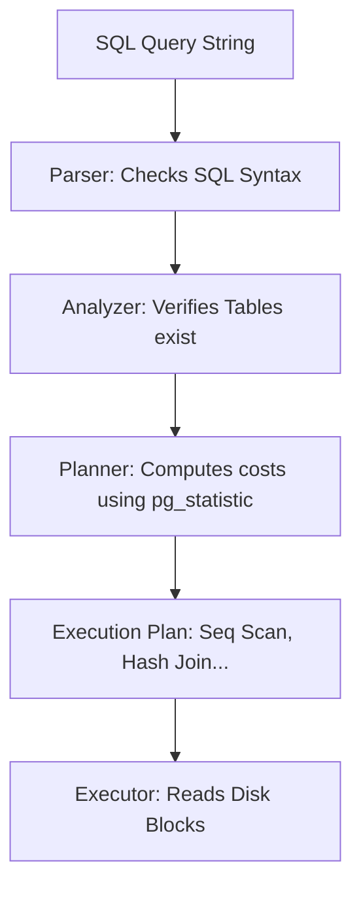

# Query Planner / Optimizer

> **Level 7 — Indexes & Query Performance**
> PostgreSQL's internal cost-based engine that parses declarative SQL queries, analyzes table statistical maps, and compiles the most efficient physical execution plan (scans, joins, sorts).

---

## 1. Prerequisites
- [`EXPLAIN` / `EXPLAIN ANALYZE`](explain_analyze.md) — The commands used to read the planner's decisions.

---

## 2. Term Category

**Performance / Optimization** (Cost-Based Query Optimizer): The Query Planner evaluates cost metrics (`random_page_cost`, table statistics) to generate the optimal physical execution plan for a SQL query.


---

## 3. Explanation

### Environment Context
- **PostgreSQL Core** (Runs automatically during the query parsing pipeline. Accesses the `pg_statistic` system catalog to evaluate plan costs).

### (1) Design Motivation — "Why did we design this?"
SQL is a **declarative** language. 

When you write a SQL query:
`SELECT * FROM users JOIN orders ON users.id = orders.user_id WHERE users.age > 30;`

You tell the database **what** data you want, but you do not tell it **how** to fetch it.

To execute this, the database must translate your text query into a step-by-step physical recipe:
1.  *Should we read users first, or orders first?*
2.  *Should we scan users sequentially or use the age index?*
3.  *Should we combine them using a Nested Loop, a Hash Join, or a Merge Join?*

We designed the **Query Planner** (or Query Optimizer) to answer these questions. 

It acts as the brain of the database: it analyzes your query, generates dozens of potential execution paths, calculates a mathematical cost score for each path, and selects the path with the lowest cost to execute.

---

### (2) Cost-Based Optimization (CBO) and Statistics
The planner calculates plan costs using arbitrary units:
-   **Sequential Page Cost (`seq_page_cost`):** The cost to read one database block sequentially off disk (defaults to `1.0`).
-   **Random Page Cost (`random_page_cost`):** The cost to read a block randomly using index lookups (defaults to `4.0`, assuming disk seek latency).

To estimate how many rows will match a query, the planner accesses the **`pg_statistic`** system catalog. 

This catalog stores detailed statistics about your tables:
-   How many rows are in the table?
-   What percentage of cells in a column are `NULL`?
-   What are the most common values in a column (histograms)?

If these statistics are **stale** (e.g., the table grew from 10 rows to 10 million rows, but the statistics were never updated), the planner will make wrong decisions—for example, choosing a slow Sequential Scan instead of an Index Scan because it thinks the table is empty.

---

### (3) Reality Metaphor
Imagine a GPS navigation app:
-   You type in a destination: *"Take me to 123 Main Street"* (declarative SQL).
-   The GPS engine calculates three different routes: Route A (highway), Route B (tolls), Route C (residential streets).
-   It estimates arrival times (costs) for each route based on speed limits and real-time traffic statistics.
-   It selects the fastest route and directs your car. If the traffic statistics are out-of-date, the GPS will accidentally direct you into a massive traffic jam.

---

### (4) Code Examples

#### The Planner's Pipeline



---

## 4. Common Mistakes & Pitfalls

### Mistake 1: Assuming the Query Planner is always right on dynamic tables

**The mistake:** Experiencing a sudden slowdown on a high-volume database, where queries that were once fast are now taking seconds, and assuming it's a bug in your code.

**Why it's wrong:** High-volume writes (inserts/deletes) alter table stats. If your autovacuum schedule is too slow, the table statistics inside `pg_statistic` become stale. The planner will calculate costs based on obsolete row counts and choose inefficient execution plans (like running sequential scans on 10-million-row tables).

**Fix: Run the `ANALYZE` maintenance command regularly to refresh system table statistics, ensuring the planner has accurate data to calculate costs.**

```sql
-- Refresh statistics for the users table immediately
ANALYZE users;
```

---


### Mistake 2: Disabling Query Planner Access Paths (`enable_seqscan = off`) in Production Configurations

**The mistake:** Setting `SET enable_seqscan = off;` globally in production postgresql.conf.

**Why it's wrong:** Setting `enable_seqscan = off` does NOT disable `Seq Scan` completely! It adds an artificial penalty cost ($10,000,000$), forcing sub-optimal index scans on small tables.

*Incorrect:*
```sql
SET enable_seqscan = off; -- ❌ Globally penalizes Seq Scan in production!
```

*Fix:*
```sql
Use enable_seqscan = off ONLY in session testing to debug query planner choices
```

### Mistake 3: Failing to Run `ANALYZE` After Large Data Batch Mutations (Outdated Planner Statistics)

**The mistake:** Inserting 10M rows and executing queries immediately without running `ANALYZE`.

**Why it's wrong:** The query planner relies on table statistics in `pg_statistic`. Outdated statistics cause the planner to choose `Seq Scan` over valid indexes. Run `ANALYZE table_name`.

*Incorrect:*
```sql
// Running queries after 10M row insertion without ANALYZE
```

*Fix:*
```sql
ANALYZE table_name; -- Updates query planner catalog statistics
```

## 5. Practice Exercises

### Exercise 1: Inspecting Cost Estimates in EXPLAIN Output

**Scenario:**
Analyze query plan cost estimates (`cost=0.00..458.00 rows=100 width=32`) in `EXPLAIN` output.

**Requirements:**
1. Explain startup cost, total cost, estimated row count, and row width metrics.

> [!check]- Answer
>
> #### Implementation
>
> ```sql
> EXPLAIN SELECT id, username, email FROM users WHERE is_active = TRUE;
> ```
>
> #### Technical Explanation
>
> 1. `cost=0.00..458.00`: `0.00` is startup cost (cost to fetch first row); `458.00` is total cost to complete the query in arbitrary disk fetch units.
> 2. `rows=100`: Estimated number of rows returned.
> 3. `width=32`: Estimated average byte width per returned row.

---

### Exercise 2: Tuning Cost Parameters (`random_page_cost`) for SSD Storage

**Scenario:**
Adjust `random_page_cost` from default `4.0` (HDD) to `1.1` (NVMe SSD) to encourage the planner to prefer index scans over sequential table scans.

**Requirements:**
1. Execute `SET random_page_cost = 1.1`.

> [!check]- Answer
>
> #### Implementation
>
> ```sql
> -- Set for current session or postgresql.conf
> SET random_page_cost = 1.1;
> 
> EXPLAIN SELECT * FROM orders WHERE customer_id = 100;
> ```
>
> #### Technical Explanation
>
> 1. Default `random_page_cost = 4.0` assumes slow spinning hard drives where random disk reads are 4x more expensive than sequential reads.
> 2. On modern SSDs/NVMe storage, random page access is nearly as fast as sequential access (`random_page_cost = 1.1`).
> 3. Instructs the query planner to favor index scans on fast storage hardware.

---

### Exercise 3: Updating Table Statistics with `ANALYZE`

**Scenario:**
Update stale catalog statistics for table `products` using `ANALYZE` after a 5,000,000 row bulk insertion.

**Requirements:**
1. Execute `ANALYZE products`.

> [!check]- Answer
>
> #### Implementation
>
> ```sql
> ANALYZE products;
> ```
>
> #### Technical Explanation
>
> 1. `ANALYZE` samples table rows to update statistical distributions in `pg_statistic`.
> 2. Accurate statistics enable the query planner to estimate row counts and select optimal join algorithms (`Hash Join` vs `Nested Loop`).
> 3. Essential step following large data import scripts.

---


## 6. Related Terms
- [`EXPLAIN` / `EXPLAIN ANALYZE`](explain_analyze.md) — Inspecting planner outputs.
- [`VACUUM` / `ANALYZE`](vacuum_analyze.md) — - Updating catalog statistics.

---

## 7. Key Takeaways
- The Query Planner chooses the most efficient physical execution path for SQL queries.
- Uses Cost-Based Optimization (CBO) to score plans in arbitrary cost units.
- Evaluates plan costs using page read weights (`seq_page_cost`, `random_page_cost`).
- Relies on table statistics in the `pg_statistic` catalog to estimate row counts.
- Stale statistics cause the planner to choose slow, inefficient scans.
- Run `ANALYZE` regularly to keep table statistics fresh and optimize query plans.
