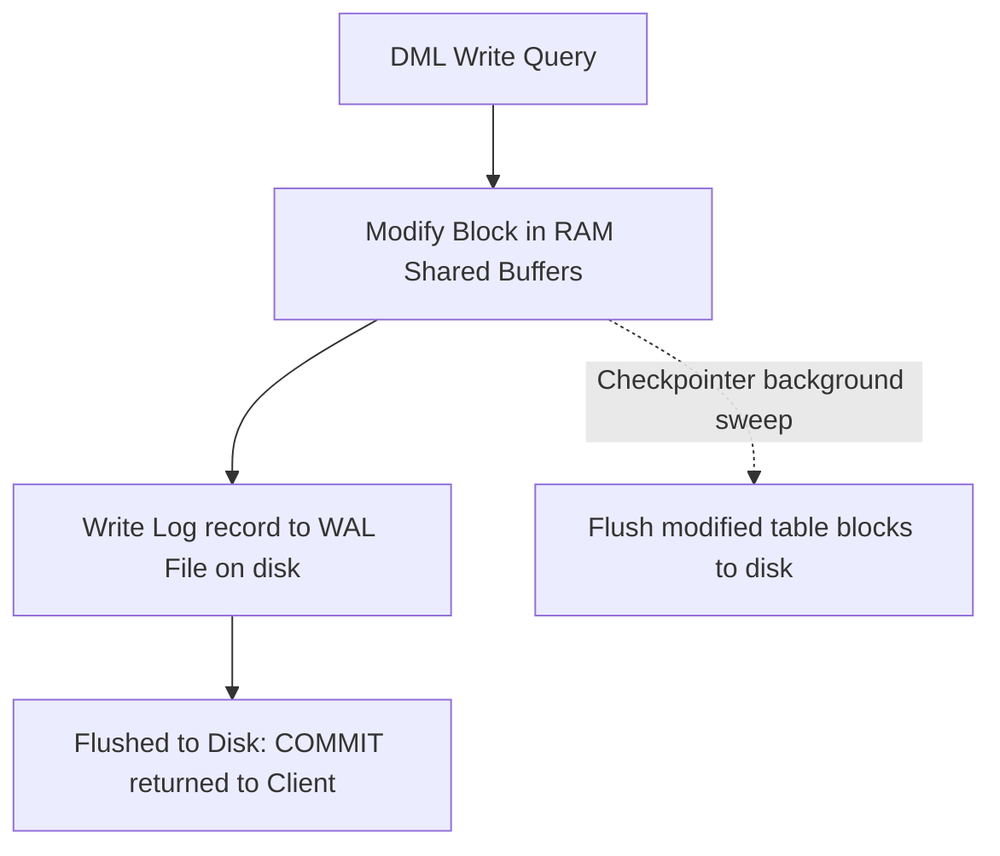

# WAL (Write-Ahead Log)

> **Level 10 — Administration, Security & Production**
> PostgreSQL's transactional logging system that records every data modification sequentially to append-only disk log files before writing changes to the actual table data files, guaranteeing crash safety.

---

## 1. Prerequisites
- [ACID Properties](../level_08/acid.md) — The Durability guarantee powered by WAL.
- [`pg_dump` / `pg_restore` (Backups)](pg_dump_restore.md) — Understanding the differences between logical and write-ahead backups.

---

## 2. Term Category

**Core Concept** (Write-Ahead Logging): Write-Ahead Logging (WAL) logs all data page modifications to disk before applying them to main heap pages, guaranteeing ACID durability.


---

## 3. Explanation

### Environment Context
- **PostgreSQL Core** (Stored physically as 16MB segment files inside the `pg_wal/` directory. Critical for crash recovery, streaming replication, and Point-in-Time Recovery).

### (1) Design Motivation — "Why did we design this?"
Relational database tables are split into standard `8KB` blocks (pages) containing row values. 

When you run an `UPDATE` query:
-   The database must update the target row.
-   These rows are scattered randomly across different database files on the hard drive.
-   Writing randomly to different sectors of a hard drive is extremely slow (disk seek latency).

If PostgreSQL was forced to write these random table blocks to disk for every single transaction, the database would choke, and write speeds would drop to a trickle.

We designed the **Write-Ahead Log (WAL)** to solve this performance bottleneck while still protecting Durability (the "D" in ACID).

---

### (2) The WAL Process Flow
Instead of modifying table files directly on disk, Postgres follows a strict pipeline:

1.  **Memory Write:** Postgres modifies the table blocks in volatile RAM (the shared buffers cache).
2.  **Sequential Log:** Postgres appends a binary description of the change to the **WAL file** on disk. Appending to a sequential file is extremely fast (zero disk seek overhead).
3.  **Commit Guarantee:** The transaction is declared committed once the WAL entry is flushed to disk.
4.  **Checkpointing:** At regular intervals (e.g. every 5 minutes), a background process called the **Checkpointer** sweeps RAM and flushes all modified table blocks to the actual table files on disk. This is called a **Checkpoint**.

---

### (3) Crash Recovery
If the database server loses power:
-   All modifications in RAM are lost.
-   The table files on disk are out-of-date or half-written.
-   Upon reboot, PostgreSQL checks the WAL. It finds the last successful Checkpoint, reads the subsequent WAL records, and **replays** the committed modifications sequentially. This restores the database to a perfect state, ensuring zero data loss.

---

### (4) Reality Metaphor
Imagine a busy auto parts warehouse:
-   **No WAL:** Every time a customer buys a spark plug, the clerk runs into the warehouse, finds the shelf, updates the stock count sticker on the box, and runs back. (Slow, exhausting).
-   **With WAL:** The clerk keeps a **Sequential Sales Ledger** notebook on the counter. When a customer buys parts, the clerk quickly scribbles: *"10:05 AM: Sold 2 spark plugs"* (write-ahead log entry) and completes the sale. 
-   At night, when the store is closed, the manager takes the ledger into the warehouse and updates all the shelf stickers at once (the Checkpoint). If the warehouse experiences a power outage mid-day, the ledger notebook preserved the records.

---

### (5) Architecture Pipeline Diagram



---

## 4. Common Mistakes & Pitfalls

### Mistake 1: Setting 'synchronous_commit = off' globally without understanding the durability risk

**The mistake:** Disabling synchronous commits in `postgresql.conf` to achieve 5x faster insert speeds, assuming it is a risk-free configuration.

**Why it's wrong:** Setting `synchronous_commit = off` instructs PostgreSQL to return success to the client immediately after updating RAM, *before* flushing the WAL record to disk. 

If the database server crashes or loses power, the last few seconds of committed transactions (orders, payments, registrations) vanish from disk, corrupting user ledgers.

**Fix: Keep `synchronous_commit = on` active for all critical transactions. Only disable it for temporary, non-critical logging tables where losing 2 seconds of history during a power failure is acceptable.**

---


### Mistake 2: Setting `fsync = off` in Production PostgreSQL Server Configurations

**The mistake:** Setting `fsync = off` in `postgresql.conf` to improve write performance.

**Why it's wrong:** `fsync = off` stops PostgreSQL from flushing WAL records to physical disk hardware. A power failure or server crash WILL cause un-recoverable database file corruption!

*Incorrect:*
```sql
fsync = off -- 💥 Causes severe database file corruption on crashes!
```

*Fix:*
```sql
Keep fsync = on enabled in production; use fast NVMe SSD storage instead
```

### Mistake 3: Exhausting Disk Storage Space Due to Un-Consumed WAL Replication Slots

**The mistake:** Creating a replication slot `pg_create_physical_replication_slot('replica1')` and abandoning the replica.

**Why it's wrong:** Active replication slots prevent PostgreSQL from deleting old WAL files until the replica consumes them. An abandoned replication slot accumulates gigabytes of WAL files until the disk is 100% full!

*Incorrect:*
```sql
// Leaving abandoned replication slot active on primary node
```

*Fix:*
```sql
Drop unused replication slots: SELECT pg_drop_replication_slot('replica1');
```

## 5. Practice Exercises

### Exercise 1: Inspecting Write-Ahead Log System Metrics

**Scenario:**
Query active Write-Ahead Log (WAL) location coordinates (`LSN`) using system functions.

**Requirements:**
1. Execute `SELECT pg_current_wal_lsn()`.

> [!check]- Answer
>
> #### Implementation
>
> ```sql
> SELECT 
>   pg_current_wal_lsn() AS current_wal_lsn,
>   pg_walfile_name(pg_current_wal_lsn()) AS current_wal_file;
> ```
>
> #### Technical Explanation
>
> 1. `pg_current_wal_lsn()` returns the Log Sequence Number (LSN) byte offset coordinate in the WAL stream.
> 2. `pg_walfile_name()` resolves the 24-character hex WAL filename (e.g. `000000010000000000000042`).
> 3. Core WAL telemetry inspection.
> 
---

### Exercise 2: Verifying WAL Durability Sequence

**Scenario:**
Explain the exact sequential order in which write transactions write to WAL buffers, disk WAL files, and table heap pages.

**Requirements:**
1. Outline the 3-step WAL write sequence.

> [!check]- Answer
>
> #### Implementation
>
> ```text
> Write-Ahead Logging (WAL) Architecture:
> Step 1: Transaction modifies data in RAM (shared_buffers) and writes a WAL log record describing the change into WAL buffers.
> Step 2: On COMMIT, PostgreSQL flushes WAL buffer bytes to disk WAL log files (/pg_wal).
> Step 3: Modified dirty table pages in shared_buffers are written to main table heap files asynchronously later during Checkpoints.
> ```
>
> #### Technical Explanation
>
> 1. WAL protocol rules: A dirty data page in RAM can NEVER be written to main table heap files until the corresponding WAL record has been flushed to disk.
> 2. Guarantees that if the server crashes or loses power, PostgreSQL can replay WAL files during startup crash recovery.
> 3. Foundation of ACID Durability in PostgreSQL.
> 
---

### Exercise 3: WAL Archiving and Retention Monitoring

**Scenario:**
Query `pg_stat_archiver` to monitor continuous WAL archiving status and archive failures.

**Requirements:**
1. Query `pg_stat_archiver`.

> [!check]- Answer
>
> #### Implementation
>
> ```sql
> SELECT 
>   archived_count, 
>   last_archived_wal, 
>   last_archived_time, 
>   failed_count, 
>   last_failed_wal 
> FROM pg_stat_archiver;
> ```
>
> #### Technical Explanation
>
> 1. `pg_stat_archiver` monitors the background WAL archiver process.
> 2. `failed_count > 0` alerts administrators that WAL archive commands (e.g. copying to S3) are failing.
> 3. Critical backup health monitoring query.
> 
---


## 6. Related Terms
- [ACID Properties](../level_08/acid.md) — The Durability guarantee powered by WAL.
- [Point-in-Time Recovery (PITR)](pitr.md) — - Restoring database state using WAL archives.
- [Replication (Streaming / Logical)](replication.md) — Using WAL to sync replica databases.
- [`pg_dump` / `pg_restore` (Backups)](pg_dump_restore.md) — Related concept: `pg_dump` / `pg_restore` (Backups).

---

## 7. Key Takeaways
- WAL records data modifications sequentially to disk before writing to table files.
- Protects Durability (ACID) while optimizing database write speeds.
- Writes to WAL are fast, sequential appends; writes to tables are slow, random page I/Os.
- Checkpoints write cached RAM updates to table files, truncating old WAL logs.
- Replays committed WAL logs upon server reboot to repair crash states.
- **Rule of Thumb:** Never turn off `synchronous_commit` for financial or user data.
- Essential engine component for replication sync and Point-in-Time Recovery.
