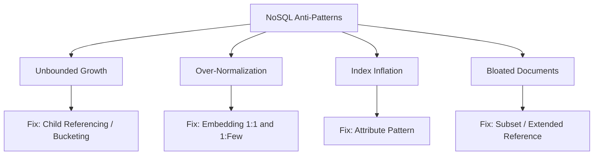

# Anti-Patterns in Schema Design

> **Level 5 — Data Modeling & Schema Design**
> The common schema design mistakes developers make when modeling documents in MongoDB, including unbounded array growth, SQL-style normalization, index inflation, and how to resolve them using correct design patterns.

---

## 1. Prerequisites
- [Schema Design (Document Modeling)](schema_design.md) — The parent modeling rules.
- [Embedding vs. Referencing](embedding_vs_referencing.md) — The core design choices.
- [Document Size Limit (16 MB)](document_size_limit.md) — The physical boundary constraint.

---

## 2. Term Category
- **Database Theory / Design Pattern**

---

## 3. Environment Context
- **Universal Standard** (Applies across all document NoSQL databases. Diagnostic criteria used during database performance audits and schema refactoring).

---

## 4. Explanation

### (1) Design Motivation — "Why did we design this?"
In document databases, there are no compilers to block you from creating bad schemas:
-   You can embed an array that grows infinitely.
-   You can create 10 separate collections and join them in every query.
-   You can create 50 indexes on a single collection.

While these schemas compile and run in development, they act as **performance time bombs** that degrade database speeds under production loads. 

We document these **Anti-Patterns** to provide developers with clear, diagnostic red flags to identify and fix bad designs before they impact users.

---

### (2) The Four Common Schema Anti-Patterns



#### 1. Unbounded Array Growth
-   *The Mistake:* Embedding an array that grows without limits (e.g., system logs or message histories) inside a single document.
-   *Result:* Bloated documents, slow queries, and eventual 16MB document size crashes.
-   *Fix:* Separate the array into its own collection (Child Referencing) or use **The Bucket Pattern**.

#### 2. Over-Normalization (Relational Design in NoSQL)
-   *The Mistake:* Splitting related entities into separate collections and using `$lookup` joins on every read query.
-   *Result:* High database CPU usage and slow API responses.
-   *Fix:* Default to **Embedding** for 1:1 and bounded 1:Few relationships.

#### 3. Index Inflation (Over-Indexing)
-   *The Mistake:* Creating separate indexes on dozens of sparse, variable fields.
-   *Result:* High RAM cache usage (indexes displace documents in memory) and slow writes (every insert must write to all indexes).
-   *Fix:* Restructure sparse keys using **The Attribute Pattern** and compound index them.

#### 4. Massively Bloated Documents
-   *The Mistake:* Embedding large, rarely read data blocks (like full article content) inside list documents.
-   *Result:* Network latency and RAM cache saturation.
-   *Fix:* Use **The Subset Pattern** or **Extended Reference Pattern**.

---

### (3) Reality Metaphor (Suitcase Packing)
Imagine packing clothes for a travel flight:
-   **Over-Normalization:** Placing every single sock, shirt, and key inside its own separate, locked mini-box, and carrying 50 mini-boxes in your hands. (Extremely slow and hard to manage).
-   **Unbounded Growth:** Stuffing dirty laundry into your suitcase forever, until the zipper bursts at the check-in counter (16MB crash).
-   **Good Schema Design:** Packing a single suitcase with exactly what you need for this week's trip (embedding), leaving heavy boots in storage (referencing).

---

### (4) Anti-Pattern Mappings

| Anti-Pattern Scenario | Primary Symptoms | Recommended Design Pattern Fix |
| :--- | :--- | :--- |
| Storing 50,000 order history IDs inside a customer document array. | BSONObj size error (10334). Slow profile reads. | **Child Referencing** (store `customer_id` in order). |
| Joining `users`, `profiles`, and `preferences` in every login query. | High CPU usage. Multi-collection lookup latency. | **One-to-One Embedding** (collapse into single document). |
| Creating 40 separate indexes for variable product specs (color, size, etc.). | RAM cache saturation. Slow write operations. | **The Attribute Pattern** (compound key-value index). |
| Embedding 1,000 reviews inside a catalog list product document. | Network payload bloat. Slow product list queries. | **The Subset Pattern** (embed top 5 reviews only). |

---

## 5. Common Mistakes & Pitfalls

### Mistake 1: Normalizing collections because "it keeps the database design clean and matches my class structures"

**The mistake:** Creating separate collections for every class in your codebase (e.g. `users`, `user_emails`, `user_phones`), assuming normalization is always the cleanest design.

**Why it's wrong:** While SQL normalization saves space, document databases are designed for speed. 

Splitting 1:1 relationships forces the database to scan disk files multiple times, eliminating NoSQL's speed advantages.

**Fix: Denormalize by default. Embed 1:1 properties inside the parent document, unless document size limits are threatened.**

---


### Mistake 2: Unbounded Array Growth Anti-Pattern

**The mistake:** Appending thousands of log entries or user activities into a single array field inside a parent document.

**Why it's wrong:** Unbounded array growth causes document size bloat, eventual 16MB BSON limit violations, and severe WiredTiger RAM re-allocation fragmentation.

*Incorrect:*
```javascript
db.users.updateOne({ _id: id }, { $push: { logs: logItem } }); // ❌ Unbounded array growth!
```

*Fix:*
```javascript
db.logs.insertOne({ userId: id, ...logItem }); // Store logs in separate collection
```

### Mistake 3: Field Name Data Anti-Pattern

**The mistake:** Storing dynamic date strings or user IDs directly as document key names `{ "2026-01-01": 100 }`.

**Why it's wrong:** Using dynamic values as field key names makes indexing and `$group` aggregations nearly impossible. Use key-value array objects `[{ date: "2026-01-01", val: 100 }]`.

*Incorrect:*
```javascript
{ "2026-01-01": 100, "2026-01-02": 200 } // ❌ Dynamic field names!
```

*Fix:*
```javascript
metrics: [{ date: "2026-01-01", count: 100 }, { date: "2026-01-02", count: 200 }]
```

## 6. Practice Exercises

### Exercise 1: Schema Diagnostic

**Problem:** You are auditing a database. The developer has created a `servers` collection. Each document contains a list of CPU usage metric measurements:
`{ hostname: "srv-01", cpu_metrics: [ { time: 10:00, value: 45 }, { time: 10:01, value: 48 }, ... ] }`
The metric is logged every second.
1.  Identify the schema anti-pattern.
2.  State the correct design pattern to resolve this.

**Expected output:**
> [!check]- Answer
> ```text
> 1. Unbounded Array Growth: Storing cpu_metrics inside a nested array that appends data every second will quickly cause the server document to bloat, eventually exceeding the 16MB limit and throwing BSON size errors.
> 2. The Bucket Pattern: Group the metrics into fixed daily or hourly documents, capping the array size to prevent bloat.
> ```
> - Assess the document growth over a 24-hour period.
> - Identify the pattern designed for time-series aggregation.

---


### Exercise 2: Identifying Schema Anti-Patterns

**Problem:** Identify anti-pattern: Storing 100,000 product reviews inside a single `product.reviews` array (Unbounded Array Anti-Pattern).

**Expected output:**
> [!check]- Answer
> ```text
> Unbounded Array Anti-Pattern
> ```
> ```text
> Unbounded Array Anti-Pattern
> ```
>
> **Explanation:** Storing unbounded arrays inside parent documents risks hitting the 16MB document limit.

---

### Exercise 3: Fixing Field Name Data Anti-Pattern

**Problem:** Refactor `{ "user_123": "admin", "user_456": "editor" }` into an array of sub-documents.

**Expected output:**
> [!check]- Answer
> ```text
> roles: [{ userId: "user_123", role: "admin" }, { userId: "user_456", role: "editor" }]
> ```
> ```javascript
> const refactored = {
>   roles: [
>     { userId: "user_123", role: "admin" },
>     { userId: "user_456", role: "editor" }
>   ]
> };
> ```
>
> **Explanation:** Converting dynamic field keys to array objects enables indexing and query filtering.

## 7. Related Terms
- [Schema Design (Document Modeling)](schema_design.md) — The parent modeling rules.
- [Embedding vs Referencing](embedding_vs_referencing.md) — The design choice.
- [Document Size Limit (16 MB)](document_size_limit.md) — The size constraint.

---

## 8. Key Takeaways
- Schema anti-patterns degrade database performance under production loads.
- Unbounded array growth causes documents to hit the 16MB limit.
- Over-normalization forces slow relational joins ($lookup), slowing reads.
- Index inflation saturates server RAM cache and slows write operations.
- Bloated documents waste network bandwidth and RAM cache capacity.
- Default to embedding for 1:1 and bounded 1:Few relations.
- Resolve time-series logs using the Bucket Pattern.
- Resolve variable specs using the Attribute Pattern.
