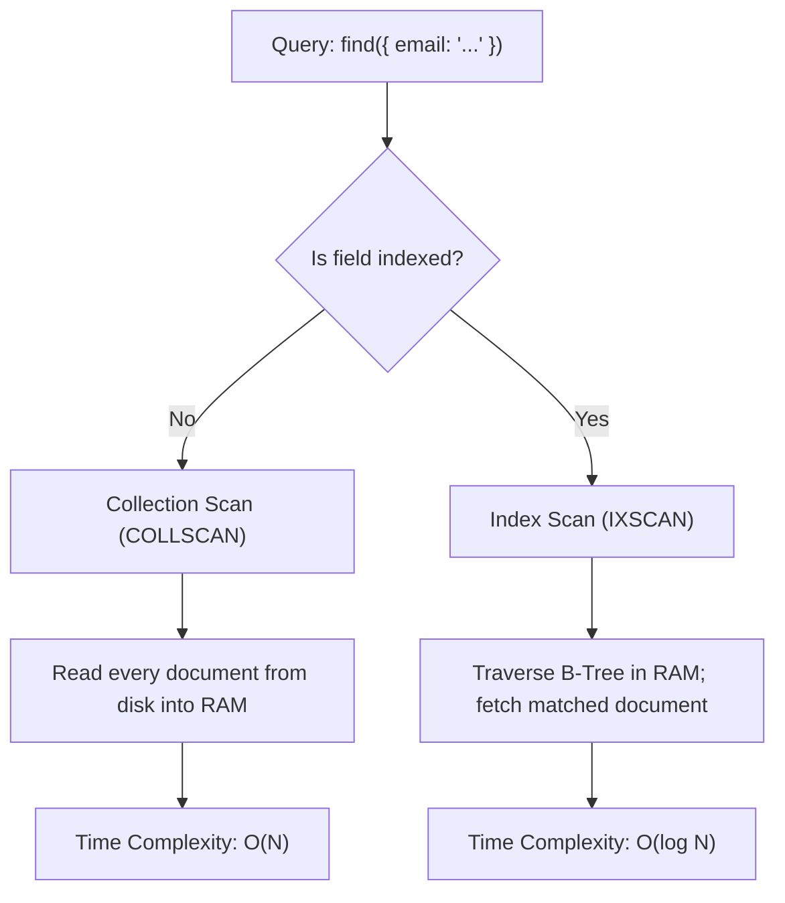

# Collection Scan vs Index Scan

> **Level 7 — Indexes & Query Performance**
> The two primary search methods MongoDB uses to retrieve data, comparing Collection Scan (COLLSCAN, which reads every document on disk) with Index Scan (IXSCAN, which searches sorted B-Tree indexes in RAM).

---

## 1. Prerequisites
- [Index (Concept in MongoDB)](index_concept.md) — The parent B-Tree index theory.
- [`explain()` Method](explain.md) — The query plan analyzer.

---

## 2. Term Category
- **Database Theory / Design Pattern**

---

## 3. Environment Context
- **Universal Standard** (Core execution paths in all relational databases (Table Scan vs Index Scan) and NoSQL engines. Determines CPU utilization and Disk I/O throughput).

---

## 4. Explanation

### (1) Design Motivation — "Why did we design this?"
To build high-performance applications, you must understand how databases retrieve data. 

When you run a query, the storage engine has two ways to find your documents. 

Understanding the differences in system resources (CPU, RAM, and Disk I/O) between these two methods is essential for database optimization.

---

### (2) The Two Search Methods



#### 1. Collection Scan (COLLSCAN)
The database reads every document in the collection sequentially to check if it matches your query.
-   **Time Complexity:** $O(N)$ (where $N$ is the total count of documents). If $N$ increases 1,000x, search times increase 1,000x.
-   **Resource Impact:** High Disk I/O (reads large files from disk), high CPU (checks every document), and high memory churn (loads irrelevant data into RAM cache).

#### 2. Index Scan (IXSCAN)
The database traverses a sorted B-Tree index to locate matching keys, and then retrieves only the matching documents from disk.
-   **Time Complexity:** $O(\log N)$ (Logarithmic scale). Searching 10 million records takes roughly 24 comparison checks.
-   **Resource Impact:** Low Disk I/O (reads only matching documents), low CPU, and high RAM efficiency (searches the index in memory).

---

### (3) Reality Metaphor (Finding Words in Dictionaries)
Imagine locating the word `"Database"` in a dictionary:
-   **COLLSCAN (Unsorted Dictionary):** A dictionary where words are printed in a completely random order. 
    -   To find `"Database"`, you must read every single page, line-by-line, from page 1 to the end. 
    -   If the dictionary is 1,000 pages, it takes hours. (Slow, linear search).
-   **IXSCAN (Sorted Dictionary):** A standard dictionary sorted alphabetically from A to Z. 
    -   You flip directly to the **"D"** section, locate `"Database"`, and read the definition. 
    -   Takes 2 seconds. (Fast, logarithmic search).

---

### (4) Comparison Summary Table

| Dimension | Collection Scan (`COLLSCAN`) | Index Scan (`IXSCAN`) |
| :--- | :--- | :--- |
| **Search Structure** | Flat sequential file scan. | Balanced B-Tree traversal. |
| **Time Complexity** | **$O(N)$** (Linear). | **$O(\log N)$** (Logarithmic). |
| **Primary Resource** | **Disk Storage** (High I/O latency). | **System RAM Cache** (High speed). |
| **CPU Usage** | High (checks every document). | Low (jumps directly to keys). |
| **SQL Equivalent** | **Table Scan** | **Index Scan** |

---

## 5. Common Mistakes & Pitfalls

### Mistake 1: Assuming a COLLSCAN is acceptable because "the collection currently only has 500 documents and queries are instant"

**The mistake:** Deploying a query to production without an index, assuming that because it takes 1ms in staging with a small database, it will stay fast under production loads.

**Why it's wrong:** As users register, the collection grows. 

A query that takes 1ms on 500 documents will take 10 seconds on 5,000,000 documents, causing database CPU spikes and service outages.

**Fix: Always design indexes for your queries during development, regardless of collection size, to guarantee logarithmic search times as your database grows.**

---


### Mistake 2: Allowing Production Queries to Fall Back to Full Collection Scans (`COLLSCAN`)

**The mistake:** Running high-frequency API queries without index coverage on 50M document collections.

**Why it's wrong:** Un-indexed queries trigger `COLLSCAN`, scanning every single document on disk, pinning CPU at 100% and exhausting WiredTiger cache memory.

*Incorrect:*
```javascript
db.users.find({ unindexedEmail: "alice@example.com" }); // ❌ COLLSCAN full collection scan!
```

*Fix:*
```javascript
db.users.createIndex({ email: 1 }); // IXSCAN index scan
```

### Mistake 3: Assuming Small Collection Scans Require Index Optimization

**The mistake:** Creating 10 compound indexes on a static 20-row lookup collection.

**Why it's wrong:** For tiny static collections (e.g. < 100 rows), `COLLSCAN` in RAM is faster than navigating B-Tree index pointers. Do not over-index small static lookup tables.

*Incorrect:*
```javascript
// Over-indexing a 10-row country lookup table
```

*Fix:*
```javascript
Keep small static lookup tables un-indexed or indexed on primary key only
```


### Mistake 4: Allowing Production Queries to Fall Back to Full Collection Scans (`COLLSCAN`)

**The mistake:** Running high-frequency API queries without index coverage on 50M document collections.

**Why it's wrong:** Un-indexed queries trigger `COLLSCAN`, scanning every single document on disk, pinning CPU at 100% and exhausting WiredTiger cache memory.

*Incorrect:*
```javascript
db.users.find({ unindexedEmail: "alice@example.com" }); // ❌ COLLSCAN full collection scan!
```

*Fix:*
```javascript
db.users.createIndex({ email: 1 }); // IXSCAN index scan
```

### Mistake 5: Assuming Small Collection Scans Require Index Optimization

**The mistake:** Creating 10 compound indexes on a static 20-row lookup collection.

**Why it's wrong:** For tiny static collections (e.g. < 100 rows), `COLLSCAN` in RAM is faster than navigating B-Tree index pointers. Do not over-index small static lookup tables.

*Incorrect:*
```javascript
// Over-indexing a 10-row country lookup table
```

*Fix:*
```javascript
Keep small static lookup tables un-indexed or indexed on primary key only
```

## 6. Practice Exercises

### Exercise 1: Search Comparison Analysis

**Problem:** You have a `users` collection.
-   Query 1: `db.users.find({ age: 25 })` (unindexed, triggers `COLLSCAN`).
-   Query 2: `db.users.find({ email: "test@mail.com" })` (indexed, triggers `IXSCAN`).
If the collection size increases from `1,000` documents to `1,000,000` documents:
1.  Explain how the search time of Query 1 will change.
2.  Explain how the search time of Query 2 will change.

**Expected output:**
> [!check]- Answer
> ```text
> 1. Query 1 (COLLSCAN) uses $O(N)$ linear time. If the collection grows 1,000x, the database must scan 1,000x more documents on disk, causing search times to increase linearly (e.g. from 2ms to 2000ms).
> 2. Query 2 (IXSCAN) uses $O(\log N)$ logarithmic time. If the collection grows 1,000x, the B-Tree search path only requires a few extra node comparisons, so search times will stay almost instant (e.g. from 0.1ms to 0.2ms).
> ```
> - Apply the principles of $O(N)$ vs $O(\log N)$ complexities.
> - Contrast disk-bound scans with memory B-Tree traversals.

---


### Exercise 2: Identifying Execution Stage in Explain Output

**Problem:** What execution stage in `explain("executionStats")` indicates an un-indexed query? (`COLLSCAN`).

**Expected output:**
> [!check]- Answer
> ```text
> COLLSCAN
> ```
> ```text
> COLLSCAN
> ```
>
> **Explanation:** `COLLSCAN` indicates that the database scanned all collection documents sequentially.

---

### Exercise 3: Ideal `totalDocsExamined` to `nReturned` Ratio

**Problem:** What is the target `totalDocsExamined` to `nReturned` ratio for fully indexed queries? (1:1 ratio or 0 for covered queries).

**Expected output:**
> [!check]- Answer
> ```text
> 1:1 ratio (totalDocsExamined equals nReturned)
> ```
> ```text
> 1:1 ratio (totalDocsExamined equals nReturned)
> ```
>
> **Explanation:** An index scan targets only matching documents, avoiding un-necessary document reads.

## 7. Related Terms
- [Index (Concept in MongoDB)](index_concept.md) — The parent B-Tree index theory.
- [`explain()` Method](explain.md) — The query planner analyzer.

---

## 8. Key Takeaways
- COLLSCAN scans every document on disk sequentially; time complexity is $O(N)$.
- IXSCAN searches a sorted B-Tree index in memory; time complexity is $O(\log N)$.
- COLLSCAN is disk-bound and CPU-heavy; IXSCAN is RAM-bound and CPU-light.
- The default search method for unindexed fields is COLLSCAN.
- The default search method for indexed fields is IXSCAN.
- A COLLSCAN that runs fast on small collections will slow down on large collections.
- Always check explain plans to verify queries use `IXSCAN` rather than `COLLSCAN`.
