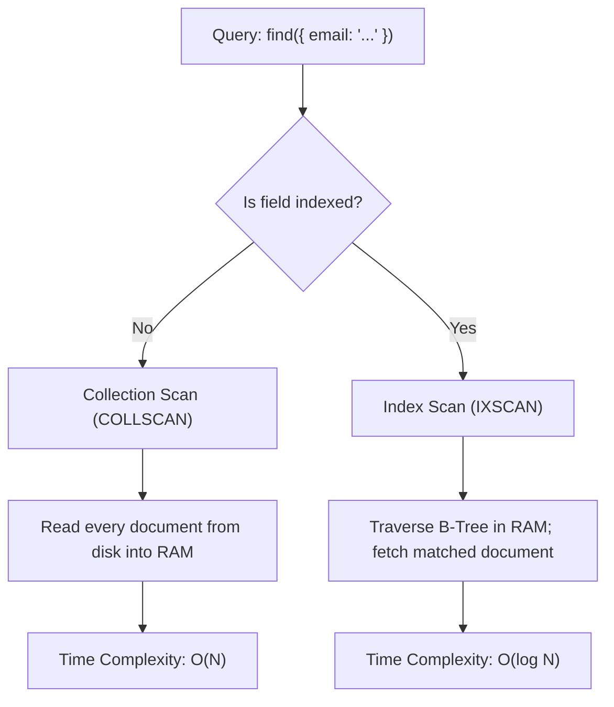

# Collection Scan vs Index Scan

> **Level 7 — Indexes & Query Performance**
> The two primary search methods MongoDB uses to retrieve data, comparing Collection Scan (COLLSCAN, which reads every document on disk) with Index Scan (IXSCAN, which searches sorted B-Tree indexes in RAM).

---

## 1. Prerequisites

- [Index (Concept in MongoDB)](index_concept.md) — The parent B-Tree index theory.
- [`explain()` Method](explain.md) — The query plan analyzer.

---

## 2. Term Category

**Index / Performance** (Query Plan Execution Strategy): Collection Scan (COLLSCAN) vs Index Scan (IXSCAN) compares scanning every raw document in a collection against utilizing B-tree index bounds to satisfy query filters.


---

## 3. Explanation

### Environment Context
- **Universal Standard** (Core execution paths in all relational databases (Table Scan vs Index Scan) and NoSQL engines. Determines CPU utilization and Disk I/O throughput).

### (1) Design Motivation — "Why did we design this?"
To build high-performance applications, you must understand how databases retrieve data. 

When you run a query, the storage engine has two ways to find your documents. 

Understanding the differences in system resources (CPU, RAM, and Disk I/O) between these two methods is essential for database optimization.

---

### (2) The Two Search Methods



#### 1. Collection Scan (COLLSCAN)
The database reads every document in the collection sequentially to check if it matches your query.
-   **Time Complexity:** $O(N)$ (where $N$ is the total count of documents). If $N$ increases 1,000x, search times increase 1,000x.
-   **Resource Impact:** High Disk I/O (reads large files from disk), high CPU (checks every document), and high memory churn (loads irrelevant data into RAM cache).

#### 2. Index Scan (IXSCAN)
The database traverses a sorted B-Tree index to locate matching keys, and then retrieves only the matching documents from disk.
-   **Time Complexity:** $O(\log N)$ (Logarithmic scale). Searching 10 million records takes roughly 24 comparison checks.
-   **Resource Impact:** Low Disk I/O (reads only matching documents), low CPU, and high RAM efficiency (searches the index in memory).

---

### (3) Reality Metaphor (Finding Words in Dictionaries)
Imagine locating the word `"Database"` in a dictionary:
-   **COLLSCAN (Unsorted Dictionary):** A dictionary where words are printed in a completely random order. 
    -   To find `"Database"`, you must read every single page, line-by-line, from page 1 to the end. 
    -   If the dictionary is 1,000 pages, it takes hours. (Slow, linear search).
-   **IXSCAN (Sorted Dictionary):** A standard dictionary sorted alphabetically from A to Z. 
    -   You flip directly to the **"D"** section, locate `"Database"`, and read the definition. 
    -   Takes 2 seconds. (Fast, logarithmic search).

---

### (4) Comparison Summary Table

| Dimension | Collection Scan (`COLLSCAN`) | Index Scan (`IXSCAN`) |
| :--- | :--- | :--- |
| **Search Structure** | Flat sequential file scan. | Balanced B-Tree traversal. |
| **Time Complexity** | **$O(N)$** (Linear). | **$O(\log N)$** (Logarithmic). |
| **Primary Resource** | **Disk Storage** (High I/O latency). | **System RAM Cache** (High speed). |
| **CPU Usage** | High (checks every document). | Low (jumps directly to keys). |
| **SQL Equivalent** | **Table Scan** | **Index Scan** |

---

## 4. Common Mistakes & Pitfalls

### Mistake 1: Assuming a COLLSCAN is acceptable because "the collection currently only has 500 documents and queries are instant"

**The mistake:** Deploying a query to production without an index, assuming that because it takes 1ms in staging with a small database, it will stay fast under production loads.

**Why it's wrong:** As users register, the collection grows. 

A query that takes 1ms on 500 documents will take 10 seconds on 5,000,000 documents, causing database CPU spikes and service outages.

**Fix: Always design indexes for your queries during development, regardless of collection size, to guarantee logarithmic search times as your database grows.**

---


### Mistake 2: Allowing Production Queries to Fall Back to Full Collection Scans (`COLLSCAN`)

**The mistake:** Running high-frequency API queries without index coverage on 50M document collections.

**Why it's wrong:** Un-indexed queries trigger `COLLSCAN`, scanning every single document on disk, pinning CPU at 100% and exhausting WiredTiger cache memory.

*Incorrect:*
```javascript
db.users.find({ unindexedEmail: "alice@example.com" }); // ❌ COLLSCAN full collection scan!
```

*Fix:*
```javascript
db.users.createIndex({ email: 1 }); // IXSCAN index scan
```


### Mistake 3: Assuming Small Collection Scans Require Index Optimization

**The mistake:** Creating 10 compound indexes on a static 20-row lookup collection.

**Why it's wrong:** For tiny static collections (e.g. < 100 rows), `COLLSCAN` in RAM is faster than navigating B-Tree index pointers. Do not over-index small static lookup tables.

*Incorrect:*
```javascript
// Over-indexing a 10-row country lookup table
```

*Fix:*
```javascript
Keep small static lookup tables un-indexed or indexed on primary key only
```


## 5. Practice Exercises

### Exercise 1: Diagnosing Collection Scans with `explain()`

**Scenario:**
Run `explain("executionStats")` on an un-indexed query filtering collection `users` by `email` and inspect `winningPlan.stage`.

**Requirements:**
1. Execute `db.users.find({ email: "alice@example.com" }).explain("executionStats")`.

> [!check]- Answer
>
> #### Implementation
>
> ```javascript
> const plan = db.users.find({ email: "alice@example.com" }).explain("executionStats");
> console.log("Execution Stage:", plan.executionStats.executionStages.stage);
> console.log("Total Docs Examined:", plan.executionStats.totalDocsExamined);
> ```
>
> #### Technical Explanation
>
> 1. Un-indexed queries produce `COLLSCAN` (Collection Scan) execution stages.
> 2. `totalDocsExamined` equals total collection document count ($O(N)$ complexity).
> 3. Consumes excessive disk IOPS and RAM cache on large collections.
> 
---

### Exercise 2: Optimizing Queries with Index Scans

**Scenario:**
Create a secondary index on `email` and verify `explain()` changes to `IXSCAN`.

**Requirements:**
1. Create index `createIndex({ email: 1 })`.
2. Inspect `explain()` output.

> [!check]- Answer
>
> #### Implementation
>
> ```javascript
> db.users.createIndex({ email: 1 });
> 
> const plan = db.users.find({ email: "alice@example.com" }).explain("executionStats");
> console.log("New Execution Stage:", plan.executionStats.executionStages.winningPlan.stage);
> console.log("Total Docs Examined:", plan.executionStats.totalDocsExamined);
> ```
>
> #### Technical Explanation
>
> 1. Creating `{ email: 1 }` transforms execution stage from `COLLSCAN` to `IXSCAN` (Index Scan).
> 2. `totalDocsExamined` drops from $N$ to 1 document ($O(\log N)$ B-tree lookup).
> 3. Dramatically reduces query latency.
> 
---

### Exercise 3: Performance Impact Comparison

**Scenario:**
Compare query latency and disk reads between COLLSCAN and IXSCAN over a 1,000,000 document collection.

**Requirements:**
1. Contrast $O(N)$ vs $O(\log N)$ execution metrics.

> [!check]- Answer
>
> #### Implementation
>
> ```text
> Performance Benchmark Comparison (1,000,000 Documents):
> - COLLSCAN: Scans 1,000,000 docs -> 450ms execution time -> High IOPS & RAM churn.
> - IXSCAN: Scans 1 index entry -> 1ms execution time -> Near-zero IOPS impact.
> ```
>
> #### Technical Explanation
>
> 1. COLLSCAN reads every collection page into RAM, evicting active cache entries.
> 2. IXSCAN targets exact B-tree key pages, minimizing memory footprint.
> 3. Core rule of MongoDB performance tuning.
> 
---


## 6. Related Terms

- [Index (Concept in MongoDB)](index_concept.md) — The parent B-Tree index theory.
- [`explain()` Method](explain.md) — The query planner analyzer.
- [Index Selectivity & Cardinality](index_selectivity.md) — Related concept: Index Selectivity & Cardinality.

---

## 7. Key Takeaways
- COLLSCAN scans every document on disk sequentially; time complexity is $O(N)$.
- IXSCAN searches a sorted B-Tree index in memory; time complexity is $O(\log N)$.
- COLLSCAN is disk-bound and CPU-heavy; IXSCAN is RAM-bound and CPU-light.
- The default search method for unindexed fields is COLLSCAN.
- The default search method for indexed fields is IXSCAN.
- A COLLSCAN that runs fast on small collections will slow down on large collections.
- Always check explain plans to verify queries use `IXSCAN` rather than `COLLSCAN`.
