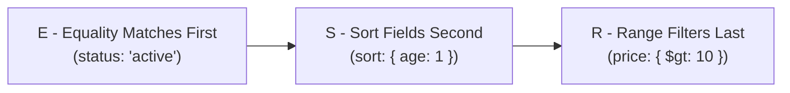

# The ESR Rule (Equality, Sort, Range)

> **Level 7 — Indexes & Query Performance**
> The fundamental database design rule for ordering fields in a compound index to maximize efficiency: Equality fields first, followed by Sort fields, and Range fields last.

---

## 1. Prerequisites

- [Compound Index](compound_index.md) — Compound index structure.
- [Index Selectivity & Cardinality](index_selectivity.md) — Analyzing query selectivity.

---

## 2. Term Category
- **Database Theory / Design Pattern**

---

## 3. Environment Context
- **Universal Standard** (Supported across all B-Tree indexing engines, including PostgreSQL and MongoDB. Determines whether queries execute instant index sorts or fall back to expensive in-memory sorts).

---

## 4. Explanation

### (1) Design Motivation — "Why did we design this?"
When designing a compound index (e.g. for a query that filters users by `status` and `age`, and sorts by `created_at`), the order of fields in the index key defines how MongoDB scans the B-Tree.

If you order the fields incorrectly (e.g. placing the range field before the sort field):
-   MongoDB must jump across different branches of the index B-Tree.
-   This breaks the sorted order of index keys, forcing the query engine to copy documents to memory and run an **In-Memory Sort**.
-   If the sorted data size exceeds **32 Megabytes**, the query crashes.

We designed **The ESR Rule** to solve this compound indexing problem. 

By ordering fields as **Equality $\rightarrow$ Sort $\rightarrow$ Range**, you ensure that matching documents are grouped, sorted, and filtered sequentially inside the B-Tree, avoiding in-memory sorting completely.

---

### (2) The ESR Components



1.  **Equality (E):** Fields queried with exact matches first (e.g. `{ status: "active" }` or `{ category: "shoes" }`). These group the B-Tree search space into a single contiguous block.
2.  **Sort (S):** Fields used in the query sort block second (e.g. `sort({ created_at: -1 })`). Within the contiguously grouped equality block, the index keys are already pre-sorted on this field, allowing MongoDB to read them sequentially.
3.  **Range (R):** Fields queried with range operators last (e.g. `{ price: { $gt: 10 } }` or `{ joined_at: { $lte: date } }`). These act as final filters on the pre-sorted stream.

---

### (3) Why placing Range before Sort breaks index sorting
If you order fields as `{ Equality, Range, Sort }`:
-   The range filter matches documents across multiple different values (e.g. prices from $11 to $100).
-   Inside the B-Tree, the index keys are sorted by price first, and then by sort keys.
-   This splits the sort keys across multiple price branches.
-   MongoDB cannot read them sequentially. It must gather the documents and sort them in memory.

---

### (4) Reality Metaphor (Filing Drawers)
Imagine sorting files in physical drawers:
-   **Equality (E):** You label the drawer: **"ACTIVE CUSTOMERS ONLY"** (groups files contiguously).
-   **Sort (S):** Inside that drawer, you arrange files by **Last Name alphabetically** (you can pull files in alphabetical order instantly).
-   **Range (R):** You check folder covers, pulling only those with a red clip saying **"Aged > 21"**. Since they are already alphabetical, the folders you pull are still sorted.
-   **Range before Sort:** You arrange folders by age first, then last name. To find all people aged > 21 sorted alphabetically, you must pull folders from 50 different age dividers, throw them in a pile on your desk, and sort them manually. (Slow, in-memory sort).

---

### (5) Code Examples

#### Applying the ESR Rule
Suppose your application executes this query:

```javascript
// Query:
db.products.find({
  category: "shoes",            // Equality (E)
  price: { $gte: 20, $lte: 50 } // Range (R)
}).sort({
  rating: -1                    // Sort (S)
});
```

Using the ESR Rule:
1.  **Equality** field: `category`
2.  **Sort** field: `rating`
3.  **Range** field: `price`

The optimal compound index order is:

```javascript
// CORRECT (Follows E -> S -> R)
db.products.createIndex({ category: 1, rating: -1, price: 1 });

// INCORRECT (E -> R -> S, forces in-memory sort!)
db.products.createIndex({ category: 1, price: 1, rating: -1 });
```

---

## 5. Common Mistakes & Pitfalls

### Mistake 1: Placing a range field (like created_at or price) before the sort field in a compound index definition

**The mistake:** Creating the index `{ status: 1, created_at: 1, score: 1 }` to optimize a query that filters by `status` and `created_at` (range), and sorts by `score`.

**Why it's wrong:** Placing the range field `created_at` before the sort field `score` breaks B-Tree sorting order, forcing MongoDB to execute an in-memory sort. 

If the query returns a large dataset, it will exceed the 32MB sort limit and crash.

**Fix: Rearrange the index keys to place the sort field before the range field: `{ status: 1, score: 1, created_at: 1 }`.**

---


### Mistake 2: Ordering Compound Index Fields in Violation of the ESR (Equality, Sort, Range) Rule

**The mistake:** Creating index `{ createdAt: -1, status: 1 }` (Range before Equality) for query `.find({ status: 'active' }).sort({ createdAt: -1 })`.

**Why it's wrong:** Violating the ESR Rule (Equality -> Sort -> Range) forces the query engine to perform in-memory sorting or scan extraneous index keys. Place Equality fields first, followed by Sort fields, followed by Range fields.

*Incorrect:*
```javascript
db.orders.createIndex({ createdAt: -1, status: 1 }); // ❌ Range/Sort before Equality!
```

*Fix:*
```javascript
db.orders.createIndex({ status: 1, createdAt: -1 }); // Correct Equality -> Sort ESR order
```

### Mistake 3: Placing Range Fields Before Sort Fields in Compound Indexes

**The mistake:** Creating index `{ status: 1, age: 1, createdAt: -1 }` for query `.find({ status: 'active', age: { $gt: 18 } }).sort({ createdAt: -1 })`.

**Why it's wrong:** Placing Range field `age` before Sort field `createdAt` forces an in-memory `SORT` stage. Place Sort fields BEFORE Range fields: `{ status: 1, createdAt: -1, age: 1 }`.

*Incorrect:*
```javascript
db.users.createIndex({ status: 1, age: 1, createdAt: -1 }); // ❌ Range before Sort!
```

*Fix:*
```javascript
db.users.createIndex({ status: 1, createdAt: -1, age: 1 }); // ESR: Equality, Sort, Range
```


### Mistake 4: Ordering Compound Index Fields in Violation of the ESR (Equality, Sort, Range) Rule

**The mistake:** Creating index `{ createdAt: -1, status: 1 }` (Range before Equality) for query `.find({ status: 'active' }).sort({ createdAt: -1 })`.

**Why it's wrong:** Violating the ESR Rule (Equality -> Sort -> Range) forces the query engine to perform in-memory sorting or scan extraneous index keys. Place Equality fields first, followed by Sort fields, followed by Range fields.

*Incorrect:*
```javascript
db.orders.createIndex({ createdAt: -1, status: 1 }); // ❌ Range/Sort before Equality!
```

*Fix:*
```javascript
db.orders.createIndex({ status: 1, createdAt: -1 }); // Correct Equality -> Sort ESR order
```

### Mistake 5: Placing Range Fields Before Sort Fields in Compound Indexes

**The mistake:** Creating index `{ status: 1, age: 1, createdAt: -1 }` for query `.find({ status: 'active', age: { $gt: 18 } }).sort({ createdAt: -1 })`.

**Why it's wrong:** Placing Range field `age` before Sort field `createdAt` forces an in-memory `SORT` stage. Place Sort fields BEFORE Range fields: `{ status: 1, createdAt: -1, age: 1 }`.

*Incorrect:*
```javascript
db.users.createIndex({ status: 1, age: 1, createdAt: -1 }); // ❌ Range before Sort!
```

*Fix:*
```javascript
db.users.createIndex({ status: 1, createdAt: -1, age: 1 }); // ESR: Equality, Sort, Range
```

## 6. Practice Exercises

### Exercise 1: ESR Index Formulation

**Problem:** You have a `users` collection. Your application frequently runs this query:
```javascript
db.users.find({
  country: "US",
  age: { $gte: 18 }
}).sort({
  joined_at: 1
});
```
Apply the ESR Rule to determine the optimal compound index key order. Write the `createIndex` command.

**Expected output:**
> [!check]- Answer
> ```javascript
> // E (country) -> S (joined_at) -> R (age)
> db.users.createIndex({ country: 1, joined_at: 1, age: 1 });
> ```
> - Identify the Equality field, the Sort field, and the Range field.
> - Arrange them in the sequence: Equality, Sort, Range.

---


### Exercise 2: Applying ESR Rule to Complex Query

**Problem:** Apply ESR rule for query `.find({ category: "tech", price: { $gte: 100 } }).sort({ rating: -1 })`.

**Expected output:**
> [!check]- Answer
> ```text
> Index: { category: 1, rating: -1, price: 1 }
> ```
> ```javascript
> db.products.createIndex({ category: 1, rating: -1, price: 1 });
> ```
>
> **Explanation:** ESR Rule orders compound index keys: 1. Equality (`category`), 2. Sort (`rating`), 3. Range (`price`).

---

### Exercise 3: ESR Rule Acronym Breakdown

**Problem:** State what ESR stands for in MongoDB index design (Equality, Sort, Range).

**Expected output:**
> [!check]- Answer
> ```text
> Equality, Sort, Range
> ```
> ```text
> Equality, Sort, Range
> ```
>
> **Explanation:** The ESR Rule defines optimal field ordering in compound B-Tree indexes.

## 7. Related Terms

- [Compound Index](compound_index.md) — The parent index type.
- [Index Selectivity & Cardinality](index_selectivity.md) — Index optimization rules.

---

## 8. Key Takeaways
- The ESR Rule dictates the optimal ordering of keys in a compound index.
- Sequence: **Equality (E) $\rightarrow$ Sort (S) $\rightarrow$ Range (R)**.
- Equality fields group matching documents contiguously in the B-Tree.
- Sort fields ensure index keys within the group are pre-sorted (prevents RAM sorts).
- Range fields filter the pre-sorted values last.
- Placing Range before Sort breaks index sorting, forcing expensive in-memory sorts.
- Prevent query crashes caused by exceeding the 32MB in-memory sort limit.
