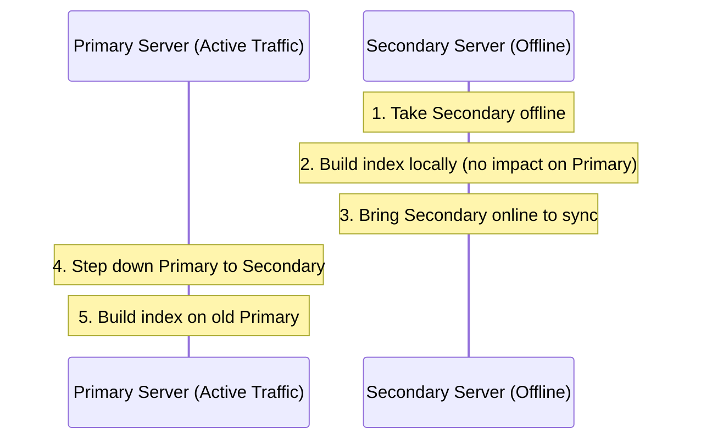

# Background / Rolling Index Builds

> **Level 7 — Indexes & Query Performance**
> The database administration practices and mechanisms used to construct indexes on large production collections without locking the database or causing application service interruptions, focusing on background builds and rolling replica set deployments.

---

## 1. Prerequisites

- [`createIndex()` / `dropIndex()`](create_drop_index.md) — The index creation triggers.
- [Replication (Streaming / Logical)](../../../12-postgres/terms/level_10/replication.md) — The replica set architecture.

---

## 2. Term Category

**Index / Performance** (Rolling & Background Index Creation): Index Builds manage asynchronous, non-blocking secondary index construction across active production collections and replica set nodes.


---

## 3. Explanation

### Environment Context
- **MongoDB Core** (Since MongoDB 4.2+, all index builds use a hybrid build system that behaves as a background process by default. Building indexes still consumes high CPU and disk write I/O).

### (1) Design Motivation — "Why did we design this?"
Building an index on a collection containing 50 million documents is a heavy task. 

The database must scan every document, extract the target field values, sort them, and compile the B-Tree blocks on disk. 

This process can take minutes to hours.

Historically, index builds were **Foreground Operations**:
-   They took an exclusive lock on the collection.
-   All read and write queries from your web application were blocked.
-   If you ran `createIndex()` on a live database at 2 PM, your entire application would freeze, causing a major outage.

To solve this, MongoDB evolved to build indexes in the **Background** by default. 

However, even background builds consume high disk I/O and CPU, which can degrade database speeds during peak hours. 

To achieve true zero-impact deployment, database administrators use **Rolling Index Builds** across replication networks.

---

### (2) Rolling Index Build Strategy
In a production Replica Set (a group of servers containing copies of the same data), you build the index one server at a time:



1.  **Stop one Secondary server** (a backup node) and restart it as a standalone instance on a different port.
2.  **Build the index** on this standalone node. Since it is offline, the high disk I/O usage has zero impact on user traffic.
3.  **Restart the node** as a secondary and let it sync up.
4.  **Repeat the process** for all other secondary nodes.
5.  **Step down the Primary node** (converting it to a secondary), making one of the indexed secondaries the new primary.
6.  **Build the index** on the old primary (now secondary) node.

This ensures the new index is deployed across the database cluster with **zero downtime or latency spikes** for active users.

---

### (3) Reality Metaphor (Highway Repainting)
Imagine painting new lane markers on a busy city highway:
-   **Foreground Build (Locked):** Closing **all lanes** of the highway during rush hour at 5 PM to paint lines. Cars back up for miles, creating a gridlock (downtime).
-   **Background Build:** Painting lines at night, closing only one lane at a time while traffic flows slowly in the remaining lanes. (Slight delays, but highway stays open).
-   **Rolling Build:** Redirecting all cars to a **parallel detour highway** (the secondary node) while you close the main highway completely to paint. Drivers experience zero delays.

---

## 4. Common Mistakes & Pitfalls

### Mistake 1: Running createIndex() on a massive production database during peak business hours, assuming background builds have "zero performance impact"

**The mistake:** Executing `db.orders.createIndex({ user_id: 1 })` on a 100-million-row collection at 10 AM on a Monday, thinking it is safe because MongoDB runs it in the background.

**Why it's wrong:** Even though MongoDB does not lock the collection (reads and writes can continue), the index build saturates disk I/O and consumes significant CPU. 

This slows down all other active queries, causing API timeouts and connection pool bottlenecks, which can still lead to a production outage.

**Fix: Always schedule index builds during low-traffic windows (e.g. 2 AM), or use the rolling index build strategy on replica sets.**

---


### Mistake 2: Running Foreground Index Builds in Legacy MongoDB Servers During Peak Hours

**The mistake:** Building large indexes on 50M document production collections in foreground mode.

**Why it's wrong:** In modern MongoDB (4.2+), all index builds use an optimized hybrid background build protocol. In older versions, foreground builds locked databases.

*Incorrect:*
```javascript
// Building 50M index without monitoring build impact
```

*Fix:*
```javascript
Monitor active index builds using db.currentOp() or cancel via db.killOp()
```


### Mistake 3: Canceling Active Index Builds via `killOp` Improperly

**The mistake:** Killing index builds abruptly without checking build progress.

**Why it's wrong:** Modern index builds can be dropped safely using `db.collection.dropIndex()`, which cleanly aborts in-progress builds.

*Incorrect:*
```javascript
db.killOp(opId); // May leave build state un-cleaned
```

*Fix:*
```javascript
db.collection.dropIndex("index_name"); // Cleanly aborts active index build
```


## 5. Practice Exercises

### Exercise 1: Monitoring Active Index Build Progress

**Scenario:**
Inspect active index build progress on collection `large_orders` in `mongosh` using `currentOp()`.

**Requirements:**
1. Query `db.currentOp({ "command.createIndexes": { $exists: true } })`.

> [!check]- Answer
>
> #### Implementation
>
> ```javascript
> const ops = db.currentOp({
>   "command.createIndexes": { $exists: true }
> });
> console.log("Active Index Builds:", ops.inprog);
> ```
>
> #### Technical Explanation
>
> 1. `db.currentOp()` tracks ongoing background operations including index builds.
> 2. Reports progress percentage, target collection, and build phase.
> 3. Essential tool for DBA database operations.

---

### Exercise 2: Rolling Index Build Process on Replica Sets

**Scenario:**
Formulate a zero-downtime rolling index creation procedure across a 3-node MongoDB replica set.

**Requirements:**
1. Outline rolling index build steps on secondary nodes before primary failover.

> [!check]- Answer
>
> #### Implementation
>
> ```text
> Rolling Index Build Procedure:
> - Step 1: Stop secondary node A; restart in standalone mode on maintenance port.
> - Step 2: Create index directly on standalone node A; restart node A in replica set mode.
> - Step 3: Repeat step 1 & 2 for secondary node B.
> - Step 4: Step down primary node C; repeat procedure for node C once demoted.
> ```
>
> #### Technical Explanation
>
> 1. Rolling index builds prevent production cluster performance degradation during heavy index construction.
> 2. Constructs indexes on secondary nodes independently before primary stepdown.
> 3. Zero downtime production deployment strategy.

---

### Exercise 3: Aborting Running Index Builds

**Scenario:**
Abort a runaway background index build on collection `logs` using `dropIndexes()`.

**Requirements:**
1. Execute `db.logs.dropIndex("idx_runaway")`.

> [!check]- Answer
>
> #### Implementation
>
> ```javascript
> db.logs.dropIndex("idx_runaway");
> ```
>
> #### Technical Explanation
>
> 1. Calling `dropIndex()` on an in-progress index build sends an abort signal to the build thread.
> 2. Safely halts index construction and cleans up temporary build files.
> 3. Restores database CPU and IOPS capacity.

---


## 6. Related Terms

- [`createIndex()` / `dropIndex()`](create_drop_index.md) — Index management.
- [Replication (Streaming / Logical)](../../../12-postgres/terms/level_10/replication.md) — Cluster architecture.

---

## 7. Key Takeaways
- Foreground index builds lock collections, blocking all read and write queries.
- Modern MongoDB builds indexes in the background (hybrid build) by default.
- Background builds allow queries to run but still consume high disk I/O and CPU.
- Rolling index builds construct indexes one node at a time across replica sets.
- Rolling builds guarantee zero performance impact on live production traffic.
- Never run heavy index builds during peak hours on active databases.
- View active index builds using `db.currentOp()` commands.
