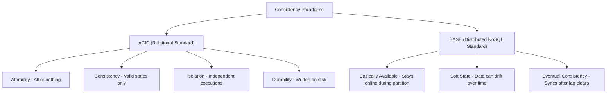

# ACID vs BASE

> **Level 8 — Transactions, Consistency & Durability**
> The comparison of database consistency paradigms, contrasting ACID (Atomicity, Consistency, Isolation, Durability—relational standard) with BASE (Basically Available, Soft state, Eventual consistency—NoSQL standard), and explaining how MongoDB bridges both models.

---

## 1. Prerequisites

- [MongoDB](../level_01/mongodb.md) — MongoDB architecture.
- [Multi-Document Transaction](multi_document_transaction.md) — MongoDB's ACID feature.

---

## 2. Term Category

**Core Concept** (Transactional Consistency Paradigm): ACID vs BASE contrasts strict relational transaction guarantees (Atomicity, Consistency, Isolation, Durability) against distributed NoSQL eventual consistency principles (Basically Available, Soft State, Eventual Consistency).


---

## 3. Explanation

### Environment Context
- **Universal Standard** (Core distributed systems science. Governs structural design trade-offs between relational database systems (like PostgreSQL) and NoSQL cluster architectures).

### (1) Design Motivation — "Why did we design this?"
In database science, you cannot build a system that has infinite speed, infinite scale, and perfect consistency simultaneously (known as the **CAP Theorem**). 

Instead, database engines must choose a consistency paradigm.

Traditionally, relational databases (like PostgreSQL) chose **ACID**. 

They prioritize data correctness and strict consistency above all else, which limits their ability to scale horizontally across multiple servers easily.

NoSQL systems (like early MongoDB) chose **BASE**. 

They prioritized horizontal scaling, low latency, and high availability, accepting that data might take a few seconds to synchronize across servers.

Understanding these paradigms helps you choose the correct model for your queries, rather than assuming NoSQL is "unreliable" or SQL is "slow."

---

### (2) The Consistency Paradigms



#### 1. ACID (Strict Consistency)
-   **Atomicity:** Writes are all-or-nothing.
-   **Consistency:** Data must conform to schema rules (constraints, keys).
-   **Isolation:** Concurrent transactions do not affect each other.
-   **Durability:** Committed data is permanently saved on disk.
-   *Best For:* Financial systems, billing ledgers, and order checkouts.

#### 2. BASE (Flexible Consistency)
-   **Basically Available (BA):** The system values availability. It stays online during network splits, even if some nodes return stale data.
-   **Soft State (S):** The data state can drift over time without user action (due to lag).
-   **Eventual Consistency (E):** The system guarantees that if no new updates are made, all replica nodes will eventually sync and show the same data.
-   *Best For:* Social media feeds, likes counters, telemetry logs, and global catalogs.

---

### (3) How MongoDB Bridges Both Worlds
MongoDB is unique because **it does not force you to choose between ACID and BASE.**
-   **By Default (BASE):** If you read from secondaries and write with `w: 1`, MongoDB behaves as a high-speed, eventually consistent BASE database.
-   **Opt-in (ACID):** If you execute queries using **Sessions** and **Multi-Document Transactions** with `writeConcern: "majority"` and `readConcern: "majority"`, MongoDB provides full **ACID compliance** matching PostgreSQL.

---

### (4) Comparison Summary Table

| Dimension | ACID Model (PostgreSQL Default) | BASE Model (Historical NoSQL Default) |
| :--- | :--- | :--- |
| **Consistency Target** | **Immediate Consistency** (always fresh). | **Eventual Consistency** (stale reads possible). |
| **Scaling Strategy** | Vertical (bigger servers). | Horizontal (more cheap servers/shards). |
| **Integrity Rules** | Hard constraints (Foreign Keys). | Soft constraints (Schema Validation). |
| **Read Latency** | Higher (blocked by locks). | Lower (reads from any node). |
| **MongoDB Mode** | Opt-in via transactions/majority settings. | Default operation mode. |

---

## 4. Common Mistakes & Pitfalls

### Mistake 1: Assuming MongoDB cannot be used for financial or transactional systems because NoSQL databases are "eventually consistent"

**The mistake:** Rejecting MongoDB for a project requiring bank transfers, assuming it only supports BASE and cannot guarantee ACID consistency.

**Why it's wrong:** Modern MongoDB (since 4.0/4.2) is fully ACID-compliant. 

By wrapping your code inside `session.withTransaction()` and configuring majority write/read concerns, you get the same transactional guarantees as SQL databases.

**Fix: Configure your critical database routes to use transactions and majority write concerns, while keeping standard analytics routes in fast BASE mode.**

---


### Mistake 2: Assuming MongoDB Lacks Multi-Document ACID Transaction Guarantees

**The mistake:** Believing MongoDB supports only eventual consistency without multi-document transactions.

**Why it's wrong:** MongoDB 4.0+ added multi-document ACID transactions across replica sets and sharded clusters. Single-document operations have always been atomic.

*Incorrect:*
```javascript
// Assuming multi-document ACID transactions are impossible in MongoDB
```

*Fix:*
```javascript
Use client sessions and withTransaction() for multi-document ACID operations
```

### Mistake 3: Using Multi-Document Transactions for Single-Document Embedded Schema Updates

**The mistake:** Wrapping single-document `$set` updates in explicit multi-document ACID transaction sessions.

**Why it's wrong:** Single-document updates are natively atomic in MongoDB without transactions. Wrapping single-document updates in transactions adds un-necessary performance latency.

*Incorrect:*
```javascript
const session = client.startSession(); session.startTransaction(); await db.users.updateOne(..., { session }); // ❌ Unnecessary transaction for single doc!
```

*Fix:*
```javascript
await db.users.updateOne(...); // Single-document updates are natively atomic
```

## 5. Practice Exercises

### Exercise 1: Multi-Document ACID Transactions for Financial Transfers

**Scenario:**
Execute a multi-document ACID transaction transferring `$100.00` from account A to account B, ensuring atomicity.

**Requirements:**
1. Start session, execute `withTransaction()`, decrement A, increment B.

> [!check]- Answer
>
> #### Implementation
>
> ```javascript
> const session = db.getMongo().startSession();
> session.startTransaction({
>   readConcern: { level: "snapshot" },
>   writeConcern: { w: "majority" }
> });
> 
> try {
>   db.accounts.updateOne(
>     { _id: "accountA" },
>     { $inc: { balance: -100 } },
>     { session }
>   );
>   db.accounts.updateOne(
>     { _id: "accountB" },
>     { $inc: { balance: 100 } },
>     { session }
>   );
>   session.commitTransaction();
> } catch (err) {
>   session.abortTransaction();
>   throw err;
> } finally {
>   session.endSession();
> }
> ```
>
> #### Technical Explanation
>
> 1. `startTransaction()` initiates an ACID transaction boundary over a client session.
> 2. Guarantees that both account balance updates succeed together or abort with zero side effects.
> 3. Enforces strict ACID compliance in document databases.
> 
---

### Exercise 2: Single-Document Atomic Updates vs BASE Patterns

**Scenario:**
Refactor a multi-document payment status update into a single atomic document update using embedded subdocuments.

**Requirements:**
1. Update order status and audit log atomically in 1 document.

> [!check]- Answer
>
> #### Implementation
>
> ```javascript
> db.orders.updateOne(
>   { _id: new ObjectId("60c72b2f9b1d8b2c88888880") },
>   {
>     $set: { status: "completed" },
>     $push: { history: { status: "completed", timestamp: new Date() } }
>   }
> );
> ```
>
> #### Technical Explanation
>
> 1. Single-document updates are inherently atomic in MongoDB without initiating multi-document transactions.
> 2. Embedding related status history inside the parent document avoids transaction overhead.
> 3. Preferred design pattern when ACID scope fits inside 1 document.
> 
---

### Exercise 3: Balancing ACID Rigor vs BASE Scalability

**Scenario:**
Evaluate when to use strict ACID transactions vs BASE eventual consistency.

**Requirements:**
1. Formulate architecture selection guide for ACID vs BASE.

> [!check]- Answer
>
> #### Implementation
>
> ```text
> Transaction Model Decision Guide:
> - Single-Document Operations: Inherently ACID (fastest, maximum throughput).
> - Multi-Document Transactions: Strict ACID for financial ledger writes (higher latency, lock overhead).
> - Distributed Eventual Consistency (BASE): Async background sync, analytics counters, and logs.
> ```
>
> #### Technical Explanation
>
> 1. Single-document atomic writes provide high-speed ACID guarantees by default.
> 2. Reserve multi-document transactions for critical cross-collection financial operations.
> 3. Maximizes system throughput and cluster scalability.
> 
---


## 6. Related Terms

- [Multi-Document Transaction](multi_document_transaction.md) — MongoDB's ACID engine.
- [Replica Set](../level_09/replica_set.md) — The distributed nodes.
- [Atomicity in MongoDB](atomicity.md) — Related concept: Atomicity in MongoDB.

---

## 7. Key Takeaways
- ACID enforces immediate consistency; BASE accepts eventual consistency.
- ACID is relational standard; BASE is distributed NoSQL standard.
- Basically Available (BA) guarantees database response uptime.
- Soft State (S) allows data versions to drift temporarily.
- Eventual Consistency (E) ensures nodes synchronize once log lag clears.
- MongoDB bridges both models, allowing developers to choose per-query.
- Enforce ACID in MongoDB using transactions and majority write/read concerns.
