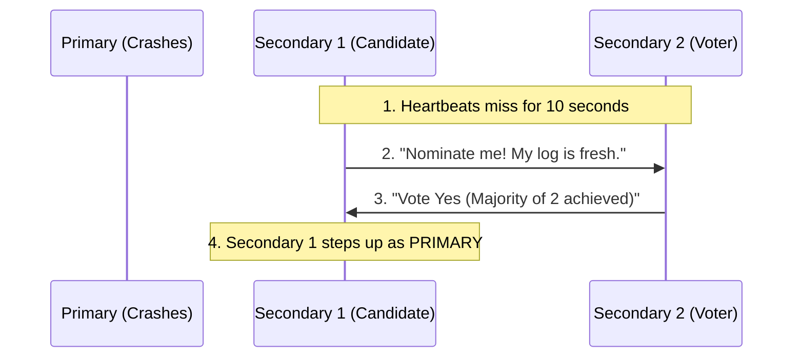

# Automatic Failover & Elections

> **Level 9 — Replica Sets & Sharding**
> The automated process by which a MongoDB replica set detects primary node failures through heartbeat pings and elects a new primary to restore write capabilities within seconds, ensuring continuous database uptime.

---

## 1. Prerequisites

- [Primary / Secondary / Arbiter](primary_secondary_arbiter.md) — The cluster roles.

---

## 2. Term Category

**Administration / Operations** (Raft-like Primary Election Protocol): Failover and Elections automatically elect a new primary node when the active primary node becomes unreachable or steps down.


---

## 3. Explanation

### Environment Context
- **MongoDB Core** (Calculated automatically by consensus protocols. During the short election window—typically under 12 seconds—the replica set blocks writes and becomes read-only).

### (1) Design Motivation — "Why did we design this?"
In traditional database administration, if the main database server crashes, a human system administrator receives an alert, wakes up, inspects logs, manually launches a standby server, updates the DNS IP records, and restarts the web application. 

This recovery process can take minutes or hours.

We designed **Automatic Failover and Elections** to eliminate this human bottleneck. 

A MongoDB replica set constantly monitors itself. 

If the primary node drops off the network, the remaining secondaries immediately run an automated election, promote a new primary, and update the client drivers, restoring database write capabilities automatically in seconds.

---

### (2) Step-by-Step Failover Mechanics



#### 1. Heartbeat Pings
Every node in a replica set sends a ping request to every other node **once every 2 seconds**.

#### 2. Timeout Detection
If the Primary node does not respond to a heartbeat within **10 seconds** (controlled by the database parameter `electionTimeoutMillis`), the other nodes mark it as offline.

#### 3. Nominating Candidates
A Secondary node with the most up-to-date replication log nominates itself as a candidate to become the new Primary.

#### 4. Casting Votes
The remaining nodes check the candidate. 
-   They vote **Yes** if the candidate is reachable, has the most recent data log, and the voter has no connection to the old primary.
-   To win, the candidate **must secure a strict majority** of votes from the total configured replica set nodes.

#### 5. Driver Redirection
Once the election is resolved, the new primary takes over. 

The client driver (e.g. your Node.js application) automatically learns of the change and routes new writes to the new primary with zero query code changes.

---

### (3) Reality Metaphor (Radio Check-ins)
Imagine a team of guards in a dark forest:
-   **Heartbeats:** Every 2 minutes, guards check in over their walkie-talkies: *"Guard A here" ... "Guard B here" ... "Captain here."*
-   **Failover Election:** Suddenly, the Captain goes silent. 
    -   Ten minutes pass without a check-in. 
    -   Guard B calls out: *"Captain is down! I am nominating myself as the new squad leader. Guard C, do you agree?"* 
    -   Guard C replies: *"Yes, your radio signal is strong, and you have the map. I vote for you."* 
    -   Guard B takes lead, and the mission continues.

---

## 4. Common Mistakes & Pitfalls

### Mistake 1: Configuring an even number of voting nodes in a replica set (e.g., a 4-node cluster) without an Arbiter, leading to election deadlocks during network splits

**The mistake:** Setting up a 4-node replica set, assuming: *"Four servers are safer than three."*

**Why it's wrong:** If a network split occurs, dividing the cluster exactly in half (2 servers on the West Coast, 2 servers on the East Coast):
-   To elect a primary, a node needs a strict majority of 4 nodes, which is **3 votes**.
-   Neither side can communicate with the other, so the East Coast can only get 2 votes, and the West Coast can only get 2 votes.
-   Because neither side can achieve 3 votes, **no primary can be elected**. 
-   Your entire database becomes read-only until the network split is repaired.

**Fix: Always maintain an ODD number of voting members in your replica set (3, 5, or 7). If you have an even number of data nodes, deploy a vote-only Arbiter node to break ties.**

---


### Mistake 2: Configuring Even Numbers of Voting Replica Set Nodes Without Arbiters

**The mistake:** Deploying a 2-node or 4-node replica set cluster without an arbiter.

**Why it's wrong:** Primary elections require a strict MAJORITY of votes ($N/2 + 1$). In a 2-node cluster, if 1 node drops, remaining 1 node cannot reach majority ($2/2 + 1 = 2$), preventing primary election. Use odd node counts (3, 5).

*Incorrect:*
```javascript
// 2-node replica set cluster configuration
```

*Fix:*
```javascript
Deploy 3 nodes or add 1 voting Arbiter to achieve odd voting counts
```

### Mistake 3: Setting Low Heartbeat Timeout Thresholds (`electionTimeoutMillis`) in Unstable Networks

**The mistake:** Setting `electionTimeoutMillis: 1000` over WAN networks.

**Why it's wrong:** Low election timeouts cause frequent false-alarm elections on minor network blips, dropping active primary connections.

*Incorrect:*
```javascript
settings: { electionTimeoutMillis: 1000 } // ❌ Triggers false-alarm elections!
```

*Fix:*
```javascript
Keep default electionTimeoutMillis: 10000 (10 seconds)
```

## 5. Practice Exercises

### Exercise 1: Triggering Manual Primary Stepdown with `replSetStepDown`

**Scenario:**
Step down the active primary node for maintenance using `rs.stepDown()` to trigger an automatic election.

**Requirements:**
1. Execute `rs.stepDown(60)`.

> [!check]- Answer
>
> #### Implementation
>
> ```javascript
> rs.stepDown(60);
> ```
>
> #### Technical Explanation
>
> 1. `rs.stepDown(seconds)` forces the current primary node to relinquish leadership and become a secondary.
> 2. Blocks the stepping-down node from seeking election for the specified duration (60s).
> 3. Triggers an automatic election among remaining secondary nodes in ~10 seconds.
> 
---

### Exercise 2: Configuring Node Priority for Primary Election Preference

**Scenario:**
Configure secondary node `node1.example.com` with `priority: 2` so it is preferred during primary elections.

**Requirements:**
1. Update `rs.conf()` node priority.

> [!check]- Answer
>
> #### Implementation
>
> ```javascript
> const cfg = rs.conf();
> cfg.members[0].priority = 2; // Higher priority node
> cfg.members[1].priority = 1;
> cfg.members[2].priority = 1;
> 
> rs.reconfig(cfg);
> ```
> 
> #### Technical Explanation
>
> 1. Higher `priority` values (e.g. `2` vs `1`) make a node eligible to win elections over lower priority nodes.
> 2. Nodes with `priority: 0` can never become primary (used for passive read-only secondaries).
> 3. Directs primary workload placement to high-capacity hardware.
> 
---

### Exercise 3: Inspecting Replication Election States with `rs.status()`

**Scenario:**
Inspect replica set member state codes (`PRIMARY: 1`, `SECONDARY: 2`) using `rs.status()`.

**Requirements:**
1. Check `rs.status().members[i].stateStr`.

> [!check]- Answer
>
> #### Implementation
>
> ```javascript
> const status = rs.status();
> status.members.forEach(m => {
>   console.log(`Node: ${m.name} | State: ${m.stateStr} | Health: ${m.health}`);
> });
> ```
>
> #### Technical Explanation
>
> 1. `rs.status()` checks heartbeat ping status across all replica set nodes.
> 2. `stateStr` reports current node role (`PRIMARY`, `SECONDARY`, `STARTUP2`, `RECOVERING`).
> 3. Essential health check for replica set operations.
> 
---


## 6. Related Terms

- [Replica Set](replica_set.md) — The parent cluster architecture.
- [Primary / Secondary / Arbiter](primary_secondary_arbiter.md) — Node roles.

---

## 7. Key Takeaways
- Automatic Failover removes the need for manual DB administrator recovery.
- Nodes exchange heartbeat pings once every 2 seconds.
- Primary offline status is triggered after a 10-second heartbeat silence.
- Secondaries hold an election to nominate and vote on a new Primary.
- Winning an election requires a strict majority of configured votes.
- Keep an odd number of voting nodes (3, 5, etc.) to prevent split-brain deadlocks.
- During elections, writes are blocked, and the cluster is read-only.
