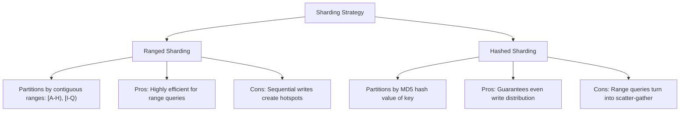

# Hashed vs. Ranged Sharding

> **Level 9 — Replica Sets & Sharding**
> The two strategies used to distribute data across shards: Ranged Sharding (which partitions by contiguous key value ranges) and Hashed Sharding (which partitions by MD5 hashes of key values to ensure even write distribution).

---

## 1. Prerequisites

- [Shard Key](shard_key.md) — The partitioning index key.
- [Targeted vs. Scatter-Gather Queries](targeted_vs_scatter.md) — The routing execution patterns.

---

## 2. Term Category
- **Database Theory / Design Pattern**

---

## 3. Environment Context
- **MongoDB Core** (Configured during collection sharding initialization. Determines how MongoDB calculates range boundaries and partitions chunks).

---

## 4. Explanation

### (1) Design Motivation — "Why did we design this?"
As learned in `shard_key.md`, selecting a shard key requires balancing write distribution (preventing hotspots) and query isolation (targeted queries).

To manage this trade-off, MongoDB provides two partitioning strategies. 

If your queries frequently scan ranges of data (like searching logs from July 1st to July 7th), you want that data kept together on the same server. 

If your writes are highly sequential (like auto-incrementing order IDs), you want that data scrambled across all servers to prevent write bottlenecks.

We designed **Ranged Sharding** and **Hashed Sharding** to let developers choose the optimal data distribution strategy for their workload.

---

### (2) The Two Sharding Strategies



#### 1. Ranged Sharding (Contiguous Buckets)
Partitions documents based on contiguous ranges of the shard key values.
-   *Example:* Shard 1 owns `[A, H)`, Shard 2 owns `[H, Q)`, Shard 3 owns `[Q, Z)`.
-   **Pros:** Highly efficient for range queries on the shard key (e.g. `find({ name: { $gt: "Alice", $lt: "Charlie" } })` is targeted to a single shard).
-   **Cons:** High risk of write hotspots if shard key values are monotonically increasing (like timestamps).

#### 2. Hashed Sharding (Uniform Scrambling)
Computes an MD5 hash of the shard key value, and partitions chunks based on the hashed number.
-   **Pros:** Guarantees even write distribution across all shards, preventing write hotspots even if keys are sequential (since `hash(10:00:00)` and `hash(10:00:01)` map to completely different numbers).
-   **Cons:** Inefficient for range queries. Because the hash function scatters contiguous values randomly across the cluster, a range query must scan **every shard** (Scatter-Gather).

---

### (3) Reality Metaphor (Sorting Mail)
-   **Ranged Sharding:** Sorting packages by **Last Name**. 
    -   All names starting A–G go to Box 1, H–P to Box 2. 
    -   If you need to find all "Smiths", you only check Box 3. (Fast range). 
    -   But if all arriving mail is for "Smith", Box 3 overflows while Boxes 1 and 2 stay empty.
-   **Hashed Sharding:** Placing mail in a **Lottery Drum**, tumbling it, and distributing envelopes randomly. 
    -   Every box gets exactly the same weight. (No write hotspots). 
    -   But if you need to find all "Smiths", you must search all boxes because the files are scattered.

---

### (4) Code Examples

#### Declaring Hashed vs. Ranged Sharding
Here is how to configure the sharding strategies in mongosh:

```javascript
// Database: ecom

// 1. RANGED SHARDING: Shard key is standard ascending (1)
// Optimizes: range queries on customer_id
db.orders.createIndex({ customer_id: 1 });
sh.shardCollection("ecom.orders", { customer_id: 1 });

// 2. HASHED SHARDING: Shard key is declared as 'hashed'
// Optimizes: write distribution on monotonically increasing timestamps
db.logs.createIndex({ created_at: "hashed" }); // Special index type!
sh.shardCollection("ecom.logs", { created_at: "hashed" });
```

---

## 5. Common Mistakes & Pitfalls

### Mistake 1: Choosing Hashed Sharding on a field that your application frequently queries using range filters ($gt, $lt)

**The mistake:** Sharding a `products` collection using `{ price: "hashed" }` and running the query `db.products.find({ price: { $gte: 20, $lte: 50 } })` expecting high speeds.

**Why it's wrong:** Because the prices are hashed and scrambled, consecutive price values are scattered across different physical shards. 

`mongos` cannot isolate the range, forcing a slow scatter-gather query that broadcasts to all shards in the cluster.

**Fix: Use Ranged Sharding if your primary access patterns rely on range scans. Use Hashed Sharding strictly for equality lookups (like `findOne({ user_id: 123 })`) or write-heavy sequential fields.**

---


### Mistake 2: Choosing Ranged Sharding for Monotonically Increasing Keys (Hotspot Anti-Pattern)

**The mistake:** Using Ranged Sharding on `_id` or `createdAt` timestamp fields.

**Why it's wrong:** Monotonically increasing keys under Ranged Sharding route ALL new write insertions to the exact same highest-range shard (write hotspot!). Use Hashed Sharding `{ _id: "hashed" }` for even write distribution.

*Incorrect:*
```javascript
sh.shardCollection("app.logs", { createdAt: 1 }); // ❌ Hotspot on single shard!
```

*Fix:*
```javascript
sh.shardCollection("app.logs", { _id: "hashed" }); // Evenly distributed hashed sharding
```

### Mistake 3: Choosing Hashed Sharding for Applications That Rely Heavily on Range Queries

**The mistake:** Using Hashed Sharding on `price` when 90% of queries execute range filters (`price: { $gte: 20, $lte: 50 }`).

**Why it's wrong:** Hashed Sharding hashes adjacent key values to random shards across the cluster. Range queries cannot target specific shards, forcing expensive Scatter-Gather queries across ALL shards.

*Incorrect:*
```javascript
sh.shardCollection("app.products", { price: "hashed" }); // Forces scatter-gather range queries!
```

*Fix:*
```javascript
Use Ranged Sharding or compound shard keys when range queries dominate
```

## 6. Practice Exercises

### Exercise 1: Strategy Selection

**Problem:** You are architecting two collections in a high-traffic sharded cluster. 
Select the optimal sharding strategy (**Ranged** or **Hashed**) for each scenario:
1.  A `sensor_readings` collection sharded on `{ timestamp: 1 }`, receiving 50,000 metrics per second.
2.  A `customers` collection sharded on `{ last_name: 1 }`, where the application constantly displays alphabetical directories (e.g., listing names from "M" to "P").

**Expected output:**
> [!check]- Answer
> ```text
> 1. Hashed: The timestamp is a monotonically increasing field. Under 50,000 writes/sec, ranged sharding will write-saturate a single primary shard. Hashed sharding distributes the writes evenly across all shards.
> 2. Ranged: The application frequently queries ranges on the shard key (alphabetical slices). Ranged sharding keeps these folders contiguous on the same shard, avoiding slow scatter-gather broadcasts.
> ```
> - Assess the write volume and if the key grows sequentially.
> - Check if queries filter ranges or single equality keys.

---


### Exercise 2: Creating Hashed Shard Key Index

**Problem:** Enable Hashed Sharding on `_id` field for `orders` collection.

**Expected output:**
> [!check]- Answer
> ```text
> sh.shardCollection("app.orders", { _id: "hashed" });
> ```
> ```javascript
> sh.shardCollection("app.orders", { _id: "hashed" });
> ```
>
> **Explanation:** `{ field: "hashed" }` hashes key values to distribute inserts evenly across cluster shards.

---

### Exercise 3: Hashed vs Ranged Tradeoff Matrix

**Problem:** State tradeoff: Hashed Sharding (Even write distribution; scatters range queries), Ranged Sharding (Co-locates ranges; risk of monotonic write hotspots).

**Expected output:**
> [!check]- Answer
> ```text
> Hashed: even write distribution; Ranged: fast localized range queries
> ```
> ```text
> Hashed: even write distribution; Ranged: fast localized range queries
> ```
>
> **Explanation:** Sharding strategy balances insertion distribution against range query targeting.

## 7. Related Terms

- [Shard Key](shard_key.md) — The partitioning index key.
- [Targeted vs. Scatter-Gather Queries](targeted_vs_scatter.md) — Query routing modes.

---

## 8. Key Takeaways
- Ranged sharding partitions data by contiguous value ranges of the shard key.
- Hashed sharding partitions data by MD5 hash values of the shard key.
- Ranged sharding optimizes range queries on the shard key.
- Hashed sharding optimizes write distribution, preventing write hotspots.
- Sequential keys (auto-incrementing IDs, timestamps) require hashed sharding.
- Hashed sharding turns range queries into slow scatter-gather broadcasts.
- Declare hashed indexes using `{ field: "hashed" }` syntax before sharding.
