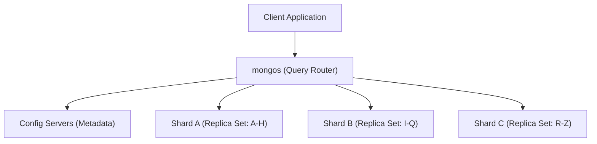

# Sharding (Horizontal Scaling)

> **Level 9 — Replica Sets & Sharding**
> The database architecture that partitions a collection across multiple physical servers (shards) to distribute storage footprint and query workloads, enabling horizontal scaling beyond the hardware limits of a single machine.

---

## 1. Prerequisites

- [Replica Set](replica_set.md) — Replica set cluster.
- [Database](../../../12-postgres/terms/level_01/database.md) — Relational database structures.

---

## 2. Term Category
- **Database Structure / Paradigm**

---

## 3. Environment Context
- **MongoDB Core** (Configured as a multi-component cluster. Sharding is used to scale datasets containing terabytes of data or experiencing write/read saturation).

---

## 4. Explanation

### (1) Design Motivation — "Why did we design this?"
Even with a Replica Set, you eventually hit a hardware ceiling:
-   Every node in a replica set stores **100% of the database data**.
-   If your database grows to 20 Terabytes, you must buy expensive 20TB SSDs for every server in the set.
-   If write query volumes saturate the CPU of the Primary node, adding secondaries does not help because writes can only execute on the primary.

To scale further, you have two choices:
1.  **Vertical Scaling (Scaling Up):** Buying a bigger server with more CPUs and RAM. However, this becomes expensive and eventually hits physical motherboard slot limits.
2.  **Horizontal Scaling (Scaling Out):** Splitting the database across multiple independent, cheaper servers.

We designed **Sharding** to automate this horizontal scaling in MongoDB. 

Instead of storing all data on one server, sharding partitions collections across multiple replica sets (called **Shards**). 

Each shard stores only a fraction of the data. 

As your database grows, you simply add more shards, scaling storage capacity and query throughput infinitely.

---

### (2) The Sharded Cluster Architecture



-   **Shards:** The physical replica sets that store the partitioned documents.
-   **Config Servers:** A small, internal replica set that stores metadata about the cluster configuration and data routing rules.
-   **`mongos` Routers:** Lightweight, stateless query routers that act as the single interface for client applications, routing queries to the correct shards.

---

### (3) Reality Metaphor (Filing Offices)
Imagine managing a large paper customer archive:
-   **Vertical Scaling:** Buying a taller, heavier **Filing Cabinet** to store folders. When it fills up, you buy a taller one, until it hits the ceiling. (Physical boundary ceiling).
-   **Sharding:** Renting **3 separate office desks** (shards):
    -   Desk 1 stores customer folders with names **A to H**.
    -   Desk 2 stores customer folders with names **I to Q**.
    -   Desk 3 stores customer folders with names **R to Z**.
    -   You hire an assistant standing at the door (**`mongos`**) who reads incoming requests and directs clients to the correct desk.

---

## 5. Common Mistakes & Pitfalls

### Mistake 1: Prematurely sharding a database collection during early startup phases before vertical scaling limits are reached

**The mistake:** Deploying a sharded cluster (config servers, mongos routers, multiple shards) for a 50 Gigabyte database to "prepare for future scale."

**Why it's wrong:** Sharding introduces massive operational complexity:
-   You must configure and monitor a minimum of 7 running server processes (3 config servers, 2 shards of 3 nodes each, and mongos).
-   Backups, index builds, and updates become complex.
-   For a small database, the network routing overhead of `mongos` actually makes queries **slower** than a single replica set.

**Fix: Scale vertically (upgrade RAM, CPU, SSDs) first. Only deploy sharding when your data volume approaches disk limits or write concurrency saturates high-end hardware.**

---


### Mistake 2: Enabling Sharding on Small Collections (< 100GB) Un-Necessarily

**The mistake:** Enabling sharding for a 10GB database.

**Why it's wrong:** Sharding adds operational complexity (mongos routers, config servers, network latency). Vertical scaling (adding RAM/CPU to replica set) is preferred until dataset size exceeds 1TB or write IOPS limits.

*Incorrect:*
```javascript
// Sharding a 10GB database
```

*Fix:*
```javascript
Scale vertically with Replica Sets until dataset size exceeds ~1TB
```

### Mistake 3: Executing Un-Targeted Scatter-Gather Queries Across All Shards

**The mistake:** Running frequent high-volume API queries that omit the shard key.

**Why it's wrong:** Queries omitting the shard key must be broadcast to EVERY shard in the cluster (`Scatter-Gather`), degrading cluster throughput.

*Incorrect:*
```javascript
// Querying sharded collection without shard key in filter
```

*Fix:*
```javascript
Include shard key in query filter to enable Single-Shard Targeted routing
```

## 6. Practice Exercises

### Exercise 1: Replication vs. Sharding Contrast

**Problem:** You are explaining database architectures to a junior developer. 
Complete the comparative analysis by stating whether **Replication** or **Sharding** is the correct solution for these scaling goals:
1.  Our database disk space is running out; we need to store 5TB of data but our largest server holds only 3TB.
2.  Our database goes offline when the primary server loses power; we need automatic failover.
3.  We want to scale read queries geographically by routing them to local secondary nodes.

**Expected output:**
> [!check]- Answer
> ```text
> 1. Sharding: Splitting data across multiple shards allows you to bypass the storage limits of a single machine by distributing the disk footprint.
> 2. Replication: Replica sets maintain identical copies of the database, enabling automatic failover when a node crashes.
> 3. Replication: Replica sets allow you to configure Read Preferences to route reads to secondary nodes.
> ```
> - Determine if the issue is a physical storage limit or a high-availability backup requirement.
> - Consider if data partitioning is necessary.

---


### Exercise 2: Enabling Sharding on Database and Collection

**Problem:** Enable sharding on database `saas_db` and shard `users` collection on `{ tenantId: 1, userId: 1 }`.

**Expected output:**
> [!check]- Answer
> ```text
> sh.enableSharding("saas_db"); sh.shardCollection("saas_db.users", { tenantId: 1, userId: 1 });
> ```
> ```javascript
> sh.enableSharding("saas_db");
> sh.shardCollection("saas_db.users", { tenantId: 1, userId: 1 });
> ```
>
> **Explanation:** Sharding requires enabling sharding on the parent database before sharding target collections.

---

### Exercise 3: Sharded Cluster Architecture Components

**Problem:** List 3 core components of a MongoDB Sharded Cluster (`mongos` routers, `Config Servers` CSRS, `Shard` replica sets).

**Expected output:**
> [!check]- Answer
> ```text
> mongos routers, Config Servers (CSRS), Shard replica sets
> ```
> ```text
> mongos routers, Config Servers (CSRS), Shard replica sets
> ```
>
> **Explanation:** `mongos` routes client requests using metadata from Config Servers to target Shards.

## 7. Related Terms

- [Replica Set](replica_set.md) — The replica node building blocks.
- [Shard Key](shard_key.md) — The partitioning index key.
- [Config Servers & `mongos` Router](config_servers_mongos.md) — Related concept: Config Servers & `mongos` Router.

---

## 8. Key Takeaways
- Sharding partitions collection data across multiple physical servers (shards).
- Implements horizontal scaling to bypass single-machine CPU/disk ceilings.
- Consists of three components: Shards, Config Servers, and `mongos` routers.
- The `mongos` router directs application queries to the target shards.
- Config Servers store the cluster metadata and partition routing tables.
- Do not shard prematurely; it adds high operational overhead.
- Scale replica sets vertically first, and deploy sharding only when disk space or write throughput limits are reached.
