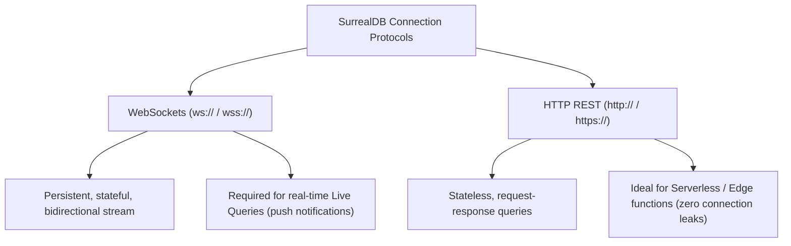

# Connection URI & Protocols (`ws://`, `wss://`, `http://`)

> **Level 1 — What Is SurrealDB?**
> The connection string formats and network protocols used by SDK clients to connect to a SurrealDB server, choosing between stateful persistent WebSockets (`ws://` / `wss://`—required for live queries) and stateless REST HTTP (`http://` / `https://`—ideal for serverless functions).

---

## 1. Prerequisites
- [SurrealDB Server (`surreal start`)](surreal_start.md) — The server process listening.

---

## 2. Term Category
- **Database Structure / Paradigm**

---

## 3. Environment Context
- **Universal Standard** (Network protocol adapters. Configured in client application configuration environments before initiating SDK connections).

---

## 4. Explanation

### (1) Design Motivation — "Why did we design this?"
Traditional databases communicate using custom, low-level binary protocols over TCP sockets (like PostgreSQL on port 5432 and MongoDB on 27017). 

While this is fast, it causes problems:
-   Web browsers cannot speak these custom TCP protocols natively due to security sandboxes.
-   Firewalls often block these custom ports, making remote connections difficult.

We designed SurrealDB to support standard web protocols natively: **WebSockets** and **HTTP**. 

By utilizing WebSockets (`ws://`) and HTTP (`http://`), SurrealDB allows web applications, mobile apps, and edge functions to connect to the database using native web channels. 

This eliminates the need for middleman connection proxies and enables real-time push events directly to client browsers.

---

### (2) The Connection Protocols



#### 1. WebSockets (`ws://` / `wss://` for secure)
-   **Characteristics:** Stateful, persistent, bidirectional connection.
-   **Why it is recommended:** It is the standard for SurrealDB SDK clients. 
-   Because the socket stays open, network overhead on queries is zero, and **the database can push real-time updates directly to the client (Live Queries)**.

#### 2. HTTP REST (`http://` / `https://` for secure)
-   **Characteristics:** Stateless request-response connections.
-   **Why it is used:** Ideal for **Serverless Edge Environments** (like AWS Lambda, Cloudflare Workers, or Vercel). 
-   Since serverless functions terminate in seconds, maintaining persistent WebSockets is wasteful. HTTP requests run queries stateless and close immediately. (Does not support Live Queries).

---

### (3) Reality Metaphor (Pigeons vs. Telephones)
Imagine talking to an off-site consultant:
-   **HTTP (`http://`):** Communicating via **Carrier Pigeons**. 
    -   Every time you have a question, you send a pigeon. 
    -   You wait for it to fly back with the answer, and then the connection is gone. 
    -   If the consultant spots a crisis, they cannot alert you unless you send a pigeon first.
-   **WebSockets (`ws://`):** Establishing a **Direct Intercom Telephone Line**. 
    -   You call once and keep the receiver pressed against your ear. 
    -   You can talk back and forth instantly. 
    -   If a crisis starts, the consultant can yell into the speaker to warn you immediately.

---

### (4) Code Examples

#### Connection URI Syntaxes

```javascript
// 1. WebSocket Protocol (recommended standard for apps and live queries)
const wsUri = "ws://localhost:8000/rpc";

// 2. Secure WebSocket Protocol (production standard with TLS)
const wssUri = "wss://database.example.com/rpc";

// 3. HTTP Protocol (stateless queries / serverless edge)
const httpUri = "http://localhost:8000";
```

---

## 5. Common Mistakes & Pitfalls

### Mistake 1: Attempting to subscribe to Live Queries (real-time push updates) while connected via an HTTP connection URI protocol

**The mistake:** Connecting your JavaScript SDK client using `http://localhost:8000` and calling `.live()` or `.subscribeLive()`, expecting UI changes to trigger.

**Why it's wrong:** HTTP is a stateless request-response protocol. 

The server returns query results and closes the connection; it cannot push events to the client. 

Attempting to run live query subscriptions over HTTP will throw driver errors or fail silently.

**Fix: Connect your application SDK client using the WebSocket protocol (`ws://` or `wss://`) if your user interface requires real-time live queries.**

---


### Mistake 2: Using `http://` Connection Scheme for Real-Time Live Queries in SDK

**The mistake:** Connecting to SurrealDB via HTTP endpoint `http://127.0.0.1:8000` when real-time `LIVE SELECT` subscriptions are required.

**Why it's wrong:** HTTP connections are stateless request-response protocols and do NOT support real-time WebSocket live query push events. Use `ws://` or `wss://`.

*Incorrect:*
```surrealql
const db = new Surreal();
// await db.connect("http://127.0.0.1:8000/rpc"); // ❌ Does not support LIVE SELECT subscriptions!
```

*Fix:*
```surrealql
const db = new Surreal();
await db.connect("ws://127.0.0.1:8000/rpc"); // WebSocket scheme enables live queries
```

### Mistake 3: Omitting `/rpc` Path in WebSocket Endpoint URIs

**The mistake:** Connecting SDKs to `ws://localhost:8000` without specifying the `/rpc` RPC endpoint path.

**Why it's wrong:** SurrealDB SDKs communicate over JSON-RPC 2.0 or binary WebSocket protocols mounted on the `/rpc` route.

*Incorrect:*
```surrealql
// await db.connect("ws://127.0.0.1:8000"); // ❌ Missing /rpc endpoint path
```

*Fix:*
```surrealql
await db.connect("ws://127.0.0.1:8000/rpc"); // Correct RPC WebSocket URI
```

## 6. Practice Exercises

### Exercise 1: Connection Protocol Matcher

**Problem:** You are building three different services. 
Select the optimal connection protocol (**ws://**, **wss://**, or **http://**) for each environment context:
1.  A local development script running in a Docker container that listens for real-time chat updates.
2.  A serverless Cloudflare Worker function that checks user keys on API requests.
3.  A production web dashboard deployed to Vercel that displays real-time system metrics charts.

**Expected output:**
```text
1. ws:// : Stateful WebSocket is required for real-time updates, and since it is local dev, unencrypted 'ws' is sufficient.
2. http:// (or https://) : Stateless HTTP is ideal for serverless edge workers where persistent socket pools are not supported.
3. wss:// : Secure WebSocket is required to support real-time metrics push notifications securely in a production browser environment.
```

> [!check]- Answer
> - Determine if the environment requires real-time push alerts.
> - Consider if the deployment is serverless (stateless) or a persistent browser view.

---


### Exercise 2: Production Secure URI Construction

**Problem:** Construct secure production connection URI using SSL WebSocket protocol for `db.example.com`.

**Expected output:**
```text
wss://db.example.com/rpc
```

> [!check]- Answer
> ```text
> wss://db.example.com/rpc
> ```
>
> **Explanation:** `wss://` establishes encrypted TLS WebSocket channels to SurrealDB RPC endpoints.

### Exercise 3: Memory Storage URI Scheme

**Problem:** What URI scheme is used to run an in-memory embedded SurrealDB instance in Rust or JS SDK? (`mem://`).

**Expected output:**
```text
mem://
```

> [!check]- Answer
> ```text
> mem://
> ```
>
> **Explanation:** `mem://` creates volatile in-memory database instances for fast unit testing.

## 7. Related Terms
- [SurrealDB Server (`surreal start`)](surreal_start.md) — The server process listening.
- [`LIVE SELECT`](../level_09/live_select.md) — The real-time queries.

---

## 8. Key Takeaways
- Connection URIs use WebSockets (`ws://`/`wss://`) or HTTP (`http://`/`https://`) protocols.
- WebSockets provide persistent, stateful, bidirectional connections.
- Stateful WebSockets are mandatory to run real-time Live Queries.
- HTTP REST is stateless and request-response based.
- Use HTTP connection strings inside serverless cloud edge runtimes.
- Production browser connections require encrypted `wss://` and `https://` ports.
- The standard WebSocket endpoint path is `/rpc`.
