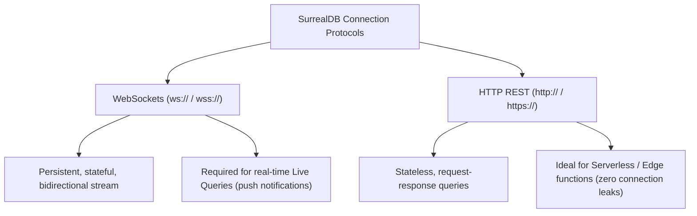

# Connection URI & Protocols (`ws://`, `wss://`, `http://`)

> **Level 1 — What Is SurrealDB?**
> The connection string formats and network protocols used by SDK clients to connect to a SurrealDB server, choosing between stateful persistent WebSockets (`ws://` / `wss://`—required for live queries) and stateless REST HTTP (`http://` / `https://`—ideal for serverless functions).

---

## 1. Prerequisites

- [SurrealDB Server (`surreal start`)](surreal_start.md) — The server process listening.

---

## 2. Term Category


**Integration / Ecosystem (connection endpoint URI scheme)**: - **Database Structure / Paradigm**


---

## 3. Explanation

### (1) Design Motivation — "Why did we design this?"
Traditional databases communicate using custom, low-level binary protocols over TCP sockets (like PostgreSQL on port 5432 and MongoDB on 27017). 

While this is fast, it causes problems:
-   Web browsers cannot speak these custom TCP protocols natively due to security sandboxes.
-   Firewalls often block these custom ports, making remote connections difficult.

We designed SurrealDB to support standard web protocols natively: **WebSockets** and **HTTP**. 

By utilizing WebSockets (`ws://`) and HTTP (`http://`), SurrealDB allows web applications, mobile apps, and edge functions to connect to the database using native web channels. 

This eliminates the need for middleman connection proxies and enables real-time push events directly to client browsers.

---

### (2) The Connection Protocols



#### 1. WebSockets (`ws://` / `wss://` for secure)
-   **Characteristics:** Stateful, persistent, bidirectional connection.
-   **Why it is recommended:** It is the standard for SurrealDB SDK clients. 
-   Because the socket stays open, network overhead on queries is zero, and **the database can push real-time updates directly to the client (Live Queries)**.

#### 2. HTTP REST (`http://` / `https://` for secure)
-   **Characteristics:** Stateless request-response connections.
-   **Why it is used:** Ideal for **Serverless Edge Environments** (like AWS Lambda, Cloudflare Workers, or Vercel). 
-   Since serverless functions terminate in seconds, maintaining persistent WebSockets is wasteful. HTTP requests run queries stateless and close immediately. (Does not support Live Queries).

---

### (3) Reality Metaphor (Pigeons vs. Telephones)
Imagine talking to an off-site consultant:
-   **HTTP (`http://`):** Communicating via **Carrier Pigeons**. 
    -   Every time you have a question, you send a pigeon. 
    -   You wait for it to fly back with the answer, and then the connection is gone. 
    -   If the consultant spots a crisis, they cannot alert you unless you send a pigeon first.
-   **WebSockets (`ws://`):** Establishing a **Direct Intercom Telephone Line**. 
    -   You call once and keep the receiver pressed against your ear. 
    -   You can talk back and forth instantly. 
    -   If a crisis starts, the consultant can yell into the speaker to warn you immediately.

---

### (4) Code Examples

#### Connection URI Syntaxes

```javascript
// 1. WebSocket Protocol (recommended standard for apps and live queries)
const wsUri = "ws://localhost:8000/rpc";

// 2. Secure WebSocket Protocol (production standard with TLS)
const wssUri = "wss://database.example.com/rpc";

// 3. HTTP Protocol (stateless queries / serverless edge)
const httpUri = "http://localhost:8000";
```

---

## 4. Common Mistakes & Pitfalls

### Mistake 1: Attempting to subscribe to Live Queries (real-time push updates) while connected via an HTTP connection URI protocol

**The mistake:** Connecting your JavaScript SDK client using `http://localhost:8000` and calling `.live()` or `.subscribeLive()`, expecting UI changes to trigger.

**Why it's wrong:** HTTP is a stateless request-response protocol. 

The server returns query results and closes the connection; it cannot push events to the client. 

Attempting to run live query subscriptions over HTTP will throw driver errors or fail silently.

**Fix: Connect your application SDK client using the WebSocket protocol (`ws://` or `wss://`) if your user interface requires real-time live queries.**

---


### Mistake 2: Using `http://` Connection Scheme for Real-Time Live Queries in SDK

**The mistake:** Connecting to SurrealDB via HTTP endpoint `http://127.0.0.1:8000` when real-time `LIVE SELECT` subscriptions are required.

**Why it's wrong:** HTTP connections are stateless request-response protocols and do NOT support real-time WebSocket live query push events. Use `ws://` or `wss://`.

*Incorrect:*
```surrealql
const db = new Surreal();
// await db.connect("http://127.0.0.1:8000/rpc"); // ❌ Does not support LIVE SELECT subscriptions!
```

*Fix:*
```surrealql
const db = new Surreal();
await db.connect("ws://127.0.0.1:8000/rpc"); // WebSocket scheme enables live queries
```

### Mistake 3: Omitting `/rpc` Path in WebSocket Endpoint URIs

**The mistake:** Connecting SDKs to `ws://localhost:8000` without specifying the `/rpc` RPC endpoint path.

**Why it's wrong:** SurrealDB SDKs communicate over JSON-RPC 2.0 or binary WebSocket protocols mounted on the `/rpc` route.

*Incorrect:*
```surrealql
// await db.connect("ws://127.0.0.1:8000"); // ❌ Missing /rpc endpoint path
```

*Fix:*
```surrealql
await db.connect("ws://127.0.0.1:8000/rpc"); // Correct RPC WebSocket URI
```

## 5. Practice Exercises

### Exercise 1: Multi-Environment Endpoint Matrix

**Scenario:**
You are configuring environment-specific connection URIs for a full-stack application connecting to SurrealDB across development, staging, production, and embedded test environments.

**Requirements:**
1. Formulate connection URIs for in-memory embedded testing (`mem://`).
2. Formulate connection URIs for local file-backed persistence (`file://`).
3. Formulate connection URIs for local WebSocket connections (`ws://`).
4. Formulate connection URIs for production TLS-encrypted WebSocket clusters (`wss://`).

> [!check]- Answer
>
> #### Implementation
>
> ```text
> - Embedded In-Memory: mem://
> - Embedded Disk (SurrealKV): file://data/app.db
> - Local Development: ws://localhost:8000/rpc
> - Production WebSockets: wss://db.example.com:443/rpc
> ```
>
> #### Technical Explanation
>
> 1. `mem://` spins up an ephemeral in-memory database engine inside the SDK process for ultra-fast unit testing.
> 2. `file://` opens a single-node persistent database engine directly from disk using local storage engines.
> 3. `ws://` connects over unencrypted WebSockets for local CLI or development server connections.
> 4. `wss://` establishes encrypted TLS WebSocket streams necessary for production web client real-time subscriptions.
> 
---

### Exercise 2: Protocol Selection for Real-Time Subscriptions

**Scenario:**
A frontend engineer is evaluating whether to connect a web application using HTTP (`https://`) or WebSockets (`wss://`) connection URIs for a live collaborative dashboard.

**Requirements:**
1. Specify which connection URI scheme enables `LIVE SELECT` real-time push notifications.
2. Explain the fundamental architectural difference between HTTP and WebSocket connection URIs in SurrealDB.

> [!check]- Answer
>
> #### Implementation
>
> ```text
> Recommended URI Scheme: wss://db.example.com/rpc
> Protocol Choice: WebSockets (wss://)
> ```
>
> #### Technical Explanation
>
> 1. WebSocket URIs (`ws://`, `wss://`) establish persistent bi-directional binary channels required for SurrealDB live queries.
> 2. HTTP URIs (`http://`, `https://`) are request-response stateless protocols suitable for serverless REST requests, but cannot receive real-time server push events.
> 3. WebSocket connections maintain connection state, allowing client SDKs to maintain active authentication tokens across query executions.
> 
---

### Exercise 3: Embedded Rust Driver URI Configuration

**Scenario:**
A Rust backend developer is initializing SurrealDB embedded directly inside a microservice process using the official Rust SDK.

**Requirements:**
1. Write the Rust SDK connection initialization code for an embedded RocksDB storage engine at path `rocksdb://./my_data`.
2. Include error handling for connection initialization.

> [!check]- Answer
>
> #### Implementation
>
> ```rust
> use surrealdb::engine::local::RocksDb;
> use surrealdb::Surreal;
> 
> #[tokio::main]
> async fn main() -> surrealdb::Result<()> {
>     // Connect to an embedded RocksDB engine using local storage path
>     let db = Surreal::new::<RocksDb>("./my_data").await?;
>     
>     println!("Embedded SurrealDB engine initialized cleanly!");
>     Ok(())
> }
> ```
>
> #### Technical Explanation
>
> 1. Embedded storage URIs allow SurrealDB to run inside application binaries without running a separate server process.
> 2. Embedded mode provides zero-network latency for high-throughput local applications.
> 3. Eliminates database client-server deployment overhead for desktop or microservice workloads.
> 
---


## 6. Related Terms

- [SurrealDB Server (`surreal start`)](surreal_start.md) — The server process listening.
- [`LIVE SELECT` (Live Queries)](../level_09/live_select.md) — The real-time queries.
- [Surrealist (Web IDE)](surrealist.md) — Related concept: Surrealist (Web IDE).
- [`KILL` (Stopping Live Queries)](../level_09/kill_live_query.md) — Related concept: `KILL` (Stopping Live Queries).
- [WebSocket vs HTTP Connection](../level_10/websocket_vs_http.md) — Related concept: WebSocket vs HTTP Connection.

---

## 7. Key Takeaways
- Connection URIs use WebSockets (`ws://`/`wss://`) or HTTP (`http://`/`https://`) protocols.
- WebSockets provide persistent, stateful, bidirectional connections.
- Stateful WebSockets are mandatory to run real-time Live Queries.
- HTTP REST is stateless and request-response based.
- Use HTTP connection strings inside serverless cloud edge runtimes.
- Production browser connections require encrypted `wss://` and `https://` ports.
- The standard WebSocket endpoint path is `/rpc`.
