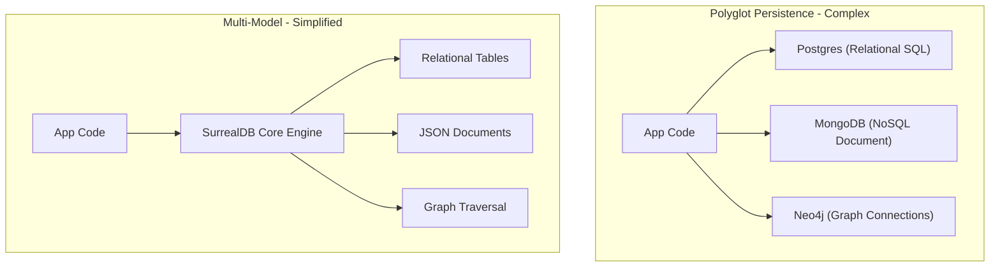

# Multi-Model Database

> **Level 1 — What Is SurrealDB?**
> A database engine that natively supports multiple data models (such as relational tables, document JSONs, graph nodes/edges, and key-value stores) within a single core engine, eliminating the operational complexity of managing separate databases.

---

## 1. Prerequisites
- [Database (Concept - PostgreSQL)](../../../12-postgres/terms/level_01/database.md) — Relational database models.
- [Database Context (MongoDB)](../../../13-mongodb/terms/level_01/database_context.md) — Document database models.

---

## 2. Term Category
- **Database Structure / Paradigm**

---

## 3. Environment Context
- **Universal Standard** (Core distributed systems architecture. Applies to multi-paradigm database designs like SurrealDB, ArangoDB, or Cosmos DB).

---

## 4. Explanation

### (1) Design Motivation — "Why did we design this?"
In modern full-stack web applications, you often need to store different types of data shapes:
-   **Relational (SQL):** Sizing billing and invoice ledgers that require strict columns, keys, and joins.
-   **Document (NoSQL):** Storing user profiles and dynamic catalogs that require flexible, nested arrays.
-   **Graph:** Traversing social network connections, followings, and recommendation trees.
-   **Key-Value:** Caching quick session states or tokens.

Historically, developers solved this using **Polyglot Persistence** (running separate databases for each need: PostgreSQL for billing, MongoDB for profiles, Neo4j for graphs, and Redis for cache). 

However, running 4 separate database servers is an operational nightmare:
-   You must configure, scale, monitor, and backup 4 different engines.
-   You must write sync pipelines (ETL) to duplicate data between them, which frequently break and introduce sync lag.
-   Your backend code must import 4 different drivers and speak 4 different query languages.

We designed the **Multi-Model Database** to solve this operational complexity. 

Instead of gluing different databases together, a multi-model database supports relational, document, graph, and key-value paradigms natively inside a **single engine core**. 

You store all data in one place, query it with a single query language, and run transactions that span across documents, relations, and graphs simultaneously.

---

### (2) Unified Core vs. Polyglot Persistence
Contrast the two database strategy models:



-   **Polyglot Persistence:** Multiple database engines $\rightarrow$ fragmented code, sync pipelines, multiple hosting costs.
-   **Multi-Model Database:** One database engine $\rightarrow$ unified query language, zero replication lag, single admin pipeline.

---

### (3) Reality Metaphor (The Swiss Army Knife)
Imagine needing tools for a camping trip:
-   **Polyglot Persistence:** Packing a heavy, separate **toolbox** containing a heavy hammer, a kitchen knife, a corkscrew, and a screwdriver. 
    -   If you want to open a wine bottle and slice a lime, you must rummage through the box, pull out two heavy items, use them, and wash both.
-   **Multi-Model Database:** Carrying a single **Swiss Army Knife** in your pocket. 
    -   It is one tool body. 
    -   You fold out the corkscrew to open the bottle, slide it back, fold out the blade to slice the lime, and clean only one tool. 
    -   It replaces multiple tool boxes in a single, compact frame.

---

### (4) Comparative Representational Matrix

| Data Model | Representation | Primary Query Action |
| :--- | :--- | :--- |
| **Relational** | Flat tables, structured columns. | Joining tables via Foreign Keys. |
| **Document** | Hierarchical, nested JSON structures. | Dot-notation nested searches. |
| **Graph** | Nodes (vertices) and Links (edges). | Arrow traversal path scans (`->`). |
| **Key-Value** | Quick index lookups. | Direct key-to-value lookups. |

---

## 5. Common Mistakes & Pitfalls

### Mistake 1: Confusing a true multi-model database with a relational database that simply has a 'JSON' column type

**The mistake:** Assuming PostgreSQL is a full multi-model database because it supports the `JSONB` data type.

**Why it's wrong:** While PostgreSQL can store JSON documents, its storage engine and indexing are fundamentally optimized for relational rows. 

PostgreSQL does not natively support graph traversal syntax (requiring complex, slow recursive CTEs) or schema-less collection sharding in its core design. 

A true multi-model database is built from the ground up to be model-agnostic, optimizing document nesting, graph traversals, and key-value speeds inside the same index trees.

**Fix: Understand that SQL databases with JSON extensions are "relational first." Choose a native multi-model database (like SurrealDB) when documents, graphs, and tables are all first-class citizen shapes in your application logic.**

---


### Mistake 2: Creating Relational Foreign Key Columns and Join Tables in Multi-Model SurrealDB

**The mistake:** Designing `user_id` integer columns and `user_group` junction tables instead of native Record Links or Graph Edges.

**Why it's wrong:** Multi-model SurrealDB supports direct pointer references (`user:alice`) and graph edges (`RELATE user:alice->member_of->group:admin`). Foreign keys and junction tables slow down queries and increase complexity.

*Incorrect:*
```surrealql
-- Relational anti-pattern
CREATE user_group CONTENT { user_id: 1, group_id: 2 };
```

*Fix:*
```surrealql
-- Multi-model graph edge
RELATE user:alice->member_of->group:admin;
```

### Mistake 3: Failing to Leverage Schemaflexibility in Mixed Data Tables

**The mistake:** Creating separate tables for minor metadata variations instead of storing nested JSON objects or using `SCHEMALESS` tables.

**Why it's wrong:** SurrealDB combines document store flexibility with relational integrity. Forcing rigid 1990s relational normalization misses document nesting capabilities.

*Incorrect:*
```surrealql
CREATE user_metadata_table CONTENT { user_id: user:1, key: "theme", val: "dark" };
```

*Fix:*
```surrealql
UPDATE user:1 SET settings.theme = "dark"; // Native nested document field
```

## 6. Practice Exercises

### Exercise 1: Model Selection Evaluation

**Problem:** You are planning a new application. Classify which data model (**Relational**, **Document**, or **Graph**) fits best for each feature:
1.  A user social network listing who follows who, and showing suggestions based on "friends-of-friends".
2.  A company database of purchase orders and invoices that require fixed columns and transaction audit safety.
3.  A blogging platform where articles have comments arrays and varying tagging categories that shift daily.

**Expected output:**
> [!check]- Answer
> ```text
> 1. Graph Model: Follows and recommendation links are best modeled as nodes and edges to traverse relationships without heavy SQL joins.
> 2. Relational Model: Structured invoice tables benefit from rigid columns and referential checks.
> 3. Document Model: Dynamic articles and comment arrays fit nestable document shapes perfectly.
> ```
> - Assess the connectedness of the data points.
> - Consider if data structures require rigid tabular layouts or dynamic, nested properties.

---


### Exercise 2: Multi-Model Feature Comparison

**Problem:** Match SurrealDB capabilities with paradigms: SQL (SurrealQL queries), Document (Nested JSON), Graph (Arrow `->` links).

**Expected output:**
> [!check]- Answer
> ```text
> SQL: SurrealQL queries, Document: Nested JSON, Graph: Arrow -> links
> ```
> ```text
> SQL: SurrealQL queries, Document: Nested JSON, Graph: Arrow -> links
> ```
>
> **Explanation:** Multi-model databases unify relational, document, and graph query capabilities into one engine.

---

### Exercise 3: Graph Pointer vs SQL JOIN Performance

**Problem:** Why does arrow path traversal `user:1->wrote->article` run in $O(1)$ constant pointer time vs $O(\log N)$ SQL JOINs?

**Expected output:**
> [!check]- Answer
> ```text
> Record links store direct storage pointers to target records without index lookup scanning
> ```
> ```text
> Record links store direct storage pointers to target records without index lookup scanning
> ```
>
> **Explanation:** Record pointers allow direct memory address dereferencing during graph traversal.

## 7. Related Terms
- [SurrealDB](surrealdb.md) — The Rust-based multi-model database.
- [SurrealQL](surrealql.md) — The unified query language.

---

## 8. Key Takeaways
- A Multi-Model Database supports multiple data paradigms in one engine.
- Supports relational tables, JSON documents, graph edges, and key-value lookups.
- Eliminates the operational cost of managing separate databases.
- Prevents data synchronization issues and replication lag.
- True multi-model engines are built model-agnostic from day one.
- Integrates all data paradigms under a single, unified query language.
- Enables transactions to span across document collections, relations, and graphs.
