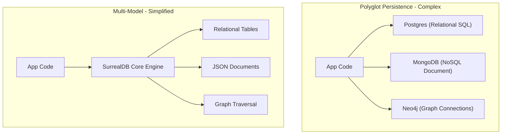

# Multi-Model Database

> **Level 1 — What Is SurrealDB?**
> A database engine that natively supports multiple data models (such as relational tables, document JSONs, graph nodes/edges, and key-value stores) within a single core engine, eliminating the operational complexity of managing separate databases.

---

## 1. Prerequisites

- [Database](../../../12-postgres/terms/level_01/database.md) — Relational database models.
- [Database (MongoDB Context)](../../../13-mongodb/terms/level_01/database_context.md) — Document database models.

---

## 2. Term Category


**Core Concept (unified multi-model database architecture)**: - **Database Structure / Paradigm**


---

## 3. Explanation

### (1) Design Motivation — "Why did we design this?"
In modern full-stack web applications, you often need to store different types of data shapes:
-   **Relational (SQL):** Sizing billing and invoice ledgers that require strict columns, keys, and joins.
-   **Document (NoSQL):** Storing user profiles and dynamic catalogs that require flexible, nested arrays.
-   **Graph:** Traversing social network connections, followings, and recommendation trees.
-   **Key-Value:** Caching quick session states or tokens.

Historically, developers solved this using **Polyglot Persistence** (running separate databases for each need: PostgreSQL for billing, MongoDB for profiles, Neo4j for graphs, and Redis for cache). 

However, running 4 separate database servers is an operational nightmare:
-   You must configure, scale, monitor, and backup 4 different engines.
-   You must write sync pipelines (ETL) to duplicate data between them, which frequently break and introduce sync lag.
-   Your backend code must import 4 different drivers and speak 4 different query languages.

We designed the **Multi-Model Database** to solve this operational complexity. 

Instead of gluing different databases together, a multi-model database supports relational, document, graph, and key-value paradigms natively inside a **single engine core**. 

You store all data in one place, query it with a single query language, and run transactions that span across documents, relations, and graphs simultaneously.

---

### (2) Unified Core vs. Polyglot Persistence
Contrast the two database strategy models:



-   **Polyglot Persistence:** Multiple database engines $\rightarrow$ fragmented code, sync pipelines, multiple hosting costs.
-   **Multi-Model Database:** One database engine $\rightarrow$ unified query language, zero replication lag, single admin pipeline.

---

### (3) Reality Metaphor (The Swiss Army Knife)
Imagine needing tools for a camping trip:
-   **Polyglot Persistence:** Packing a heavy, separate **toolbox** containing a heavy hammer, a kitchen knife, a corkscrew, and a screwdriver. 
    -   If you want to open a wine bottle and slice a lime, you must rummage through the box, pull out two heavy items, use them, and wash both.
-   **Multi-Model Database:** Carrying a single **Swiss Army Knife** in your pocket. 
    -   It is one tool body. 
    -   You fold out the corkscrew to open the bottle, slide it back, fold out the blade to slice the lime, and clean only one tool. 
    -   It replaces multiple tool boxes in a single, compact frame.

---

### (4) Comparative Representational Matrix

| Data Model | Representation | Primary Query Action |
| :--- | :--- | :--- |
| **Relational** | Flat tables, structured columns. | Joining tables via Foreign Keys. |
| **Document** | Hierarchical, nested JSON structures. | Dot-notation nested searches. |
| **Graph** | Nodes (vertices) and Links (edges). | Arrow traversal path scans (`->`). |
| **Key-Value** | Quick index lookups. | Direct key-to-value lookups. |

---

## 4. Common Mistakes & Pitfalls

### Mistake 1: Confusing a true multi-model database with a relational database that simply has a 'JSON' column type

**The mistake:** Assuming PostgreSQL is a full multi-model database because it supports the `JSONB` data type.

**Why it's wrong:** While PostgreSQL can store JSON documents, its storage engine and indexing are fundamentally optimized for relational rows. 

PostgreSQL does not natively support graph traversal syntax (requiring complex, slow recursive CTEs) or schema-less collection sharding in its core design. 

A true multi-model database is built from the ground up to be model-agnostic, optimizing document nesting, graph traversals, and key-value speeds inside the same index trees.

**Fix: Understand that SQL databases with JSON extensions are "relational first." Choose a native multi-model database (like SurrealDB) when documents, graphs, and tables are all first-class citizen shapes in your application logic.**

---


### Mistake 2: Creating Relational Foreign Key Columns and Join Tables in Multi-Model SurrealDB

**The mistake:** Designing `user_id` integer columns and `user_group` junction tables instead of native Record Links or Graph Edges.

**Why it's wrong:** Multi-model SurrealDB supports direct pointer references (`user:alice`) and graph edges (`RELATE user:alice->member_of->group:admin`). Foreign keys and junction tables slow down queries and increase complexity.

*Incorrect:*
```surrealql
-- Relational anti-pattern
CREATE user_group CONTENT { user_id: 1, group_id: 2 };
```

*Fix:*
```surrealql
-- Multi-model graph edge
RELATE user:alice->member_of->group:admin;
```

### Mistake 3: Failing to Leverage Schemaflexibility in Mixed Data Tables

**The mistake:** Creating separate tables for minor metadata variations instead of storing nested JSON objects or using `SCHEMALESS` tables.

**Why it's wrong:** SurrealDB combines document store flexibility with relational integrity. Forcing rigid 1990s relational normalization misses document nesting capabilities.

*Incorrect:*
```surrealql
CREATE user_metadata_table CONTENT { user_id: user:1, key: "theme", val: "dark" };
```

*Fix:*
```surrealql
UPDATE user:1 SET settings.theme = "dark"; // Native nested document field
```

## 5. Practice Exercises

### Exercise 1: Multi-Model Feature Capability Matrix

**Scenario:**
You are comparing SurrealDB's multi-model architecture against traditional single-model databases (PostgreSQL and MongoDB) for a system design review.

**Requirements:**
1. Identify which database engine(s) support native graph arrow traversals (`->`) without JOIN tables.
2. Identify which database engine(s) support mixing SCHEMAFULL and SCHEMALESS tables within the same database.
3. Identify which database engine(s) allow web applications to connect via WebSockets with built-in row-level security.

> [!check]- Answer
>
> #### Implementation
>
> ```text
> - Native Graph Arrow Traversals: SurrealDB (PostgreSQL requires JOINs/CTEs; MongoDB requires $lookup).
> - Per-Table SCHEMAFULL / SCHEMALESS Toggle: SurrealDB (PostgreSQL is strictly relational; MongoDB is document/jsonSchema).
> - Direct WebSocket Client Access with Built-in RLS: SurrealDB (PostgreSQL and MongoDB require custom backend API servers).
> ```
>
> #### Technical Explanation
>
> 1. SurrealDB merges relational tables, document JSON, and graph pointer edges into a single unified query engine.
> 2. Eliminates the need to deploy and synchronize separate relational, document, and graph database clusters.
> 3. Built-in WebSocket real-time subscriptions and row-level security reduce backend API middleware complexity.
> 
---

### Exercise 2: Paradigm Synthesis Mapping

**Scenario:**
A developer transitioning from SQL and MongoDB needs a clear mapping of how core concepts translate into SurrealDB's multi-model paradigm.

**Requirements:**
1. Map PostgreSQL Foreign Keys and MongoDB ObjectId references to SurrealDB's equivalent mechanism.
2. Map PostgreSQL SQL JOIN tables and MongoDB `$lookup` aggregations to SurrealDB's equivalent mechanism.

> [!check]- Answer
>
> #### Implementation
>
> ```text
> - Foreign Keys / ObjectId References -> SurrealDB Record Links (record<table> type, e.g. user:john)
> - SQL JOIN / $lookup Aggregations -> SurrealDB Graph Relations (RELATE ... -> ... -> ...) and Arrow Traversal (->)
> ```
>
> #### Technical Explanation
>
> 1. Record links store direct table-scoped pointers (`table:id`), avoiding foreign key constraints and manual ID strings.
> 2. Graph edge relations (`RELATE`) replace junction tables, allowing pointer traversal in $O(1)$ time complexity.
> 3. Unifies relational data integrity with document schema flexibility.
> 
---

### Exercise 3: Evaluating Multi-Model vs Single-Model Architecture Trade-offs

**Scenario:**
An architecture team is deciding whether to adopt SurrealDB or stick with PostgreSQL for a financial accounting core service requiring 30+ years of battle-tested ecosystem tooling.

**Requirements:**
1. Provide 2 architectural scenarios where SurrealDB's multi-model approach excels.
2. Provide 1 scenario where a mature single-model engine like PostgreSQL remains the preferred choice.

> [!check]- Answer
>
> #### Implementation
>
> ```text
> SurrealDB Excels:
> - Real-time collaborative web applications needing live subscriptions, graph connections, and direct client auth.
> - Heterogeneous data domains combining tabular transactions, nested JSON documents, and social graph links.
> 
> PostgreSQL Preferred:
> - Legacy financial systems relying on 30+ years of deep extension ecosystems (PostGIS, pgvector, specialized ORMs) and strict SQL compliance.
> ```
>
> #### Technical Explanation
>
> 1. SurrealDB eliminates complex multi-database sync pipelines by consolidating relational, document, and graph models.
> 2. Honest architectural evaluation acknowledges that mature legacy ecosystems (like PostgreSQL) may still suit specialized legacy tools.
> 3. Understanding multi-model trade-offs prevents cargo-cult technology selection.
> 
---


## 6. Related Terms

- [SurrealDB](surrealdb.md) — The Rust-based multi-model database.
- [SurrealQL](surrealql.md) — The unified query language.
- [SurrealDB vs. PostgreSQL vs. MongoDB](surrealdb_vs_postgres_mongo.md) — Related concept: SurrealDB vs. PostgreSQL vs. MongoDB.

---

## 7. Key Takeaways
- A Multi-Model Database supports multiple data paradigms in one engine.
- Supports relational tables, JSON documents, graph edges, and key-value lookups.
- Eliminates the operational cost of managing separate databases.
- Prevents data synchronization issues and replication lag.
- True multi-model engines are built model-agnostic from day one.
- Integrates all data paradigms under a single, unified query language.
- Enables transactions to span across document collections, relations, and graphs.
