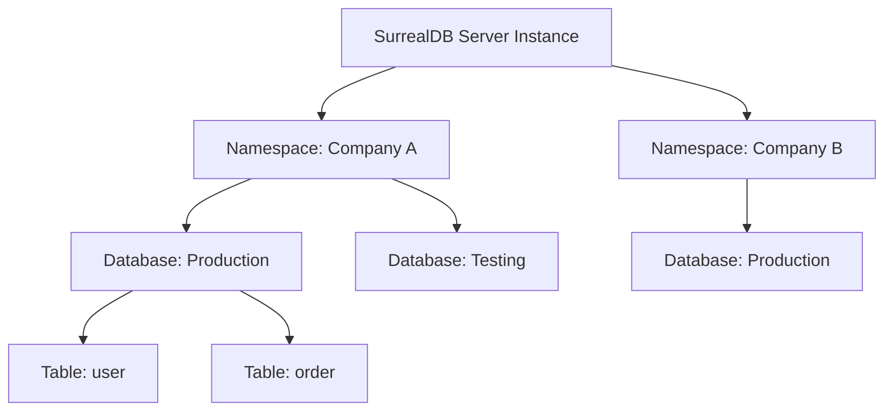

# Namespace & Database

> **Level 1 — What Is SurrealDB?**
> The two-level multi-tenant organizational hierarchy in SurrealDB, where a Namespace groups related databases (for tenant isolation) and a Database groups tables and records, equivalent to PostgreSQL's database-and-schema structure.

---

## 1. Prerequisites
- [Table](table.md) — The collections grouped.

---

## 2. Term Category
- **Database Structure / Paradigm**

---

## 3. Environment Context
- **SurrealDB Core** (Managed at the connection session level. Governs authentication token scopes and data access isolation).

---

## 4. Explanation

### (1) Design Motivation — "Why did we design this?"
If you are building a **Multi-Tenant SaaS** application (a software platform where multiple customer companies share the same application server):
-   You must guarantee that Company A's employees can never see Company B's records.
-   If you store all clients in the same database table and filter by `company_id`, a single developer coding error in a query filter can leak sensitive data across companies.

In PostgreSQL, you solve this by manually managing separate databases or creating custom user schemas.

In SurrealDB, multi-tenant isolation is built directly into the core using a two-level hierarchy: **Namespaces** and **Databases**. 

A **Namespace** acts as a top-level firewall container. 

You can assign each customer company to its own Namespace. 

Inside that namespace, they can create multiple **Databases** (such as a database for production, one for testing, or database divisions for HR vs. Sales). 

Data cannot bleed between namespaces, and you can assign access users restricted to specific namespace scopes, securing tenant data.

---

### (2) The Organizational Hierarchy



-   **Server Instance:** The running database process.
-   **Namespace (NS):** Isolates client tenants or separate projects.
-   **Database (DB):** Isolates data scopes (e.g. dev vs. prod environment) within a tenant.
-   **Table:** A collection of records inside a database.

---

### (3) Reality Metaphor (Office Buildings)
Imagine a physical office building:
-   **Server Instance:** The physical **Office Building** structure.
-   **Namespace:** A **Floor** in the building. 
    -   Floor 3 is leased to Company A; Floor 4 to Company B. 
    -   Employees from Floor 3 cannot press the elevator button to Floor 4 or look at their files. (Complete tenant isolation).
-   **Database:** A **Room** on that floor (e.g., the "Finance Office" or "HR Office").
-   **Table:** A **Filing Cabinet** inside that room holding folders (records).

---

### (4) Code Examples

#### Selecting Namespace and Database in SurrealQL
Before running queries, you must instruct your connection session which namespace and database scope to target using the `USE` statement:

```sql
-- 1. Select Namespace 'company_a' and Database 'production'
USE NS company_a DB production;

-- 2. Now you can run queries in this database scope
CREATE user:tobie SET name = "Tobie";

-- 3. Switch to the testing database under the same namespace
USE DB testing; // NS remains 'company_a'

-- 4. Switch to a completely different tenant namespace
USE NS company_b DB production;
```

---

## 5. Common Mistakes & Pitfalls

### Mistake 1: Running CRUD queries on a new database session without executing the 'USE' command first

**The mistake:** Opening a connection shell or connecting an SDK client and running `SELECT * FROM user` immediately, getting session errors.

**Why it's wrong:** SurrealDB does not default to a global database context. 

If you do not specify a Namespace and Database, SurrealDB has no context on where to write or read, throwing the error: `There was a problem with the database: Specify a namespace to use`.

**Fix: Always execute a `USE NS <name> DB <name>;` statement immediately after opening a database connection before running any queries.**

---


### Mistake 2: Executing Queries Before Specifying Namespace and Database Scope

**The mistake:** Running `SELECT * FROM user;` in CLI or SDK before invoking `USE NS` and `USE DB`.

**Why it's wrong:** SurrealDB organizes data in a two-tier hierarchy (`NS` -> `DB`). Executing queries without selecting namespace and database targets throws error `There is no database selected`.

*Incorrect:*
```surrealql
-- ❌ Query executed without selecting NS and DB
SELECT * FROM user;
```

*Fix:*
```surrealql
USE NS production DB main;
SELECT * FROM user; // Correct namespace and database selection
```

### Mistake 3: Confusing Namespace Scope with Database Scope

**The mistake:** Expecting tables in Database A under Namespace X to be accessible from Database B under Namespace X.

**Why it's wrong:** Tables and records belong to specific Databases. Namespaces isolate multiple tenant Databases from each other.

*Incorrect:*
```surrealql
-- Expecting cross-database table reads without explicit switching
SELECT * FROM db_b.user; // ❌ Tables are isolated per database
```

*Fix:*
```surrealql
USE NS production DB db_b;
SELECT * FROM user;
```

## 6. Practice Exercises

### Exercise 1: Hierarchy Navigation

**Problem:** You are configuring a SurrealDB database cluster. 
Write the SurrealQL commands to:
1.  Target a namespace named `"saas_tenant_01"` and a database named `"billing"`.
2.  Switch the database target to `"analytics"` under the same namespace.

**Expected output:**
```sql
-- 1. Target Namespace and Database
USE NS saas_tenant_01 DB billing;

-- 2. Switch Database context
USE DB analytics;
```

> [!check]- Answer
> - The keyword to select database context scopes is `USE`.
> - If you only change the database, you can omit the `NS` prefix parameter.

---


### Exercise 2: SurrealQL Scope Selection Command

**Problem:** Write SurrealQL command to select namespace `tenant_a` and database `billing`.

**Expected output:**
```text
USE NS tenant_a DB billing;
```

> [!check]- Answer
> ```surrealql
> USE NS tenant_a DB billing;
> ```
>
> **Explanation:** The `USE` statement sets active namespace and database context for subsequent queries.

### Exercise 3: Multi-Tenancy Hierarchy Isolation

**Problem:** Explain how Namespaces enable multi-tenant application isolation.

**Expected output:**
```text
Namespaces isolate databases, users, and tokens per tenant boundary
```

> [!check]- Answer
> ```text
> Namespaces isolate databases, users, and tokens per tenant boundary
> ```
>
> **Explanation:** Namespaces group databases per tenant, preventing cross-tenant data leaks.

## 7. Related Terms
- [Table](table.md) — The collections grouped.
- [Connection Credentials (`USE NS ... DB ...`)](connection_credentials.md) — Session authentication.

---

## 8. Key Takeaways
- Namespace and Database form SurrealDB's multi-tenant hierarchy.
- A Namespace isolates independent projects or client tenants.
- A Database isolates data environments within a specific namespace.
- Hierarchy: Server Instance $\rightarrow$ Namespace $\rightarrow$ Database $\rightarrow$ Table $\rightarrow$ Record.
- Prevents cross-tenant data leaks at the database core engine layer.
- Always execute `USE NS ... DB ...` to declare your session context.
- CRUD queries run without a active namespace context throw session errors.
