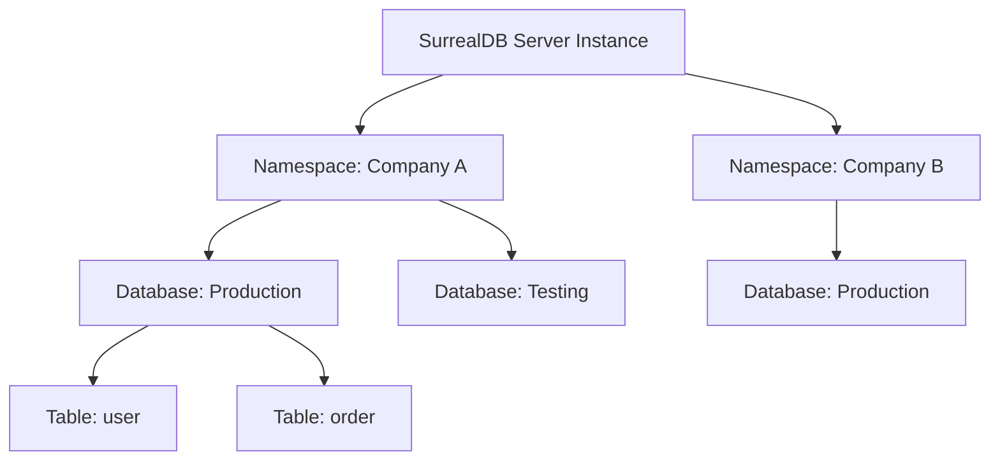

# Namespace & Database

> **Level 1 — What Is SurrealDB?**
> The two-level multi-tenant organizational hierarchy in SurrealDB, where a Namespace groups related databases (for tenant isolation) and a Database groups tables and records, equivalent to PostgreSQL's database-and-schema structure.

---

## 1. Prerequisites

- [Table](table.md) — The collections grouped.

---

## 2. Term Category


**Core Concept (multi-tenant namespace and database hierarchy)**: - **Database Structure / Paradigm**


---

## 3. Explanation

### (1) Design Motivation — "Why did we design this?"
If you are building a **Multi-Tenant SaaS** application (a software platform where multiple customer companies share the same application server):
-   You must guarantee that Company A's employees can never see Company B's records.
-   If you store all clients in the same database table and filter by `company_id`, a single developer coding error in a query filter can leak sensitive data across companies.

In PostgreSQL, you solve this by manually managing separate databases or creating custom user schemas.

In SurrealDB, multi-tenant isolation is built directly into the core using a two-level hierarchy: **Namespaces** and **Databases**. 

A **Namespace** acts as a top-level firewall container. 

You can assign each customer company to its own Namespace. 

Inside that namespace, they can create multiple **Databases** (such as a database for production, one for testing, or database divisions for HR vs. Sales). 

Data cannot bleed between namespaces, and you can assign access users restricted to specific namespace scopes, securing tenant data.

---

### (2) The Organizational Hierarchy



-   **Server Instance:** The running database process.
-   **Namespace (NS):** Isolates client tenants or separate projects.
-   **Database (DB):** Isolates data scopes (e.g. dev vs. prod environment) within a tenant.
-   **Table:** A collection of records inside a database.

---

### (3) Reality Metaphor (Office Buildings)
Imagine a physical office building:
-   **Server Instance:** The physical **Office Building** structure.
-   **Namespace:** A **Floor** in the building. 
    -   Floor 3 is leased to Company A; Floor 4 to Company B. 
    -   Employees from Floor 3 cannot press the elevator button to Floor 4 or look at their files. (Complete tenant isolation).
-   **Database:** A **Room** on that floor (e.g., the "Finance Office" or "HR Office").
-   **Table:** A **Filing Cabinet** inside that room holding folders (records).

---

### (4) Code Examples

#### Selecting Namespace and Database in SurrealQL
Before running queries, you must instruct your connection session which namespace and database scope to target using the `USE` statement:

```sql
-- 1. Select Namespace 'company_a' and Database 'production'
USE NS company_a DB production;

-- 2. Now you can run queries in this database scope
CREATE user:tobie SET name = "Tobie";

-- 3. Switch to the testing database under the same namespace
USE DB testing; // NS remains 'company_a'

-- 4. Switch to a completely different tenant namespace
USE NS company_b DB production;
```

---

## 4. Common Mistakes & Pitfalls

### Mistake 1: Running CRUD queries on a new database session without executing the 'USE' command first

**The mistake:** Opening a connection shell or connecting an SDK client and running `SELECT * FROM user` immediately, getting session errors.

**Why it's wrong:** SurrealDB does not default to a global database context. 

If you do not specify a Namespace and Database, SurrealDB has no context on where to write or read, throwing the error: `There was a problem with the database: Specify a namespace to use`.

**Fix: Always execute a `USE NS <name> DB <name>;` statement immediately after opening a database connection before running any queries.**

---


### Mistake 2: Executing Queries Before Specifying Namespace and Database Scope

**The mistake:** Running `SELECT * FROM user;` in CLI or SDK before invoking `USE NS` and `USE DB`.

**Why it's wrong:** SurrealDB organizes data in a two-tier hierarchy (`NS` -> `DB`). Executing queries without selecting namespace and database targets throws error `There is no database selected`.

*Incorrect:*
```surrealql
-- ❌ Query executed without selecting NS and DB
SELECT * FROM user;
```

*Fix:*
```surrealql
USE NS production DB main;
SELECT * FROM user; // Correct namespace and database selection
```

### Mistake 3: Confusing Namespace Scope with Database Scope

**The mistake:** Expecting tables in Database A under Namespace X to be accessible from Database B under Namespace X.

**Why it's wrong:** Tables and records belong to specific Databases. Namespaces isolate multiple tenant Databases from each other.

*Incorrect:*
```surrealql
-- Expecting cross-database table reads without explicit switching
SELECT * FROM db_b.user; // ❌ Tables are isolated per database
```

*Fix:*
```surrealql
USE NS production DB db_b;
SELECT * FROM user;
```

## 5. Practice Exercises

### Exercise 1: Multi-Tenant Hierarchy Setup Script

**Scenario:**
You are setting up a multi-tenant SaaS application architecture in SurrealDB where tenant organizations are isolated in separate namespaces, and environments (production, staging) are isolated in databases.

**Requirements:**
1. Write the SurrealQL statements to create namespace `tenant_acme` and target database `production`.
2. Define a table `customer` in `tenant_acme:production`.
3. Create namespace `tenant_globex` and target database `production`.
4. Define a table `customer` in `tenant_globex:production`.

> [!check]- Answer
>
> #### Implementation
>
> ```surrealql
> -- Setup Acme Tenant Production Scope
> USE NS tenant_acme DB production;
> DEFINE TABLE customer SCHEMAFULL;
> CREATE customer:c1 SET name = "Acme Corp Customer 1";
> 
> -- Setup Globex Tenant Production Scope
> USE NS tenant_globex DB production;
> DEFINE TABLE customer SCHEMAFULL;
> CREATE customer:c1 SET name = "Globex Corp Customer 1";
> ```
>
> #### Technical Explanation
>
> 1. SurrealDB structures data hierarchically: `Instance -> Namespace -> Database -> Table -> Record`.
> 2. Namespaces provide hard tenant isolation; tables in different namespaces cannot leak data across boundaries.
> 3. Identical table names (`customer`) and record IDs (`customer:c1`) can safely exist independently across namespaces.

---

### Exercise 2: Context Introspection with `INFO` Commands

**Scenario:**
A database administrator needs to inspect all databases present within namespace `tenant_acme` and list all tables within database `production`.

**Requirements:**
1. Target namespace `tenant_acme`.
2. Run the SurrealQL introspection statement to list all databases in `tenant_acme`.
3. Target database `production` and list all table definitions.

> [!check]- Answer
>
> #### Implementation
>
> ```surrealql
> USE NS tenant_acme;
> INFO FOR NS;
> 
> USE DB production;
> INFO FOR DB;
> ```
>
> #### Technical Explanation
>
> 1. `INFO FOR NS` returns metadata about all databases, users, and access methods defined under the active namespace.
> 2. `INFO FOR DB` returns metadata about all tables, functions, analyzers, and parameters defined under the active database.
> 3. Introspection commands verify multi-tenant schema isolation during administrative audits.

---

### Exercise 3: Cross-Namespace Data Isolation Rules

**Scenario:**
A developer asks if a single `SELECT` query in SurrealDB can join or fetch records across two different namespaces (`NS tenant_a` and `NS tenant_b`).

**Requirements:**
1. Answer whether cross-namespace queries are permitted in SurrealDB.
2. Explain the architectural reasoning for this security design.

> [!check]- Answer
>
> #### Implementation
>
> ```text
> Answer: No, cross-namespace queries are strictly prohibited in SurrealDB.
> ```
> 
> ```surrealql
> -- This session is scoped strictly to tenant_a; tenant_b is completely inaccessible!
> USE NS tenant_a DB main;
> SELECT * FROM customer; 
> ```
>
> #### Technical Explanation
>
> 1. Namespaces form hard multi-tenant security boundaries in SurrealDB's storage engine.
> 2. Blocking cross-namespace queries prevents accidental data leakage between SaaS tenants at the database engine level.
> 3. Applications needing shared global lookup data should place shared tables in a dedicated common namespace.

---


## 6. Related Terms

- [Table](table.md) — The collections grouped.
- [Connection Credentials (`USE NS ... DB ...`)](connection_credentials.md) — Session authentication.
- [`INFO FOR` (Introspection)](../level_03/info_for.md) — Related concept: `INFO FOR` (Introspection).

---

## 7. Key Takeaways
- Namespace and Database form SurrealDB's multi-tenant hierarchy.
- A Namespace isolates independent projects or client tenants.
- A Database isolates data environments within a specific namespace.
- Hierarchy: Server Instance $\rightarrow$ Namespace $\rightarrow$ Database $\rightarrow$ Table $\rightarrow$ Record.
- Prevents cross-tenant data leaks at the database core engine layer.
- Always execute `USE NS ... DB ...` to declare your session context.
- CRUD queries run without a active namespace context throw session errors.
