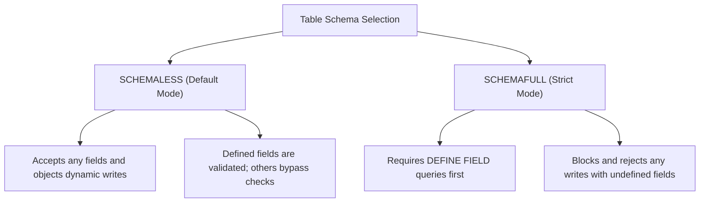

# `SCHEMAFULL` vs `SCHEMALESS`

> **Level 1 — What Is SurrealDB?**
> The table-level configuration toggle that controls data validation: `SCHEMAFULL` enforces strict SQL-like schemas (rejecting undefined fields), while `SCHEMALESS` allows dynamic MongoDB-like flexibility (accepting any unstructured JSON shape).

---

## 1. Prerequisites

- [Table](table.md) — The parent records collection.

---

## 2. Term Category


**Schema & Modeling (flexible vs strict table schema modes)**: - **Database Structure / Paradigm**


---

## 3. Explanation

### (1) Design Motivation — "Why did we design this?"
Relational databases (like PostgreSQL) are strictly schema-full:
-   If you rename or add a column, you must run DDL migrations first.
-   This provides high data integrity but slows down development when requirements change.

Document databases (like MongoDB) are schema-less:
-   You can write any document shape on the fly.
-   This enables rapid development, but data consistency can drift, resulting in corrupted or missing fields.

We designed the **`SCHEMAFULL` vs `SCHEMALESS`** toggle in SurrealDB to combine the benefits of both paradigms in a single database. 

Instead of forcing a single schema model globally, SurrealDB allows you to choose the schema level table-by-table. 

You can run critical invoicing tables in strict `SCHEMAFULL` mode while keeping logging tables flexible in `SCHEMALESS` mode, matching the constraints to the business risk.

---

### (2) The Two Schema Modes



#### 1. `SCHEMALESS` (Default Mode)
-   **Behavior:** Tables are schema-less by default. You can insert any JSON key-value pair.
-   **Hybrid Feature:** If you use `DEFINE FIELD` on a `SCHEMALESS` table, SurrealDB will **validate those specific fields**, but will still accept any other undefined fields you insert.

#### 2. `SCHEMAFULL` (Strict Mode)
-   **Behavior:** Enforces strict validation. You must define the table and all its allowed fields using `DEFINE FIELD` commands before inserting data.
-   **Rejection:** If a query tries to write an undefined field, SurrealDB blocks the write transaction and throws an error.

---

### (3) Reality Metaphor (Forms vs. Blank Cards)
-   **`SCHEMAFULL` Table:** A **Government Visa Application Form**. 
    -   It has pre-printed boxes for First Name, Last Name, and Passport Number. 
    -   If you draw a doodle in the margins or write your favorite band's name, the officer rejects the form. Only defined boxes are allowed.
-   **`SCHEMALESS` Table:** A **Blank Post-it Note**. 
    -   You can write your name, list shopping items, draw a doodle, or leave it blank. 
    -   The card accepts whatever you put on it.

---

### (4) Code Examples

#### Enforcing Schema Modes in SurrealQL
Let's see how both modes behave side-by-side:

```sql
-- ==========================================
-- SCENARIO A: SCHEMALESS TABLE (Flexible)
-- ==========================================
DEFINE TABLE profile SCHEMALESS;
DEFINE FIELD username ON profile TYPE string;

-- This write succeeds (username is validated as string; fav_color is accepted dynamically):
CREATE profile:alice SET username = "Alice", fav_color = "red";


-- ==========================================
-- SCENARIO B: SCHEMAFULL TABLE (Strict SQL)
-- ==========================================
DEFINE TABLE account SCHEMAFULL;
DEFINE FIELD balance ON account TYPE decimal;

-- This write succeeds (balance is defined):
CREATE account:acc01 SET balance = 150.00;

-- This write FAILS (status is NOT defined on the table!):
CREATE account:acc02 SET balance = 15.50, status = "active";
-- Resulting Error: "Database index/validation error: Field 'status' is not defined..."
```

---

## 4. Common Mistakes & Pitfalls

### Mistake 1: Defining a table as 'SCHEMAFULL' but forgetting to write 'DEFINE FIELD' commands, causing all subsequent inserts to fail

**The mistake:** Running `DEFINE TABLE logs SCHEMAFULL;` and trying to insert records immediately: `CREATE logs SET time = time::now();`.

**Why it's wrong:** Under `SCHEMAFULL` rules, any field not explicitly defined by a `DEFINE FIELD` command is blocked. 

If you do not define any fields, the table will reject all writes, making it impossible to insert data.

**Fix: When creating a `SCHEMAFULL` table, always write the corresponding `DEFINE FIELD` statements for every field your application expects to save.**

---


### Mistake 2: Expecting `SCHEMAFULL` Tables to Accept Un-Defined Fields

**The mistake:** Inserting `{ name: "Alice", age: 30 }` into a `SCHEMAFULL` table where `age` field was not defined via `DEFINE FIELD`.

**Why it's wrong:** `SCHEMAFULL` tables strictly reject any field that has not been explicitly declared with `DEFINE FIELD`.

*Incorrect:*
```surrealql
DEFINE TABLE user SCHEMAFULL;
DEFINE FIELD name ON user TYPE string;
-- Inserting un-declared age field:
CREATE user SET name = "Alice", age = 30; // ❌ Field 'age' ignored or rejected!
```

*Fix:*
```surrealql
DEFINE TABLE user SCHEMAFULL;
DEFINE FIELD name ON user TYPE string;
DEFINE FIELD age ON user TYPE number; // Explicitly define age field
CREATE user SET name = "Alice", age = 30;
```

### Mistake 3: Assuming `SCHEMALESS` Tables Cannot Use `DEFINE FIELD` Validation Rules

**The mistake:** Thinking `SCHEMALESS` tables forbid defining type assertions or constraints on specific fields.

**Why it's wrong:** `SCHEMALESS` tables allow extra arbitrary fields while still enforcing `DEFINE FIELD` assertions on fields that ARE explicitly defined.

*Incorrect:*
```surrealql
-- Assuming SCHEMALESS cannot validate specific fields
```

*Fix:*
```surrealql
DEFINE TABLE user SCHEMALESS;
DEFINE FIELD email ON user TYPE string ASSERT is::email($value); // Validates email on flexible table!
```

## 5. Practice Exercises

### Exercise 1: Hybrid Mode Schema Configuration

**Scenario:**
You are designing a user management table where core fields (`email`, `status`) must be strictly validated, but a `metadata` field should allow arbitrary JSON objects for flexible user preferences.

**Requirements:**
1. Define table `user` in `SCHEMAFULL` mode.
2. Define field `email` as `string` with email format validation.
3. Define field `metadata` as `object` or `flexible` object to store arbitrary key-value pairs.

> [!check]- Answer
>
> #### Implementation
>
> ```surrealql
> DEFINE TABLE user SCHEMAFULL;
> 
> DEFINE FIELD email ON TABLE user TYPE string ASSERT string::is::email($value);
> DEFINE FIELD status ON TABLE user TYPE string DEFAULT "active";
> DEFINE FIELD metadata ON TABLE user TYPE object FLEXIBLE;
> 
> -- Test insertion with flexible metadata keys
> CREATE user:u1 SET 
>     email = "u1@example.com",
>     metadata = { theme: "dark", custom_dashboard_layout: [1, 2, 3] };
> ```
>
> #### Technical Explanation
>
> 1. `SCHEMAFULL` mode rejects any field not explicitly defined with `DEFINE FIELD`.
> 2. Marking a nested `object` field as `FLEXIBLE` permits arbitrary nested JSON properties while maintaining strict outer table schema rules.
> 3. Hybrid modeling provides relational schema safety alongside document store flexibility.

---

### Exercise 2: Transitioning SCHEMALESS to SCHEMAFULL

**Scenario:**
A startup began prototyping a `product` table in `SCHEMALESS` mode. As the product matures, they want to enforce strict `SCHEMAFULL` rules to prevent schema drift.

**Requirements:**
1. Write the DDL statement to alter `product` table from `SCHEMALESS` to `SCHEMAFULL`.
2. Define required fields `name` (`string`) and `price` (`decimal`).

> [!check]- Answer
>
> #### Implementation
>
> ```surrealql
> -- Transition table mode to SCHEMAFULL
> DEFINE TABLE OVERWRITE product SCHEMAFULL;
> 
> DEFINE FIELD OVERWRITE name ON TABLE product TYPE string;
> DEFINE FIELD OVERWRITE price ON TABLE product TYPE decimal ASSERT $value >= 0.0dec;
> ```
>
> #### Technical Explanation
>
> 1. `DEFINE TABLE OVERWRITE` updates existing table schema modes idempotently.
> 2. Switching to `SCHEMAFULL` enforces write-time rejection of undefined fields for all subsequent `CREATE` and `UPDATE` queries.
> 3. Existing records violating the new schema will fail subsequent write mutations.

---

### Exercise 3: Validating SCHEMAFULL Rejection Rules

**Scenario:**
Write a test query demonstrating that a `SCHEMAFULL` table rejects writes containing undeclared fields.

**Requirements:**
1. Define a `SCHEMAFULL` table `article` with field `title` (`string`).
2. Attempt to create a record setting `title` and an undeclared field `unapproved_field`.
3. Verify that SurrealDB returns a schema validation error.

> [!check]- Answer
>
> #### Implementation
>
> ```surrealql
> DEFINE TABLE article SCHEMAFULL;
> DEFINE FIELD title ON TABLE article TYPE string;
> 
> -- This query will FAIL with a schema validation error:
> -- "Found field 'unapproved_field' on 'article', but this table is SCHEMAFULL and field is not defined"
> CREATE article:1 SET title = "My Article", unapproved_field = "Illegal Data";
> ```
>
> #### Technical Explanation
>
> 1. `SCHEMAFULL` tables act like strict relational SQL tables, guarding against typo fields and accidental data pollution.
> 2. `SCHEMALESS` tables (default if omitted) accept any JSON property dynamically like MongoDB documents.
> 3. Choosing between modes depends on whether the application domain requires prototyping flexibility or strict data contract enforcement.

---


## 6. Related Terms

- [Table](table.md) — The parent records collection.
- [`DEFINE FIELD`](../level_04/define_field.md) — Setting field rules.
- [`null` vs `NONE`](../level_02/null_none.md) — Related concept: `null` vs `NONE`.
- [`DEFINE TABLE`](../level_04/define_table.md) — Related concept: `DEFINE TABLE`.

---

## 7. Key Takeaways
- `SCHEMALESS` allows dynamic fields; `SCHEMAFULL` enforces strict schemas.
- Tables are `SCHEMALESS` by default in SurrealDB.
- `SCHEMAFULL` tables reject any writes containing undefined fields.
- `SCHEMALESS` tables validate defined fields but accept undefined ones.
- Choose `SCHEMAFULL` for critical production transaction tables.
- Use `SCHEMALESS` for rapid prototyping or polymorphic metrics logs.
- Enforce schemas table-by-table in the same database.
