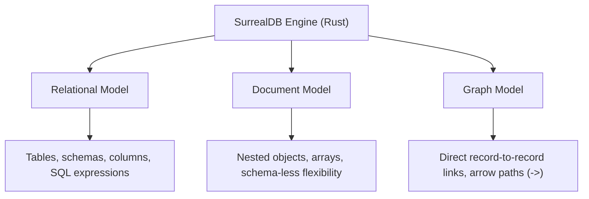

# SurrealDB

> **Level 1 — What Is SurrealDB?**
> An open-source, multi-model database written in Rust that unifies relational SQL tables, document JSON stores, and graph database traversal networks into a single, high-performance database engine.

---

## 1. Prerequisites

- [Multi-Model Database](multi_model_database.md) — The parent paradigm concept.

---

## 2. Term Category


**Core Concept (multi-model database engine)**: - **Database Structure / Paradigm**


---

## 3. Explanation

### (1) Design Motivation — "Why did we design this?"
Relational databases (like PostgreSQL) are reliable but force you to normalize data, resulting in complex JOIN queries that slow down as database size grows. 

Document databases (like MongoDB) are flexible but make relationships hard to manage, forcing you to run slow aggregations (`$lookup`) or join data manually in application code. 

Graph databases (like Neo4j) map relationships beautifully but are difficult to use for standard billing and tabular records.

We designed **SurrealDB** to combine the strengths of all three models while eliminating their limitations. 

Written in Rust for speed and memory safety, SurrealDB is built from scratch as a unified multi-model engine. 

It provides SQL-like structure, NoSQL document nesting, and graph arrow routing. 

Furthermore, it simplifies architecture by building web-tier features—like real-time subscriptions, user signup/login access controls, and WebSocket endpoints—directly into the database, allowing web clients to query the database securely without an intermediate backend API layer.

---

### (2) The SurrealDB Model Fusion



-   **As a SQL DB:** You query data using a SQL-like language (SurrealQL), define indexes, and run ACID transactions.
-   **As a Document DB:** You store unstructured nested JSON records, query array fields, and mix schema rules per table.
-   **As a Graph DB:** You connect documents directly with pointer arrows, navigating relationships without slow SQL JOIN tables.

---

### (3) Reality Metaphor (The Amphibious Hovercraft)
Imagine navigating different terrains:
-   **PostgreSQL (A Passenger Train):** Runs on rigid, pre-laid steel tracks. It is extremely reliable and carries huge loads, but it cannot steer off the track. (Tabular structure).
-   **MongoDB (An Off-Road Jeep):** Drives anywhere. It can steer off-road and navigate muddy paths, but it is hard to connect to a train network. (Document flexibility).
-   **SurrealDB (An Amphibious Hovercraft):** A vehicle that glides over train tracks, drives over muddy off-road swamps, and floats across deep lakes seamlessly. 
    -   It combines the speed of the train and the freedom of the Jeep in a single hull.

---

## 4. Common Mistakes & Pitfalls

### Mistake 1: Writing relational schema code with junction tables and foreign keys in SurrealDB, bypassing native record links

**The mistake:** Creating a `user_post_junction` table to store many-to-many links between users and posts, replicating SQL patterns.

**Why it's wrong:** SurrealDB does not need junction tables. 

It supports **Record Links** (fields storing `table:id` pointers) and **Graph Edges** (created using the `RELATE` command). 

Replicating SQL join tables increases schema complexity and slows down queries, as you miss out on SurrealDB's arrow operators (`->`) which traverse relationships in constant time.

**Fix: Learn to use SurrealDB's native record pointer links (e.g. `record<user>`) and graph edge paths instead of designing relational schema keys and junction tables.**

---


### Mistake 2: Creating Relational Junction Tables instead of Native Graph Arrows

**The mistake:** Creating `user_post_junction` table to store many-to-many relationships in SurrealDB.

**Why it's wrong:** SurrealDB features native graph edge tables created via `RELATE user:1->wrote->post:10`. Junction tables add unnecessary overhead and prevent arrow path queries (`user:1->wrote->post`).

*Incorrect:*
```surrealql
-- Relational junction table pattern (Anti-pattern in SurrealDB)
CREATE user_post CONTENT { user: user:1, post: post:10 };
```

*Fix:*
```surrealql
-- Native graph edge creation
RELATE user:1->wrote->post:10 SET created_at = time::now();
```

### Mistake 3: Building Intermediary API Server Wrappers when Direct Client Auth Suffices

**The mistake:** Building a 2,000-line Express/Fastify API server solely to forward basic CRUD queries to SurrealDB.

**Why it's wrong:** SurrealDB includes built-in JWT authentication, Scope access permissions, and WebSocket subscriptions, enabling web clients to query the database directly with strict row-level security.

*Incorrect:*
```surrealql
// Express API route forwarding raw queries
app.get('/users', async (req, res) => { res.json(await db.select('user')); });
```

*Fix:*
```surrealql
// Direct client SDK connection using row-level security permissions
const db = new Surreal();
await db.signin({ access: "user", ... });
await db.select("user"); // Filtered safely by SurrealDB PERMISSIONS!
```

## 5. Practice Exercises

### Exercise 1: Multi-Model Paradigm Comparison Matrix

**Scenario:**
You are explaining SurrealDB's multi-model architecture to a development team familiar with PostgreSQL and MongoDB.

**Requirements:**
1. Compare how relational tables, document JSON, and graph connections are modeled in SurrealDB versus PostgreSQL and MongoDB.
2. Highlight SurrealDB's unified query language capabilities.

> [!check]- Answer
>
> #### Implementation
>
> ```text
> Feature Comparison Matrix:
> +-------------------+-----------------------+-----------------------+-------------------------+
> | Feature           | PostgreSQL            | MongoDB               | SurrealDB               |
> +-------------------+-----------------------+-----------------------+-------------------------+
> | Data Model        | Strict Relational     | Flexible Document     | Unified Multi-Model     |
> | Relationships     | Foreign Keys + JOINs  | ObjectId + $lookup    | Record Links & Arrows   |
> | Real-Time         | LISTEN / NOTIFY       | Change Streams        | Native LIVE SELECT      |
> | Web Client Access | Requires Backend API  | Requires Backend API  | Direct WS with RLS Auth |
> +-------------------+-----------------------+-----------------------+-------------------------+
> ```
>
> #### Technical Explanation
>
> 1. SurrealDB combines SQL table structure, NoSQL document nesting, and graph arrow traversals into one engine.
> 2. Eliminates relational junction tables and expensive SQL `JOIN` operations using direct record pointer links.
> 3. Built-in WebSocket real-time live queries and row-level security allow web clients to query the database safely without custom backend middleware.

---

### Exercise 2: Unified Paradigm Query Mapping

**Scenario:**
Write SurrealQL query snippets demonstrating how SurrealDB handles relational structure, document arrays, and graph pointer traversals in a single unified language syntax.

**Requirements:**
1. Show relational table selection with field filters.
2. Show document array selection and nested object extraction.
3. Show graph arrow traversal query (`->wrote->post`).

> [!check]- Answer
>
> #### Implementation
>
> ```surrealql
> -- 1. Relational-style tabular query
> SELECT id, name, email FROM user WHERE active = true;
> 
> -- 2. Document-style nested field extraction
> SELECT name, settings.theme, tags[0] FROM user:john;
> 
> -- 3. Graph-style arrow relationship traversal
> SELECT ->wrote->post.title FROM user:john;
> ```
>
> #### Technical Explanation
>
> 1. Tabular `SELECT` statements provide familiar SQL semantics for structured reporting.
> 2. Dot-notation (`settings.theme`) and array indexing (`tags[0]`) extract nested document fields without unnesting.
> 3. Arrow operators (`->wrote->post`) navigate graph edge relationships in $O(1)$ time complexity without `JOIN` syntax.

---

### Exercise 3: Embedded Rust and WASM Execution

**Scenario:**
A desktop application developer is evaluating SurrealDB's embedded execution mode for an offline-first desktop app.

**Requirements:**
1. State whether SurrealDB can run embedded directly inside Rust desktop applications or browser WASM runtimes.
2. Explain the deployment advantage of embedded mode over traditional client-server databases.

> [!check]- Answer
>
> #### Implementation
>
> ```text
> Answer: Yes, SurrealDB runs embedded inside Rust, Node.js, and WebAssembly (WASM) applications natively.
> ```
> 
> ```rust
> // Embedded Rust initialization
> use surrealdb::engine::local::Mem;
> use surrealdb::Surreal;
> 
> let db = Surreal::new::<Mem>(()).await?;
> ```
>
> #### Technical Explanation
>
> 1. SurrealDB is written in Rust and can be compiled directly into application binaries as a lightweight embedded library.
> 2. Running embedded in WebAssembly (WASM) allows in-browser local database execution for offline-first web apps.
> 3. Eliminates network latency and external database server dependency for desktop, mobile, and edge computing.

---


## 6. Related Terms

- [Multi-Model Database](multi_model_database.md) — The parent paradigm concept.
- [SurrealQL](surrealql.md) — The query language.
- [SurrealDB vs. PostgreSQL vs. MongoDB](surrealdb_vs_postgres_mongo.md) — Related concept: SurrealDB vs. PostgreSQL vs. MongoDB.
- [`object`](../level_02/object_type.md) — Related concept: `object`.
- [`DEFINE SCOPE` (Auth Scopes Overview)](../level_04/define_scope.md) — Related concept: `DEFINE SCOPE` (Auth Scopes Overview).

---

## 7. Key Takeaways
- SurrealDB is a Rust-based, high-performance multi-model database.
- Fuses SQL structure, document nesting, and graph traversals in one engine.
- Written in Rust for maximum speed, concurrency, and memory safety.
- Eliminates the need for relational junction tables or SQL JOIN queries.
- Built-in WebSockets, real-time live queries, and JWT authentication tokens.
- Supports pluggable storage (in-memory, single-node disk, or TiKV cluster).
- Enables direct browser-to-database connections with row-level security.
