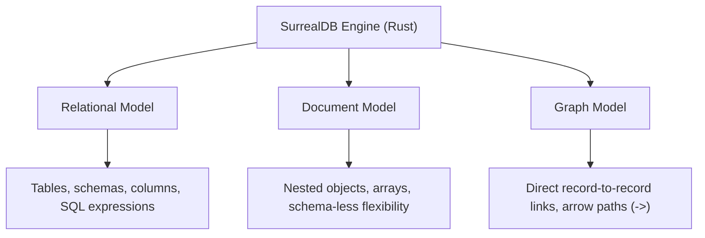

# SurrealDB

> **Level 1 — What Is SurrealDB?**
> An open-source, multi-model database written in Rust that unifies relational SQL tables, document JSON stores, and graph database traversal networks into a single, high-performance database engine.

---

## 1. Prerequisites
- [Multi-Model Database](multi_model_database.md) — The parent paradigm concept.

---

## 2. Term Category
- **Database Structure / Paradigm**

---

## 3. Environment Context
- **SurrealDB Core** (The database engine server. Runs as a standalone command line binary `surreal` or embedded inside Rust/WASM applications).

---

## 4. Explanation

### (1) Design Motivation — "Why did we design this?"
Relational databases (like PostgreSQL) are reliable but force you to normalize data, resulting in complex JOIN queries that slow down as database size grows. 

Document databases (like MongoDB) are flexible but make relationships hard to manage, forcing you to run slow aggregations (`$lookup`) or join data manually in application code. 

Graph databases (like Neo4j) map relationships beautifully but are difficult to use for standard billing and tabular records.

We designed **SurrealDB** to combine the strengths of all three models while eliminating their limitations. 

Written in Rust for speed and memory safety, SurrealDB is built from scratch as a unified multi-model engine. 

It provides SQL-like structure, NoSQL document nesting, and graph arrow routing. 

Furthermore, it simplifies architecture by building web-tier features—like real-time subscriptions, user signup/login access controls, and WebSocket endpoints—directly into the database, allowing web clients to query the database securely without an intermediate backend API layer.

---

### (2) The SurrealDB Model Fusion



-   **As a SQL DB:** You query data using a SQL-like language (SurrealQL), define indexes, and run ACID transactions.
-   **As a Document DB:** You store unstructured nested JSON records, query array fields, and mix schema rules per table.
-   **As a Graph DB:** You connect documents directly with pointer arrows, navigating relationships without slow SQL JOIN tables.

---

### (3) Reality Metaphor (The Amphibious Hovercraft)
Imagine navigating different terrains:
-   **PostgreSQL (A Passenger Train):** Runs on rigid, pre-laid steel tracks. It is extremely reliable and carries huge loads, but it cannot steer off the track. (Tabular structure).
-   **MongoDB (An Off-Road Jeep):** Drives anywhere. It can steer off-road and navigate muddy paths, but it is hard to connect to a train network. (Document flexibility).
-   **SurrealDB (An Amphibious Hovercraft):** A vehicle that glides over train tracks, drives over muddy off-road swamps, and floats across deep lakes seamlessly. 
    -   It combines the speed of the train and the freedom of the Jeep in a single hull.

---

## 5. Common Mistakes & Pitfalls

### Mistake 1: Writing relational schema code with junction tables and foreign keys in SurrealDB, bypassing native record links

**The mistake:** Creating a `user_post_junction` table to store many-to-many links between users and posts, replicating SQL patterns.

**Why it's wrong:** SurrealDB does not need junction tables. 

It supports **Record Links** (fields storing `table:id` pointers) and **Graph Edges** (created using the `RELATE` command). 

Replicating SQL join tables increases schema complexity and slows down queries, as you miss out on SurrealDB's arrow operators (`->`) which traverse relationships in constant time.

**Fix: Learn to use SurrealDB's native record pointer links (e.g. `record<user>`) and graph edge paths instead of designing relational schema keys and junction tables.**

---


### Mistake 2: Creating Relational Junction Tables instead of Native Graph Arrows

**The mistake:** Creating `user_post_junction` table to store many-to-many relationships in SurrealDB.

**Why it's wrong:** SurrealDB features native graph edge tables created via `RELATE user:1->wrote->post:10`. Junction tables add unnecessary overhead and prevent arrow path queries (`user:1->wrote->post`).

*Incorrect:*
```surrealql
-- Relational junction table pattern (Anti-pattern in SurrealDB)
CREATE user_post CONTENT { user: user:1, post: post:10 };
```

*Fix:*
```surrealql
-- Native graph edge creation
RELATE user:1->wrote->post:10 SET created_at = time::now();
```

### Mistake 3: Building Intermediary API Server Wrappers when Direct Client Auth Suffices

**The mistake:** Building a 2,000-line Express/Fastify API server solely to forward basic CRUD queries to SurrealDB.

**Why it's wrong:** SurrealDB includes built-in JWT authentication, Scope access permissions, and WebSocket subscriptions, enabling web clients to query the database directly with strict row-level security.

*Incorrect:*
```surrealql
// Express API route forwarding raw queries
app.get('/users', async (req, res) => { res.json(await db.select('user')); });
```

*Fix:*
```surrealql
// Direct client SDK connection using row-level security permissions
const db = new Surreal();
await db.signin({ access: "user", ... });
await db.select("user"); // Filtered safely by SurrealDB PERMISSIONS!
```

## 6. Practice Exercises

### Exercise 1: Capability Checklist

**Problem:** You are comparing SurrealDB with your existing PostgreSQL and MongoDB knowledge base. 
Identify which database engine (**PostgreSQL**, **MongoDB**, or **SurrealDB**) supports the following feature capabilities:
1.  Enforces strict column schemas on one table, while allowing completely schema-less JSON objects on another table in the same database.
2.  Traverses social connection paths using arrow path operators (`->`) natively without JOIN keys.
3.  Allows web applications to connect via WebSockets and query data directly with built-in row permissions.

**Expected output:**
```text
1. SurrealDB (PostgreSQL is strictly schema-full; MongoDB is schema-less/jsonSchema, but only SurrealDB allows toggling SCHEMAFULL vs SCHEMALESS per table).
2. SurrealDB (PostgreSQL requires JOINs; MongoDB requires $lookup; SurrealDB utilizes native graph arrow routes).
3. SurrealDB (Both PostgreSQL and MongoDB require an intermediary backend API server to handle client queries safely).
```

> [!check]- Answer
> - Evaluate which database integrates client authentication and websockets directly.
> - Consider which database supports graph edge links at the syntax layer.

---


### Exercise 2: Unified Paradigm Mapping

**Problem:** Map SurrealDB capabilities: Relational (Tables, SQL), Document (Nested JSON), Graph (`->` record links).

**Expected output:**
```text
Relational: Tables & SQL, Document: Nested JSON, Graph: Record links & arrow paths
```

> [!check]- Answer
> ```text
> Relational: Tables & SQL, Document: Nested JSON, Graph: Record links & arrow paths
> ```
>
> **Explanation:** SurrealDB unifies relational structure, document flexibility, and graph connectivity.

### Exercise 3: SurrealDB Embedded Rust Feature

**Problem:** Can SurrealDB be embedded directly into Rust binaries without network overhead? (Yes).

**Expected output:**
```text
Yes, SurrealDB runs embedded inside Rust or WASM applications natively
```

> [!check]- Answer
> ```text
> Yes, SurrealDB runs embedded inside Rust or WASM applications natively
> ```
>
> **Explanation:** SurrealDB can be compiled directly into Rust applications as an embedded library.

## 7. Related Terms
- [Multi-Model Database](multi_model_database.md) — The parent paradigm concept.
- [SurrealQL](surrealql.md) — The query language.

---

## 8. Key Takeaways
- SurrealDB is a Rust-based, high-performance multi-model database.
- Fuses SQL structure, document nesting, and graph traversals in one engine.
- Written in Rust for maximum speed, concurrency, and memory safety.
- Eliminates the need for relational junction tables or SQL JOIN queries.
- Built-in WebSockets, real-time live queries, and JWT authentication tokens.
- Supports pluggable storage (in-memory, single-node disk, or TiKV cluster).
- Enables direct browser-to-database connections with row-level security.
