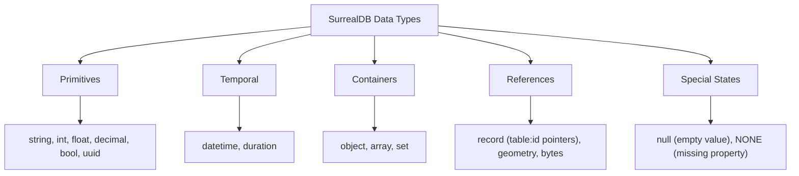

# Data Types (Overview)

> **Level 2 — Data Types & Record Structure**
> The unified type system of SurrealDB, serving as a rich superset that combines the strict type safety of PostgreSQL with the flexible document nesting structures of MongoDB.

---

## 1. Prerequisites

- [Record](../level_01/record.md) — The storage context.
- [SurrealDB](../level_01/surrealdb.md) — SurrealDB core concepts.

---

## 2. Term Category


**Data Type (SurrealDB native type system overview)**: - **Database Structure / Paradigm**


---

## 3. Explanation

### (1) Design Motivation — "Why did we design this?"
Relational databases (like PostgreSQL) have rigid type systems. 

While this prevents bugs, columns cannot easily hold arrays or sub-objects, making nesting difficult. 

NoSQL document databases (like MongoDB) support objects and arrays, but they are schema-flexible, allowing database properties to drift and corrupt application logic.

We designed the **SurrealDB Type System** to bridge these paradigms. 

It is a strict, strongly-typed system. 

It supports standard SQL primitives (like integers, decimals, and strings) and NoSQL container shapes (like objects, arrays, and sets). 

Furthermore, it introduces native relational data types—like **Record Links** (representing direct pointers to other records)—allowing you to define strict schemas that validate nested documents and references automatically at the engine layer.

---

### (2) The Data Type Landscape
SurrealDB data types are classified into five major groups:



1.  **Primitives:** `string`, `int`, `float`, `decimal` (exact numbers), `bool`, `uuid`.
2.  **Temporal:** `datetime` (ISO timestamps), `duration` (e.g., `7d` or `1h30m`).
3.  **Containers:** `object` (nested JSON), `array` (ordered list), `set` (unique list).
4.  **References:** `record` (pointers to specific tables like `record<user>`), `geometry` (GeoJSON maps).
5.  **Special States:** `null` (field exists with empty value), `NONE` (field is completely absent).

---

### (3) Reality Metaphor (Modular Sorting Trays)
Imagine sorting items for shipping:
-   **PostgreSQL (Rigid Slots):** A tray with pre-cut, non-adjustable plastic slots. 
    -   You have a round slot for coins and a thin slot for cards. 
    -   You cannot place a bulky package or attach secondary boxes.
-   **MongoDB (Empty Box):** A wide cardboard box. 
    -   You toss everything inside. 
    -   It is flexible, but items roll around and get damaged.
-   **SurrealDB (Modular Container Organizer):** 
    -   It has standard slots for coins and cards (primitives).
    -   It has adjustable slider dividers for bulky items (objects and arrays).
    -   It has a built-in magnetic snap-mount to lock a tracking label (`record` link) directly onto the box, linking it to another container.

---

### (4) Code Examples

#### Declaring Typed Fields in SurrealQL
To enforce the type system, you write field definitions using the `TYPE` parameter:

```sql
DEFINE TABLE user SCHEMAFULL;

-- 1. Primitive types
DEFINE FIELD name ON user TYPE string;
DEFINE FIELD age ON user TYPE int;
DEFINE FIELD active ON user TYPE bool;

-- 2. Container types (with nested type parameters!)
DEFINE FIELD settings ON user TYPE object;
DEFINE FIELD tags ON user TYPE array<string>; // Array holding only strings

-- 3. Temporal and Pointer types
DEFINE FIELD created_at ON user TYPE datetime;
DEFINE FIELD manager ON user TYPE record<user>; // Link pointing to another user record
```

---

## 4. Common Mistakes & Pitfalls

### Mistake 1: Assuming SurrealDB does not validate types in 'SCHEMALESS' tables

**The mistake:** Thinking that because a table is configured as `SCHEMALESS`, you can write mismatched types to defined fields, assuming "schema-less ignores types."

**Why it's wrong:** In SurrealDB, `SCHEMALESS` only means you can write **undefined** fields. 

If you explicitly define a field's type using the `DEFINE FIELD` command, SurrealDB will enforce that type validation strictly on all write queries, rejecting mismatched data.

**Fix: If you want a field to accept completely flexible types in any mode, do not write a `DEFINE FIELD` statement for it, or declare its type as a union: `TYPE string | int | object`.**

---


### Mistake 2: Passing Mismatched Data Types to `SCHEMAFULL` Field Definitions

**The mistake:** Inserting string `"123"` into a field defined as `TYPE number` without automatic type casting.

**Why it's wrong:** `SCHEMAFULL` tables reject field values whose runtime types do not match declared `TYPE` definitions unless flexible type casting or FLEXIBLE fields are specified.

*Incorrect:*
```surrealql
DEFINE FIELD age ON TABLE user TYPE number;
CREATE user SET age = "thirty"; // ❌ Type error: Expected number, got string
```

*Fix:*
```surrealql
DEFINE FIELD age ON TABLE user TYPE number;
CREATE user SET age = <number> "30"; // Explicit type casting
```

### Mistake 3: Confusing `NONE` Data Type with `NULL` Data Type

**The mistake:** Expecting `NONE` (absent field) to behave identically to `NULL` (explicit null value).

**Why it's wrong:** `NONE` represents the complete absence of a field key. `NULL` represents a key assigned explicit null. They have distinct query filtering behaviors.

*Incorrect:*
```surrealql
-- Expecting NONE to equal NULL
SELECT * FROM user WHERE bio = NULL; // Misses records where bio is NONE!
```

*Fix:*
```surrealql
SELECT * FROM user WHERE bio = NONE OR bio = NULL;
```

## 5. Practice Exercises

### Exercise 1: Native Type Enforcement Schema

**Scenario:**
You are building an e-commerce inventory product schema requiring strong data type definitions for text, currency decimals, integer stock, and ISO datetimes.

**Requirements:**
1. Define table `inventory` in `SCHEMAFULL` mode.
2. Define field `sku` as `string`.
3. Define field `unit_cost` as `decimal`.
4. Define field `quantity` as `int`.
5. Define field `last_restocked` as `datetime`.

> [!check]- Answer
>
> #### Implementation
>
> ```surrealql
> DEFINE TABLE inventory SCHEMAFULL;
> DEFINE FIELD sku ON TABLE inventory TYPE string;
> DEFINE FIELD unit_cost ON TABLE inventory TYPE decimal;
> DEFINE FIELD quantity ON TABLE inventory TYPE int;
> DEFINE FIELD last_restocked ON TABLE inventory TYPE datetime;
> 
> CREATE inventory:inv1 SET 
>     sku = "KEY-MECH-01",
>     unit_cost = 89.99dec,
>     quantity = 150,
>     last_restocked = time::now();
> ```
>
> #### Technical Explanation
>
> 1. SurrealDB features a rich native type system (`string`, `decimal`, `int`, `datetime`, `record`, `geometry`).
> 2. `decimal` avoids binary floating-point rounding errors inherent to currency calculations.
> 3. Strict field types prevent schema corruption during application write operations.

---

### Exercise 2: Type Coercion Error Handling

**Scenario:**
Test SurrealDB's type enforcement by attempting to write a string `"one hundred"` into an integer `int` field.

**Requirements:**
1. Create table `test_type` in `SCHEMAFULL` mode with field `val` of type `int`.
2. Show the invalid creation query and verify that SurrealDB throws a type mismatch error.

> [!check]- Answer
>
> #### Implementation
>
> ```surrealql
> DEFINE TABLE test_type SCHEMAFULL;
> DEFINE FIELD val ON TABLE test_type TYPE int;
> 
> -- This query will FAIL with a type mismatch error:
> -- "Expected a int but found 'one hundred'"
> CREATE test_type:1 SET val = "one hundred";
> ```
>
> #### Technical Explanation
>
> 1. In `SCHEMAFULL` mode, SurrealDB validates field data types at write time before committing transactions.
> 2. Unconvertible data types are rejected immediately, protecting database integrity.
> 3. Valid numeric strings (e.g. `"100"`) may be auto-coerced depending on strictness settings.

---

### Exercise 3: Inspecting Field Types via `INFO FOR TABLE`

**Scenario:**
A database developer needs to introspect the schema of an existing table to audit field type definitions.

**Requirements:**
1. Run the `INFO FOR TABLE` statement for table `inventory`.
2. Inspect the output object to verify defined field data types.

> [!check]- Answer
>
> #### Implementation
>
> ```surrealql
> INFO FOR TABLE inventory;
> ```
>
> #### Technical Explanation
>
> 1. `INFO FOR TABLE` outputs an object listing all defined fields, types, assertions, and default values.
> 2. Facilitates automated schema inspection and type auditing in CI/CD pipelines.
> 3. Helps developers verify type definitions before running data migration scripts.

---


## 6. Related Terms

- [Record ID (`table:id`)](../level_01/record_id.md) — The composite identifier.
- [Type Casting & Coercion](type_casting.md) — Converting between types.
- [`array`](array_type.md) — Related concept: `array`.
- [`bool`](bool.md) — Related concept: `bool`.
- [`datetime` / `duration`](datetime_duration.md) — Related concept: `datetime` / `duration`.
- [`geometry` (GeoJSON)](geometry_type.md) — Related concept: `geometry` (GeoJSON).
- [`int` / `float` / `decimal`](number_types.md) — Related concept: `int` / `float` / `decimal`.
- [`set`](set_type.md) — Related concept: `set`.
- [`string`](string.md) — Related concept: `string`.
- [`uuid`](uuid_type.md) — Related concept: `uuid`.
- [`record` (Record Link Type)](record_link_type.md) — Record link types.

---

## 7. Key Takeaways
- SurrealDB's type system combines relational structure with NoSQL flexibility.
- Supports primitives, temporal data, containers, references, and null states.
- Type definitions are declared using the `TYPE` clause in `DEFINE FIELD`.
- Enforces strict type validations even inside `SCHEMALESS` tables for defined fields.
- `set` handles unique value lists; `record` handles pointers to table rows.
- Union types allow a field to accept multiple declared types (e.g. `string | int`).
- Nested syntax (like `array<string>`) guarantees type-safety inside containers.
