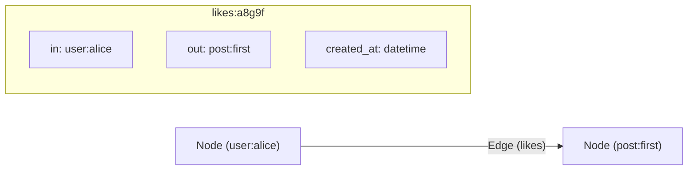

# Graph Connections (Overview: Nodes vs Edges)

> **Level 5 — Relational Data & Graph Operations**
> The core graph database concepts in SurrealDB, separating entities (**Nodes** or Vertices) from relationships (**Edges** or Relations), explaining how edges act as first-class records containing `in` and `out` pointer fields.

---

## 1. Prerequisites

- [Record Link (Concept)](record_link_concept.md) — The single reference link.
- [`DEFINE TABLE`](../level_04/define_table.md) — Table structure configurations.

---

## 2. Term Category


**Core Concept (multi-model graph data architecture)**: - **Database Structure / Paradigm**


---

## 3. Explanation

### (1) Design Motivation — "Why did we design this?"
In relational databases, representing complex networks (like social connections or recommendations) requires many-to-many junction tables:
-   To check if User A follows User B, you must query a `follows` junction table.
-   As your network grows, queries require chaining multiple self-joins.
-   These SQL self-joins are slow because they scan table indexes sequentially.

We designed native **Graph Connections** in SurrealDB to solve this scaling problem. 

Instead of treating connections as abstract keys, SurrealDB uses a first-class **Node and Edge** model. 

Relationships are traversed in constant time, allowing you to query complex connection networks (like "friends of friends who bought product X") without SQL joins.

---

### (2) Nodes vs. Edges in SurrealDB



#### 1. Nodes (Vertices)
Nodes represent the core entities in your application (e.g. users, articles, products). 
-   They are standard records stored in normal database tables.

#### 2. Edges (Relations)
Edges represent the relationships connecting the nodes (e.g. `follows`, `bought`, `likes`).
-   In SurrealDB, edges are **first-class records** stored in relation tables.
-   Every edge record has a unique ID (e.g. `likes:a8g9f...`) and contains two mandatory fields:
    -   **`in`:** A record link pointing to the source node (the origin of the relationship).
    -   **`out`:** A record link pointing to the target node (the destination of the relationship).
-   Because edges are records, you can store custom properties directly on the edge itself (e.g., saving the timestamp when a user liked a post).

---

### (3) Reality Metaphor (Flight Routes)
Imagine looking at a global transportation map:
-   **Nodes (Airports):** The **Cities** on the map (New York, London, Tokyo). They are fixed locations.
-   **Edges (Flight Routes):** The **Flight Paths** connecting the cities. 
    -   The path is not just an empty line; it has its own properties (flight number, distance, ticket price). 
    -   The path has a start location (`in` New York) and a destination (`out` London).

---

## 4. Common Mistakes & Pitfalls

### Mistake 1: Treating graph edges as simple metadata strings, unaware that they are full database records with 'in' and 'out' pointer fields

**The mistake:** Assuming that creating a relationship is just a string marker and trying to query edges without referencing the `in` and `out` keys in edge validation scripts.

**Why it's wrong:** In SurrealDB, edges are complete database records. 

If you define a relation table, you must treat `in` and `out` as first-class record link fields. 

If you write validation rules on the relation table, forgetting that `in` and `out` are mandatory fields will block relation writes.

**Fix: Learn to write schema definitions for relation tables that validate the `in` and `out` fields as record links, matching your node tables:**

```sql
-- CORRECT RELATION SCHEMA WITH NODE VALIDATION
DEFINE TABLE follows TYPE RELATION FROM user TO user;
-- Under the hood, follows contains:
-- FIELD in TYPE record<user>
-- FIELD out TYPE record<user>
```

---


### Mistake 2: Treating Graph Edge Tables as Auxiliary Tables That Cannot Be Directly Queried

**The mistake:** Assuming graph edge tables created via `RELATE` cannot be queried with standard `SELECT` statements.

**Why it's wrong:** Graph edge tables in SurrealDB are first-class record tables! You can run `SELECT * FROM wrote;`, update edges, index edge fields, or attach changefeeds.

*Incorrect:*
```surrealql
-- Assuming edges cannot be queried directly
```

*Fix:*
```surrealql
SELECT * FROM wrote WHERE created_at > d"2026-01-01T00:00:00Z"; // Query edge records directly!
```

### Mistake 3: Creating Duplicate Un-Indexed Graph Edges Between Identical Record Nodes

**The mistake:** Executing `RELATE user:alice->likes->post:1;` 10 times creating 10 duplicate edge records.

**Why it's wrong:** `RELATE` creates a new edge record with a random ID every time unless custom edge IDs or unique indexes are specified.

*Incorrect:*
```surrealql
-- Creates multiple duplicate edge records!
RELATE user:alice->likes->post:1;
RELATE user:alice->likes->post:1; // ❌ Duplicate edge created!
```

*Fix:*
```surrealql
DEFINE INDEX UNIQUE_LIKE ON TABLE likes FIELDS in, out UNIQUE;
RELATE user:alice->likes->post:1; // Prevented by unique index
```


## 5. Practice Exercises

### Exercise 1: Multi-Model Graph vs Relational Paradigms

**Scenario:**
Compare how graph connections are created and queried in SurrealDB versus traditional SQL relational databases.

**Requirements:**
1. Explain how graph relations (`RELATE`) replace SQL foreign key junction tables.
2. Explain how arrow path traversals (`->`) replace SQL `JOIN` clauses.

> [!check]- Answer
>
> #### Implementation
>
> ```text
> SQL Relational Paradigm:
> - Creates a junction table 'user_posts' (user_id FK, post_id FK).
> - Requires SELECT ... FROM user JOIN user_posts ON ... JOIN post ON ...
> 
> SurrealDB Graph Paradigm:
> - Creates a relation edge table using RELATE user:alice->wrote->post:p1.
> - Queries connected posts using SELECT ->wrote->post FROM user:alice.
> ```
>
> #### Technical Explanation
>
> 1. `RELATE` creates direct $O(1)$ record link pointers between source and target records.
> 2. Arrow operators (`->`) follow direct pointer addresses without table scanning or index join lookups.
> 3. Unifies relational schema safety with graph database traversal speeds.
> 
---

### Exercise 2: Basic Relation Edge Creation with `RELATE`

**Scenario:**
Create a graph relation edge `liked` connecting `user:alice` to `post:p1` with a `liked_at` timestamp property.

**Requirements:**
1. Execute `RELATE user:alice -> liked -> post:p1 SET liked_at = time::now()`.

> [!check]- Answer
>
> #### Implementation
>
> ```surrealql
> CREATE user:alice SET name = "Alice";
> CREATE post:p1 SET title = "SurrealDB Graph Overview";
> 
> -- Create graph relation edge
> RELATE user:alice->liked->post:p1 SET liked_at = time::now();
> ```
>
> #### Technical Explanation
>
> 1. `RELATE in->edge->out` establishes a directed graph connection between two record IDs.
> 2. Stores `in` (source ID), `out` (target ID), and custom edge properties (`liked_at`).
> 3. Edge tables (`liked`) can be queried directly or traversed via arrow paths.
> 
---

### Exercise 3: Graph Arrow Traversal Execution

**Scenario:**
Query all posts liked by `user:alice` using `->liked->post`.

**Requirements:**
1. Write `SELECT ->liked->post.title FROM user:alice`.

> [!check]- Answer
>
> #### Implementation
>
> ```surrealql
> SELECT ->liked->post.title AS liked_titles FROM user:alice;
> ```
>
> #### Technical Explanation
>
> 1. `->liked->post` navigates from `user:alice` across `liked` edges to `post` vertices.
> 2. Resolves graph connections in a single database execution step.
> 3. Returns an array of target post titles.
> 
---


## 6. Related Terms

- [Record Link (Concept)](record_link_concept.md) — The single reference link.
- [`RELATE` Statement](relate.md) — Creating graph edges.
- [Graph Traversal vs. Relational JOINs](graph_vs_joins.md) — Graph traversal vs SQL JOINs.

---

## 7. Key Takeaways
- Graph databases separate data into entity Nodes and relationship Edges.
- Nodes represent objects; Edges represent connections between objects.
- In SurrealDB, Edges are first-class records stored in relation tables.
- Every edge record contains mandatory `in` (source) and `out` (target) pointer fields.
- Edges can store custom properties (like timestamps, weights, or ratings).
- Graph traversals bypass slow SQL joins, resolving links in constant time.
- Define relation schemas explicitly using `DEFINE TABLE ... TYPE RELATION`.
