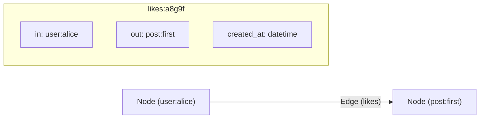

# Graph Connections (Overview: Nodes vs Edges)

> **Level 5 — Relational Data & Graph Operations**
> The core graph database concepts in SurrealDB, separating entities (**Nodes** or Vertices) from relationships (**Edges** or Relations), explaining how edges act as first-class records containing `in` and `out` pointer fields.

---

## 1. Prerequisites
- [Record Link (Concept)](record_link_concept.md) — The single reference link.
- [`DEFINE TABLE`](../level_04/define_table.md) — Table structure configurations.

---

## 2. Term Category
- **Database Structure / Paradigm**

---

## 3. Environment Context
- **SurrealDB Core** (Governed by the graph storage engine. Edges are stored in specialized relation index tables, linking nodes directly).

---

## 4. Explanation

### (1) Design Motivation — "Why did we design this?"
In relational databases, representing complex networks (like social connections or recommendations) requires many-to-many junction tables:
-   To check if User A follows User B, you must query a `follows` junction table.
-   As your network grows, queries require chaining multiple self-joins.
-   These SQL self-joins are slow because they scan table indexes sequentially.

We designed native **Graph Connections** in SurrealDB to solve this scaling problem. 

Instead of treating connections as abstract keys, SurrealDB uses a first-class **Node and Edge** model. 

Relationships are traversed in constant time, allowing you to query complex connection networks (like "friends of friends who bought product X") without SQL joins.

---

### (2) Nodes vs. Edges in SurrealDB



#### 1. Nodes (Vertices)
Nodes represent the core entities in your application (e.g. users, articles, products). 
-   They are standard records stored in normal database tables.

#### 2. Edges (Relations)
Edges represent the relationships connecting the nodes (e.g. `follows`, `bought`, `likes`).
-   In SurrealDB, edges are **first-class records** stored in relation tables.
-   Every edge record has a unique ID (e.g. `likes:a8g9f...`) and contains two mandatory fields:
    -   **`in`:** A record link pointing to the source node (the origin of the relationship).
    -   **`out`:** A record link pointing to the target node (the destination of the relationship).
-   Because edges are records, you can store custom properties directly on the edge itself (e.g., saving the timestamp when a user liked a post).

---

### (3) Reality Metaphor (Flight Routes)
Imagine looking at a global transportation map:
-   **Nodes (Airports):** The **Cities** on the map (New York, London, Tokyo). They are fixed locations.
-   **Edges (Flight Routes):** The **Flight Paths** connecting the cities. 
    -   The path is not just an empty line; it has its own properties (flight number, distance, ticket price). 
    -   The path has a start location (`in` New York) and a destination (`out` London).

---

## 5. Common Mistakes & Pitfalls

### Mistake 1: Treating graph edges as simple metadata strings, unaware that they are full database records with 'in' and 'out' pointer fields

**The mistake:** Assuming that creating a relationship is just a string marker and trying to query edges without referencing the `in` and `out` keys in edge validation scripts.

**Why it's wrong:** In SurrealDB, edges are complete database records. 

If you define a relation table, you must treat `in` and `out` as first-class record link fields. 

If you write validation rules on the relation table, forgetting that `in` and `out` are mandatory fields will block relation writes.

**Fix: Learn to write schema definitions for relation tables that validate the `in` and `out` fields as record links, matching your node tables:**

```sql
-- CORRECT RELATION SCHEMA WITH NODE VALIDATION
DEFINE TABLE follows TYPE RELATION FROM user TO user;
-- Under the hood, follows contains:
-- FIELD in TYPE record<user>
-- FIELD out TYPE record<user>
```

---


### Mistake 2: Treating Graph Edge Tables as Auxiliary Tables That Cannot Be Directly Queried

**The mistake:** Assuming graph edge tables created via `RELATE` cannot be queried with standard `SELECT` statements.

**Why it's wrong:** Graph edge tables in SurrealDB are first-class record tables! You can run `SELECT * FROM wrote;`, update edges, index edge fields, or attach changefeeds.

*Incorrect:*
```surrealql
-- Assuming edges cannot be queried directly
```

*Fix:*
```surrealql
SELECT * FROM wrote WHERE created_at > d"2026-01-01T00:00:00Z"; // Query edge records directly!
```

### Mistake 3: Creating Duplicate Un-Indexed Graph Edges Between Identical Record Nodes

**The mistake:** Executing `RELATE user:alice->likes->post:1;` 10 times creating 10 duplicate edge records.

**Why it's wrong:** `RELATE` creates a new edge record with a random ID every time unless custom edge IDs or unique indexes are specified.

*Incorrect:*
```surrealql
-- Creates multiple duplicate edge records!
RELATE user:alice->likes->post:1;
RELATE user:alice->likes->post:1; // ❌ Duplicate edge created!
```

*Fix:*
```surrealql
DEFINE INDEX UNIQUE_LIKE ON TABLE likes FIELDS in, out UNIQUE;
RELATE user:alice->likes->post:1; // Prevented by unique index
```


### Mistake 4: Treating Graph Edge Tables as Auxiliary Tables That Cannot Be Directly Queried

**The mistake:** Assuming graph edge tables created via `RELATE` cannot be queried with standard `SELECT` statements.

**Why it's wrong:** Graph edge tables in SurrealDB are first-class record tables! You can run `SELECT * FROM wrote;`, update edges, index edge fields, or attach changefeeds.

*Incorrect:*
```surrealql
-- Assuming edges cannot be queried directly
```

*Fix:*
```surrealql
SELECT * FROM wrote WHERE created_at > d"2026-01-01T00:00:00Z"; // Query edge records directly!
```

### Mistake 5: Creating Duplicate Un-Indexed Graph Edges Between Identical Record Nodes

**The mistake:** Executing `RELATE user:alice->likes->post:1;` 10 times creating 10 duplicate edge records.

**Why it's wrong:** `RELATE` creates a new edge record with a random ID every time unless custom edge IDs or unique indexes are specified.

*Incorrect:*
```surrealql
-- Creates multiple duplicate edge records!
RELATE user:alice->likes->post:1;
RELATE user:alice->likes->post:1; // ❌ Duplicate edge created!
```

*Fix:*
```surrealql
DEFINE INDEX UNIQUE_LIKE ON TABLE likes FIELDS in, out UNIQUE;
RELATE user:alice->likes->post:1; // Prevented by unique index
```

## 6. Practice Exercises

### Exercise 1: Graph Structure Audit

**Problem:** You are building a book review app. 
Classify the following tables as either **Nodes** (entity tables) or **Edges** (relation tables):
1.  `users` (stores user accounts)
2.  `reviewed` (connects a user to a book, storing their star rating)
3.  `books` (stores book details)
4.  `bookmarked` (connects a user to a book for reading later)

**Expected output:**
```text
1. Node Table (user entities)
2. Edge Table (relation connecting user -> book with rating properties)
3. Node Table (book entities)
4. Edge Table (relation connecting user -> book)
```

> [!check]- Answer
> - Nodes represent the nouns (objects) in your database.
> - Edges represent the verbs (actions/relationships) connecting those nouns.

---


### Exercise 2: Graph Engine Fundamentals

**Problem:** Explain what fields every graph edge record contains (`id`, `in` pointer to source node, `out` pointer to target node).

**Expected output:**
```text
id, in (source record link), out (target record link)
```

> [!check]- Answer
> ```text
> id, in (source record link), out (target record link)
> ```
>
> **Explanation:** Edge records store `in` (source pointer) and `out` (target pointer) record links.

### Exercise 3: Creating Edge Record with Custom ID

**Problem:** Create graph edge with custom ID `likes:alice_post1` relating `user:alice` to `post:1`.

**Expected output:**
```text
RELATE user:alice->likes:alice_post1->post:1;
```

> [!check]- Answer
> ```surrealql
> RELATE user:alice->likes:alice_post1->post:1;
> ```
>
> **Explanation:** `RELATE node->edge:id->node` creates graph edges with explicit custom Record IDs.

## 7. Related Terms
- [Record Link (Concept)](record_link_concept.md) — The single reference link.
- [`RELATE` Statement](relate.md) — Creating graph edges.

---

## 8. Key Takeaways
- Graph databases separate data into entity Nodes and relationship Edges.
- Nodes represent objects; Edges represent connections between objects.
- In SurrealDB, Edges are first-class records stored in relation tables.
- Every edge record contains mandatory `in` (source) and `out` (target) pointer fields.
- Edges can store custom properties (like timestamps, weights, or ratings).
- Graph traversals bypass slow SQL joins, resolving links in constant time.
- Define relation schemas explicitly using `DEFINE TABLE ... TYPE RELATION`.
